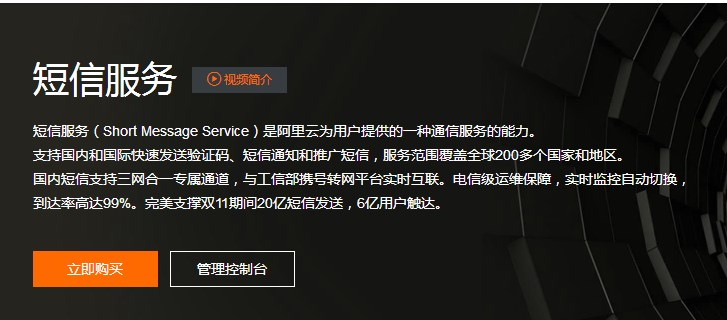
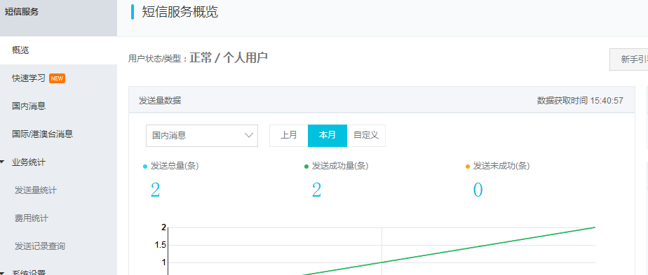
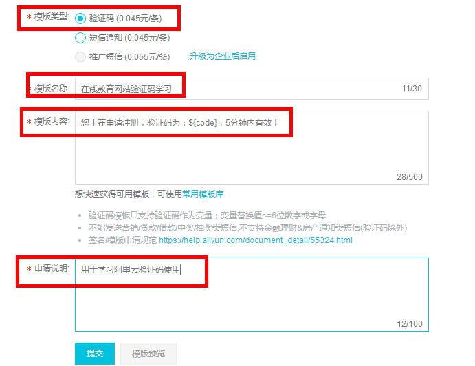
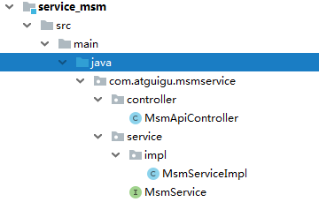

# 一、阿里云短信服务

**帮助文档：**

https://help.aliyun.com/product/44282.html?spm=5176.10629532.0.0.38311cbeYzBm73

## 1、开通阿里云短信服务






## 2、添加签名管理与模板管理

**（1）添加模板管理**

**选择 国内消息 - 模板管理 - 添加模板**


**点击 添加模板，进入到添加页面，输入模板信息**



**点击提交，等待审核，审核通过后可以使用**

**（2）添加签名管理**

选择 国内消息 - 签名管理 - 添加签名

点击添加签名，进入添加页面，填入相关信息注意：签名要写的有实际意义点击提交，等待审核，审核通过后可以使

# 二、新建短信微服务

## 1、在service模块下创建子模块service_msm


## 2、创建controller和service代码



## 3、配置application.properties

```properties
# 服务端口
server.port=8206
# 服务名
spring.application.name=service-msm

spring.redis.host=192.168.44.165
spring.redis.port=6379
spring.redis.database= 0
spring.redis.timeout=1800000

spring.redis.lettuce.pool.max-active=20
spring.redis.lettuce.pool.max-wait=-1
  #最大阻塞等待时间(负数表示没限制)
spring.redis.lettuce.pool.max-idle=5
spring.redis.lettuce.pool.min-idle=0
  #最小空闲
# nacos服务地址
spring.cloud.nacos.discovery.server-addr=127.0.0.1:8848

#返回json的全局时间格式
spring.jackson.date-format=yyyy-MM-dd HH:mm:ss
spring.jackson.time-zone=GMT+8

#配置mapper xml文件的路径
mybatis-plus.mapper-locations=classpath:com/atguigu/cmsservice/mapper/xml/*.xml

#mybatis日志
mybatis-plus.configuration.log-impl=org.apache.ibatis.logging.stdout.StdOutImpl
```

## 4、创建启动类

创建ServiceMsmApplication.java

```java
@ComponentScan({"com.atguigu"})
@SpringBootApplication(exclude = DataSourceAutoConfiguration.class)//取消数据源自动配置
public class ServiceMsmApplication {
    public static void main(String[] args) {
        SpringApplication.run(ServiceMsmApplication.class, args);
    }
}
```

# 三、编写发送短信接口

## 1、在service-msm的pom中引入依赖

```xml
<dependencies>
    <dependency>
        <groupId>com.alibaba</groupId>
        <artifactId>fastjson</artifactId>
    </dependency>
   <dependency>
        <groupId>org.apache.httpcomponents</groupId>
        <artifactId>httpclient</artifactId>
    </dependency>
</dependencies>
```

## 2、编写controller，根据手机号发送短信

```java
@RestController
@RequestMapping("/api/msm")
public class MsmController {

    @Autowired
    private MsmService msmService;

    @Autowired
    private RedisTemplate<String, String> redisTemplate;

    @GetMapping(value = "/send/{phone}")
    public R code(@PathVariable String phone) {
        String code = redisTemplate.opsForValue().get(phone);
        if(!StringUtils.isEmpty(code)) return R.ok();

        code = RandomUtil.getFourBitRandom();
        Map<String,Object> param = new HashMap<>();
        param.put("code", code);
        boolean isSend = msmService.send(phone, "SMS_180051135", param);
        if(isSend) {
            redisTemplate.opsForValue().set(phone, code,5, TimeUnit.MINUTES);
            return R.ok();
        } else {
            return R.error().message("发送短信失败");
        }
    }
}
```

## 3、编写service

```
@Service
public class MsmServiceImpl implements MsmService {

    /**
     * 发送短信
     */
    public boolean send(String PhoneNumbers, String templateCode, Map<String,Object> param) {

        if(StringUtils.isEmpty(PhoneNumbers)) return false;

        DefaultProfile profile =
                DefaultProfile.getProfile("default", "LTAIq6nIPY09VROj", "FQ7UcixT9wEqMv9F35nORPqKr8XkTF");
        IAcsClient client = new DefaultAcsClient(profile);

        CommonRequest request = new CommonRequest();
        //request.setProtocol(ProtocolType.HTTPS);
        request.setMethod(MethodType.POST);
        request.setDomain("dysmsapi.aliyuncs.com");
        request.setVersion("2017-05-25");
        request.setAction("SendSms");

        request.putQueryParameter("PhoneNumbers", PhoneNumbers);
        request.putQueryParameter("SignName", "我的谷粒在线教育网站");
        request.putQueryParameter("TemplateCode", templateCode);
        request.putQueryParameter("TemplateParam", JSONObject.toJSONString(param));

        try {
            CommonResponse response = client.getCommonResponse(request);
            System.out.println(response.getData());
            return response.getHttpResponse().isSuccess();
        } catch (ServerException e) {
            e.printStackTrace();
        } catch (ClientException e) {
            e.printStackTrace();
        }
        return false;
    }
}
```

# 四、完善登录接口

修改UserInfoServiceImpl

```java
@Autowired
private RedisTemplate<String, String> redisTemplate;

//校验校验验证码
String mobleCode = redisTemplate.opsForValue().get(phone);
if(!code.equals(mobleCode)) {
    throw new YyghException(20001,"验证码失败");
}
```
