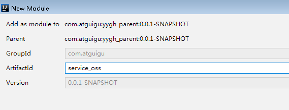
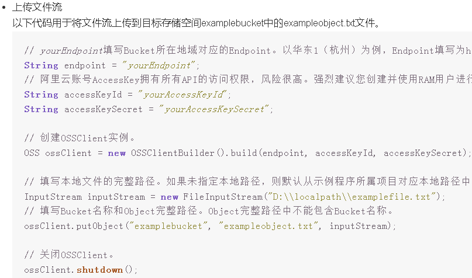

# 一、新建云存储微服务

## 1、在service模块下创建子模块service_oss



## 2、配置pom.xml

service-oss上级模块service已经引入service的公共依赖，service-oss模块只需引入阿里云oss相关依赖

```xml
<dependencies>
    <!-- 阿里云oss依赖 -->
    <dependency>
        <groupId>com.aliyun.oss</groupId>
        <artifactId>aliyun-sdk-oss</artifactId>
    </dependency>

    <!-- 日期工具栏依赖 -->
    <dependency>
        <groupId>joda-time</groupId>
        <artifactId>joda-time</artifactId>
    </dependency>
</dependencies>
```

## 3、配置application.properties

```properties
#服务端口
server.port=8205
#服务名
spring.application.name=service-oss

#环境设置：dev、test、prod
spring.profiles.active=dev
    
spring.servlet.multipart.max-file-size=1024MB
spring.servlet.multipart.max-request-size=1024MB

#阿里云 OSS
#不同的服务器，地址不同
aliyun.oss.file.endpoint=oss-cn-beijing.aliyuncs.com
aliyun.oss.file.keyid=your accessKeyId
aliyun.oss.file.keysecret=your accessKeySecret
#bucket可以在控制台创建，也可以使用java代码创建
aliyun.oss.file.bucketname=guli-file
```

## 4、创建启动类

创建OssApplication.java

```java
@SpringBootApplication(exclude = DataSourceAutoConfiguration.class)
@ComponentScan(basePackages = {"com.atguigu"})
public class OssApplication {

    public static void main(String[] args) {
        SpringApplication.run(OssApplication.class, args);
    }
}
```

# 二、实现文件上传接口

## 1、从配置文件读取常量

创建常量读取工具类：ConstantPropertiesUtil.java

使用@Value读取application.properties里的配置内容

用spring的 InitializingBean 的 afterPropertiesSet 来初始化配置信息，这个方法将在所有的属性被初始化后调用。

```java
/**
 * 常量类，读取配置文件application.properties中的配置
 */
@Component
//@PropertySource("classpath:application.properties")
public class ConstantPropertiesUtil implements InitializingBean {

    @Value("${aliyun.oss.file.endpoint}")
    private String endpoint;
  
    @Value("${aliyun.oss.file.keyid}")
    private String keyId;
  
    @Value("${aliyun.oss.file.keysecret}")
    private String keySecret;
  
    @Value("${aliyun.oss.file.bucketname}")
    private String bucketName;
  
    public static String END_POINT;
    public static String ACCESS_KEY_ID;
    public static String ACCESS_KEY_SECRET;
    public static String BUCKET_NAME;
  
    @Override
    public void afterPropertiesSet() throws Exception {
        END_POINT = endpoint;
        ACCESS_KEY_ID = keyId;
        ACCESS_KEY_SECRET = keySecret;
        BUCKET_NAME = bucketName;
    }
}
```

## 2、文件上传

创建Service接口：FileService.java

```java
public interface FileService {

    /**
     * 文件上传至阿里云
     */
    String upload(MultipartFile file);
}
```

实现：FileServiceImpl.java

参考SDK中的：Java->上传文件->简单上传->流式上传->上传文件流



```java
@Service
public class FileServiceImpl implements FileService {
    @Override
    public String upload(MultipartFile file) {
        // Endpoint以杭州为例，其它Region请按实际情况填写。
        String endpoint = ConstantPropertiesUtil.END_POINT;
        String accessKeyId = ConstantPropertiesUtil.ACCESS_KEY_ID;
        String accessKeySecret = ConstantPropertiesUtil.ACCESS_KEY_SECRET;
        String bucketName = ConstantPropertiesUtil.BUCKET_NAME;
        try {
            // 创建OSSClient实例。
            OSS ossClient = new OSSClientBuilder().build(endpoint, accessKeyId, accessKeySecret);
            // 上传文件流。
            InputStream inputStream = file.getInputStream();
            String fileName = file.getOriginalFilename();
            //生成随机唯一值，使用uuid，添加到文件名称里面
            String uuid = UUID.randomUUID().toString().replaceAll("-","");
            fileName = uuid+fileName;
            //按照当前日期，创建文件夹，上传到创建文件夹里面
            //  2021/02/02/01.jpg
            String timeUrl = new DateTime().toString("yyyy/MM/dd");
            fileName = timeUrl+"/"+fileName;
            //调用方法实现上传
            ossClient.putObject(bucketName, fileName, inputStream);
            // 关闭OSSClient。
            ossClient.shutdown();
            //上传之后文件路径
            // https://yygh-atguigu.oss-cn-beijing.aliyuncs.com/01.jpg
            String url = "https://"+bucketName+"."+endpoint+"/"+fileName;
            //返回
            return url;
        } catch (IOException e) {
            e.printStackTrace();
            return null;
        }
    }
}
```

## 3、创建Controller

FileUploadController.java

```java
@Api(description="阿里云文件管理")
@RestController
@RequestMapping("/admin/oss/file")
public class FileUploadController {

    @Autowired
    private FileService fileService;

    /**
     * 文件上传
     */
    @ApiOperation(value = "文件上传")
    @PostMapping("upload")
    public R upload(
            @ApiParam(name = "file", value = "文件", required = true)
            @RequestParam("file") MultipartFile file) {

        String uploadUrl = fileService.upload(file);
        return R.ok().message("文件上传成功").data("url", uploadUrl);

    }
}
```

## 4、配置网关

```properties
#设置路由id
spring.cloud.gateway.routes[5].id=service-oss
#设置路由的uri
spring.cloud.gateway.routes[5].uri=lb://service-oss
#设置路由断言,代理servicerId为auth-service的/auth/路径
spring.cloud.gateway.routes[5].predicates= Path=/*/oss/**
```
