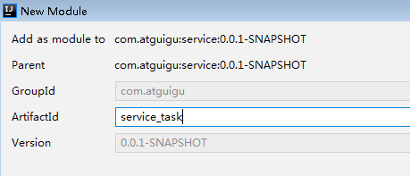
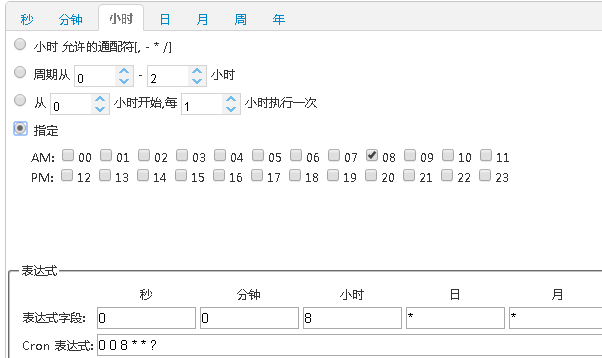

# 一、就医提醒

**我们通过定时任务，每天8点执行，提醒就诊**

## 1、搭建定时任务模块



### （1）添加依赖

```xml
<dependencies>
    <dependency>
        <groupId>com.atguigu</groupId>
        <artifactId>rabbit_util</artifactId>
        <version>0.0.1-SNAPSHOT</version>
    </dependency>
</dependencies>
```

### （2）添加配置文件

```properties
# 服务端口
server.port=8208
# 服务名
spring.application.name=service-task
# 环境设置：dev、test、prod
spring.profiles.active=dev

# nacos服务地址
spring.cloud.nacos.discovery.server-addr=127.0.0.1:8848

#rabbitmq地址
spring.rabbitmq.host=192.168.44.165
spring.rabbitmq.port=5672
spring.rabbitmq.username=guest
spring.rabbitmq.password=guest
```

### （3）添加启动类

```java
@SpringBootApplication(exclude = DataSourceAutoConfiguration.class)
@EnableDiscoveryClient
@ComponentScan(basePackages = "com.atguigu")
public class ServiceTaskApplication {
    public static void main(String[] args) {
        SpringApplication.run(ServiceTaskApplication.class, args);
    }
}
```

### （4）添加常量配置

在rabbit-util模块MqConst类添加

```properties
//定时任务
public static final String EXCHANGE_DIRECT_TASK = "exchange.direct.task";
public static final String ROUTING_TASK_8 = "task.8";
//队列
public static final String QUEUE_TASK_8 = "queue.task.8";
```

### （5）添加定时任务

**cron表达式**



```java
@Component
@EnableScheduling
public class ScheduledTask {

    @Autowired
    private RabbitService rabbitService;

    /**
     * 每天8点执行 提醒就诊
     */
    //@Scheduled(cron = "0 0 8 * * ?")
    @Scheduled(cron = "0/50 * * * * ?")
    public void task1() {
        System.out.println(new Date().toLocaleString());
        rabbitService.sendMessage(MqConst.EXCHANGE_DIRECT_TASK, MqConst.ROUTING_TASK_8, "");
    }
}
```

## 2、添加就医提醒处理

**操作模块service-order**

### （1）添加OrderInfoService接口和实现

```java
/**
 * 就诊提醒
 */
void patientTips();

//实现方法
@Override
public void patientTips() {
    QueryWrapper<OrderInfo> queryWrapper = new QueryWrapper<>();
    queryWrapper.eq("reserve_date",new DateTime().toString("yyyy-MM-dd"));
    List<OrderInfo> orderInfoList = baseMapper.selectList(queryWrapper);
    for(OrderInfo orderInfo : orderInfoList) {
        //短信提示
        MsmVo msmVo = new MsmVo();
        msmVo.setPhone(orderInfo.getPatientPhone());
        String reserveDate = new DateTime(orderInfo.getReserveDate()).toString("yyyy-MM-dd") + (orderInfo.getReserveTime()==0 ? "上午": "下午");
        Map<String,Object> param = new HashMap<String,Object>(){{
            put("title", orderInfo.getHosname()+"|"+orderInfo.getDepname()+"|"+orderInfo.getTitle());
            put("reserveDate", reserveDate);
            put("name", orderInfo.getPatientName());
        }};
        msmVo.setParam(param);
        rabbitService.sendMessage(MqConst.EXCHANGE_DIRECT_MSM, MqConst.ROUTING_MSM_ITEM, msmVo);
    }
}
```

### （2）添加mq监听

```java
@Component
public class OrderReceiver {

    @Autowired
    private OrderInfoService orderService;

    @RabbitListener(bindings = @QueueBinding(
            value = @Queue(value = MqConst.QUEUE_TASK_8, durable = "true"),
            exchange = @Exchange(value = MqConst.EXCHANGE_DIRECT_TASK),
            key = {MqConst.ROUTING_TASK_8}
    ))
    public void patientTips(Message message, Channel channel) throws IOException {
        orderService.patientTips();
    }
}
```
