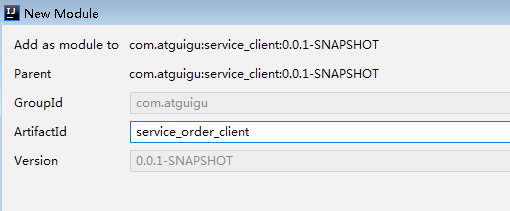
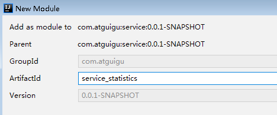

# 一、后台管理系统-预约统计功能

我们统计医院每天的预约情况，通过图表的形式展示，统计的数据都来自订单模块，因此我们在该模块封装好数据，在统计模块通过feign的形式获取数据。

我们为什么需要一个统计模块呢，因为在实际的生产环境中，有很多种各式统计，数据来源于各个服务模块，我们得有一个统计模块来专门管理

## 1、开发每天预约数据接口

**操作模块：service_orders**

### （1）在OrderInfoMapper添加方法

```java
public interface OrderMapper extends BaseMapper<OrderInfo> {

    //统计每天平台预约数据
    List<OrderCountVo> selectOrderCount(OrderCountQueryVo orderCountQueryVo);
}
```

### （2）在OrderInfoMapper.xml添加方法

**创建OrderInfoMapper.xml文件**

```xml
<?xml version="1.0" encoding="UTF-8" ?>
<!DOCTYPE mapper PUBLIC "-//mybatis.org//DTD Mapper 3.0//EN"
        "http://mybatis.org/dtd/mybatis-3-mapper.dtd">
<mapper namespace="com.atguigu.yygh.orders.mapper.OrderMapper">

    <select id="selectOrderCount" resultType="com.atguigu.yygh.vo.order.OrderCountVo">
        select reserve_date as reserveDate, count(reserve_date) as count
        from order_info
        <where>
            <if test="hosname != null and hosname != ''">
                and hosname like CONCAT('%',#{hosname},'%')
            </if>
            <if test="reserveDateBegin != null and reserveDateBegin != ''">
                and reserve_date >= #{reserveDateBegin}
            </if>
            <if test="reserveDateEnd != null and reserveDateEnd != ''">
                and reserve_date &lt;= #{reserveDateEnd}
            </if>
            and is_deleted = 0
        </where>
        group by reserve_date
        order by reserve_date
    </select>
</mapper>
```

### （3）添加配置

**application.properties添加**

```properties
mybatis-plus.mapper-locations=classpath:com/atguigu/yygh/orders/mapper/xml/*.xml
```

**service模块的pom.xml添加**

```xml
<build>
    <plugins>
        <plugin>
            <groupId>org.springframework.boot</groupId>
            <artifactId>spring-boot-maven-plugin</artifactId>
        </plugin>
    </plugins>
    <resources>
        <resource>
            <directory>src/main/java</directory>
            <includes>
                <include>**/*.yml</include>
                <include>**/*.properties</include>
                <include>**/*.xml</include>
            </includes>
            <filtering>false</filtering>
        </resource>
        <resource>
            <directory>src/main/resources</directory>
            <includes> <include>**/*.yml</include>
                <include>**/*.properties</include>
                <include>**/*.xml</include>
            </includes>
            <filtering>false</filtering>
        </resource>
    </resources>
</build>
```

### （4） OrderService添加方法和实现

```java
/**
     * 订单统计
     */
Map<String, Object> getCountMap(OrderCountQueryVo orderCountQueryVo);

//实现方法
@Override
public Map<String, Object> getCountMap(OrderCountQueryVo orderCountQueryVo) {
    Map<String, Object> map = new HashMap<>();

    List<OrderCountVo> orderCountVoList
        = baseMapper.selectOrderCount(orderCountQueryVo);
    //日期列表
    List<String> dateList
        =orderCountVoList.stream().map(OrderCountVo::getReserveDate).collect(Collectors.toList());
    //统计列表
    List<Integer> countList
        =orderCountVoList.stream().map(OrderCountVo::getCount).collect(Collectors.toList());
    map.put("dateList", dateList);
    map.put("countList", countList);
    return map;
}
```

### （5 **）** 在OrderApiController添加方法

```java
@ApiOperation(value = "获取订单统计数据")
@PostMapping("inner/getCountMap")
public Map<String, Object> getCountMap(@RequestBody OrderCountQueryVo orderCountQueryVo) {
    return orderInfoService.getCountMap(orderCountQueryVo);
}
```

## 2、封装远程调用接口

### （1）创建模块：service_order_client



### （2）添加feign接口

```java
@FeignClient(value = "service-orders")
@Repository
public interface OrderFeignClient {
    /**
     * 获取订单统计数据
     */
    @PostMapping("/api/order/orderInfo/inner/getCountMap")
    Map<String, Object> getCountMap(@RequestBody OrderCountQueryVo orderCountQueryVo);

}
```

## 3、搭建统计分析模块

### （1）创建service_statistics模块



### （2）引入依赖

```xml
<dependencies>
    <dependency>
        <groupId>com.atguigu</groupId>
        <artifactId>service_order_client</artifactId>
        <version>0.0.1-SNAPSHOT</version>
    </dependency>
</dependencies>
```

### （3）添加配置文件

```properties
# 服务端口
server.port=8209
# 服务名
spring.application.name=service-sta
# 环境设置：dev、test、prod
spring.profiles.active=dev

# nacos服务地址
spring.cloud.nacos.discovery.server-addr=127.0.0.1:8848
```

### （4）添加启动类

```java
@SpringBootApplication(exclude = DataSourceAutoConfiguration.class)
@EnableDiscoveryClient
@EnableFeignClients(basePackages = {"com.atguigu"})
@ComponentScan(basePackages = {"com.atguigu"})
public class ServiceStatisticsApplication {

    public static void main(String[] args) {
        SpringApplication.run(ServiceStatisticsApplication.class, args);
    }

}
```

### （5）添加controller方法

```java
@Api(tags = "统计管理接口")
@RestController
@RequestMapping("/admin/statistics")
public class StatisticsController {

    @Autowired
    private OrderFeignClient orderFeignClient;

    @ApiOperation(value = "获取订单统计数据")
    @GetMapping("getCountMap")
    public R getCountMap(@ApiParam(name = "orderCountQueryVo", value = "查询对象", required = false) OrderCountQueryVo orderCountQueryVo) {
        Map<String, Object> map = orderFeignClient.getCountMap(orderCountQueryVo);
        return R.ok().data(map);
    }
}
```

## 4、整合统计功能前端

ECharts是百度的一个项目，后来百度把Echart捐给apache，用于图表展示，提供了常规的[折线图](https://echarts.baidu.com/option.html#series-line)、[柱状图](https://echarts.baidu.com/option.html#series-line)、[散点图](https://echarts.baidu.com/option.html#series-scatter)、[饼图](https://echarts.baidu.com/option.html#series-pie)、[K线图](https://echarts.baidu.com/option.html#series-candlestick)，用于统计的[盒形图](https://echarts.baidu.com/option.html#series-boxplot)，用于地理数据可视化的[地图](https://echarts.baidu.com/option.html#series-map)、[热力图](https://echarts.baidu.com/option.html#series-heatmap)、[线图](https://echarts.baidu.com/option.html#series-lines)，用于关系数据可视化的[关系图](https://echarts.baidu.com/option.html#series-graph)、[treemap](https://echarts.baidu.com/option.html#series-treemap)、[旭日图](https://echarts.baidu.com/option.html#series-sunburst)，多维数据可视化的[平行坐标](https://echarts.baidu.com/option.html#series-parallel)，还有用于 BI 的[漏斗图](https://echarts.baidu.com/option.html#series-funnel)，[仪表盘](https://echarts.baidu.com/option.html#series-gauge)，并且支持图与图之间的混搭。

官方网站：https://echarts.apache.org/zh/index.html

### （1）项目中安装 echarts组件

npm install --save echarts@4.1.0

### （2）添加路由

```js
  {
    path: '/statistics',
    component: Layout,
    redirect: '/statistics/order/index',
    name: 'BasesInfo',
    meta: { title: '统计管理', icon: 'table' },
    alwaysShow: true,
    children: [
        {
    path: 'order/index',
    name: '预约统计',
    component: () =>import('@/views/yygh/sta/index'),
    meta: { title: '预约统计' }
        }
      ]
  },
```

### （3）封装api请求

```js
import request from '@/utils/request'

const api_name = '/admin/statistics'

export default {

    getCountMap(searchObj) {
        return request({
            url: `${api_name}/getCountMap`,
            method: 'get',
            params: searchObj
        })
    }
}
```

### （4）添加组件

**创建/views/yygh/sta/index.vue组件**

```html
<template>
    <div class="app-container">
    <!--表单-->
    <el-form :inline="true" class="demo-form-inline">
        <el-form-item>
            <el-input v-model="searchObj.hosname" placeholder="点击输入医院名称"/>
        </el-form-item>

        <el-form-item>
            <el-date-picker
                v-model="searchObj.reserveDateBegin"
                type="date"
                placeholder="选择开始日期"
                value-format="yyyy-MM-dd"/>
        </el-form-item>
        <el-form-item>
            <el-date-picker
                v-model="searchObj.reserveDateEnd"
                type="date"
                placeholder="选择截止日期"
                value-format="yyyy-MM-dd"/>
        </el-form-item>
        <el-button
            :disabled="btnDisabled"
            type="primary"
            icon="el-icon-search"
            @click="showChart()">查询</el-button>
    </el-form>

    <div class="chart-container">
        <div id="chart" ref="chart" 
            class="chart" style="height:500px;width:100%"/>
    </div>
    </div>
</template>

<script>
import echarts from 'echarts'
import statisticsApi from '@/api/yygh/sta'

export default {

    data() {
        return {
            searchObj: {
                hosname: '',
                reserveDateBegin: '',
                reserveDateEnd: ''
            },
            btnDisabled: false,
            chart: null,
            title: '',
            xData: [], // x轴数据
            yData: [] // y轴数据
        }
    },

    methods: {
        // 初始化图表数据
        showChart() {
            statisticsApi.getCountMap(this.searchObj).then(response => {
                this.yData = response.data.countList
                this.xData = response.data.dateList
                this.setChartData()
            })
        },

        setChartData() {
            // 基于准备好的dom，初始化echarts实例
            var myChart = echarts.init(document.getElementById('chart'))
            // 指定图表的配置项和数据
            var option = {
                title: {
                    text: this.title + '挂号量统计'
                },
                tooltip: {},
                legend: {
                    data: [this.title]
                },
                xAxis: {
                    data: this.xData
                },
                yAxis: {
                    minInterval: 1
                },
                series: [{
                    name: this.title,
                    type: 'line',
                    data: this.yData
                }]
            }

            // 使用刚指定的配置项和数据显示图表。
            myChart.setOption(option)
        },
    }
}
</script>
```
