# 一、项目部署

## 1、项目部署流程


## 2、项目打包

打开idea，找到maven，选择父工程里面 Lifecycle -- package 进行打包

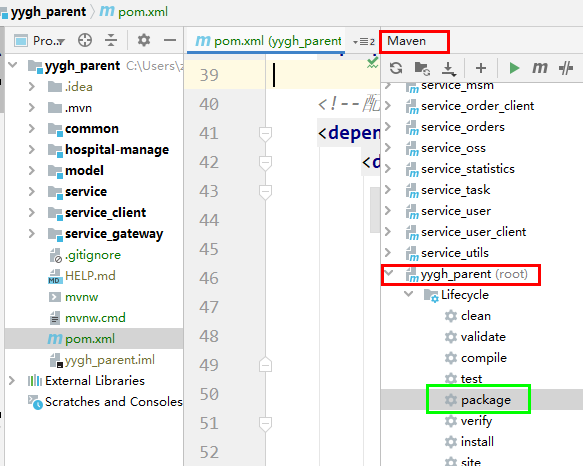

**执行package之后，出现Bulid SUCCESS打包成功**

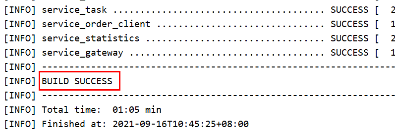

## 3、制作镜像

### 3.1 编写Dockerfile文件

```dockerfile
FROM openjdk:8-jdk-alpine
VOLUME /tmp
ADD ./service_oss-0.0.1-SNAPSHOT.jar service_oss.jar
ENTRYPOINT ["java","-jar","/service_oss.jar", "&"]
```

### 3.2 上传jar包和Dockerfile文件

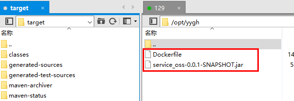

### 3.3 进入Dockerfile所在目录

**执行命令制作镜像：**

**docker build -t service-oss:1.0.0 .**

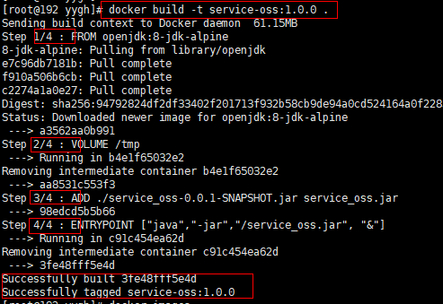

**容器启动测试：**

注：项目需要nacos环境，需要启动nacos服务，可以在Liunx中安装启动

**docker run -d -p 8205:8205 service-oss:1.0.0 -t**

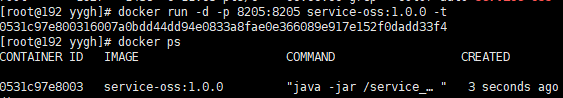

**访问测试：**

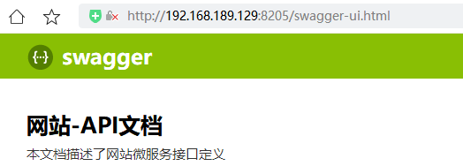

## 4、上传镜像

### 4.1 登录阿里云，搜索容器镜像服务 ACR


### 4.2 进入管理控制台，选择个人版


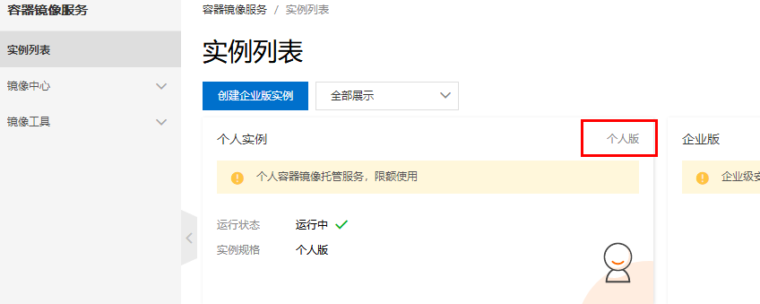

### 4.3 创建命名空间

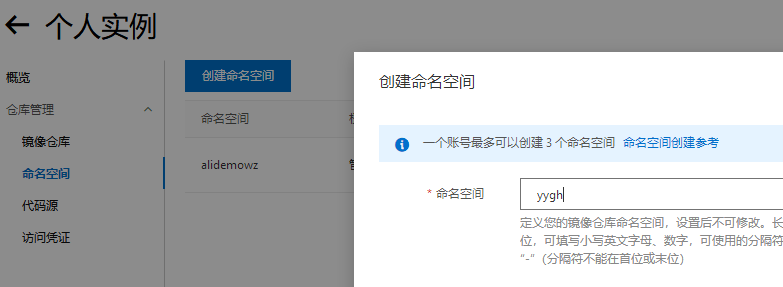

### 4.4 创建镜像仓库

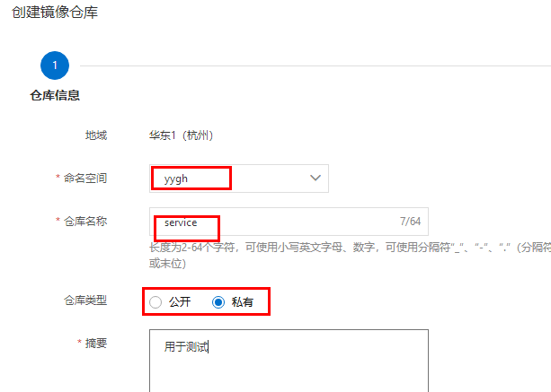

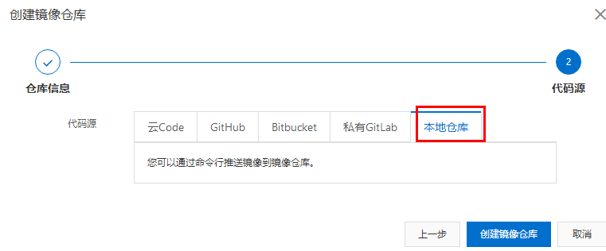

### 4.5 推送镜像（按照文档命令操作）

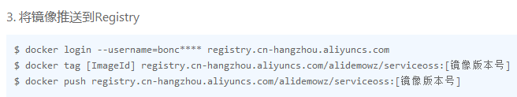

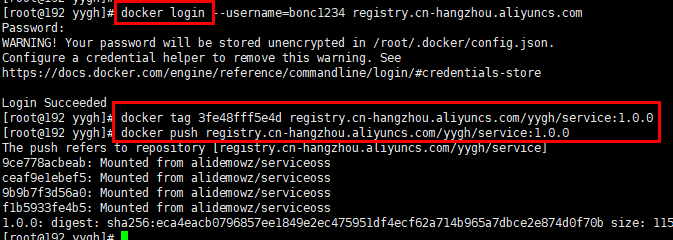

### 4.6 下载镜像

**docker pull registry.cn-hangzhou.aliyuncs.com/yygh/service:1.0.0**

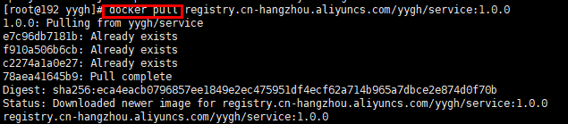
