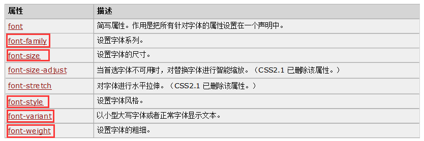

### 01-本阶段技术体系

* 客户端技术
  * html、css、javascript、vue、ajax、axios
* 服务器技术
  * tomcat、servlt、request、response、cookie、sesson、filter、listener、thymeleaf
* 数据库技术
  * mysql、jdbc、连接池、dbutils


### 02-hbuilder概述及使用

* 概述

  * HBuilder是[DCloud](https://baike.baidu.com/item/DCloud)（[数字天堂](https://baike.baidu.com/item/数字天堂/244387)）推出的一款支持[HTML5](https://baike.baidu.com/item/HTML5)的[Web](https://baike.baidu.com/item/Web/150564)开发[IDE](https://baike.baidu.com/item/IDE/8232086)。 [1] HBuilder的编写用到了[Java](https://baike.baidu.com/item/Java/85979)、[C](https://baike.baidu.com/item/C/7252092)、Web和[Ruby](https://baike.baidu.com/item/Ruby/11419)。HBuilder[本身](https://baike.baidu.com/item/本身/126627)主体是由Java编写。

* 官网

  * [HBuilderX-高效极客技巧 (dcloud.io)](https://www.dcloud.io/hbuilderx.html)

* 安装

  * 解压即可

* 界面

  * 

* 使用

  * 

* 项目结构说明(记忆)

  | 结构       | 说明                                   |
  | ---------- | -------------------------------------- |
  | css        | 存储css样式文件                        |
  | img        | 存储图片、文本、音频、视频等等网站资源 |
  | js         | 存储js脚本文件                         |
  | index.html | 当前项目的欢迎页面                     |

  


### 03-html介绍

* 概述
  * Hyper Text Markup Language : 超文本标记语言
* 作用
  * 让开发人员可以和浏览器交互
* 超文本
  * 网站上的资源，比如：文本、图片、视频、音频、连接、表格、列表等等
* 标记
  * 也叫标签，一个标签语言
* 语言
  * 交流工具


### 04-html书写规范

* 语法

  ```html
  <开始标签 属性1="值1" 属性2="值2">标签内容</结束标签>
  ```

  * 一般情况下，有开始标签，也有结束标签，标签是成对出现
    * 如果只有开始标签，没有结束标签，自关闭标签
  * 一般情况下， 标签名称要求小写，前后一致
  * 标签属性，只能放到开始标签中


### 05-文件标签

* 概述

  * 一个html的基本组成部分

* 分类

  * html : 声明当前文件是一个html文档
  * head : 设置当前页面的属性，往往不可显示
  * body : 设置当前页面的内容，往往会显示

* 代码实现

  ```html
  <!DOCTYPE html>
  <!-- 声明当前是一个html文档 -->
  <html>
  	<!-- 设置当前页面的属性 -->
  	<head>
  		<!-- 设置字符集 -->
  		<meta charset="utf-8" />
  		<!-- 设置页面的标题 -->
  		<title>欢迎来到前端世界</title>
  	</head>
  	
  	<!-- 设置当前页面的内容 -->
  	<body>
  		fuck world
  	</body>
  </html>
  
  
  ```

  

* 注意事项

  * 一个html文件的后缀名是".html"、".htm"


### 06-标签属性

* body属性

  * background、text、bgcolor
  * 颜色取值(16进制值、颜色名称)

* 代码实现

  ```html
  <!DOCTYPE html>
  <html>
  	<head>
  		<meta charset="utf-8">
  		<title>标签属性</title>
  	</head>
  	<body text="green" bgcolor="pink" background="img/girl1.jpg">
  		hello world
  	</body>
  </html>
  
  ```

  


### 07-文本标签之br标签

* 概述

  * 插入一个简单的换行符。

* 代码实现

  ```html
  <!DOCTYPE html>
  <html>
  	<head>
  		<meta charset="utf-8">
  		<title>br标签</title>
  	</head>
  	<body>
  		hello<br/>
  		world
  	</body>
  </html>
  ```

  


### 08-文本标签之p标签

* 概述

  * 定义段落。会自动在其前后创建一些空白。

* 常用属性

  * align : 规定段落中文本的对齐方式。

* 代码实现

  ```html
  <!DOCTYPE html>
  <html>
  	<head>
  		<meta charset="utf-8">
  		<title>p标签</title>
  	</head>
  	<body>
  		<p align="center">hello</p>
  		<p>world</p>
  	</body>
  </html>
  
  ```

  


### 09-文本标签之font标签

* 概述

  * 规定文本的字体、字体尺寸、字体颜色。

* 代码实现

  ```html
  <!DOCTYPE html>
  <html>
  	<head>
  		<meta charset="utf-8">
  		<title>font标签</title>
  	</head>
  	<body>
  		
  		<font face="楷体" color="red" size="7">helloworld</font>
  		
  	</body>
  </html>
  ```

  


### 10-文本标签之标题标签

* 概述

  * 可定义标题。<h1> 定义最大的标题。<h6> 定义最小的标题。

* 代码实现

  ```html
  <!DOCTYPE html>
  <html>
  	<head>
  		<meta charset="utf-8">
  		<title>标题标签</title>
  	</head>
  	<body>
  		<h1 align="center">这是标题 1</h1>
  		<h2>这是标题 2</h2>
  		<h3>这是标题 3</h3>
  		<h4>这是标题 4</h4>
  		<h5>这是标题 5</h5>
  		<h6>这是标题 6</h6>
  	</body>
  </html>
  
  ```

  


### 11-img标签

* 概述

  * 向网页中嵌入一幅图像。
  * 两个必需的属性：[src 属性](att_img_src.asp.htm) 和 [alt 属性](att_img_alt.asp.htm)。

* 常用属性

  * src、alt、border、width、height

* 代码实现

  ```html
  <!DOCTYPE html>
  <html>
  	<head>
  		<meta charset="utf-8">
  		<title>img标签</title>
  	</head>
  	<body>
  		
  	</body>
  </html>
  ```

  


### 12-列表标签

* 概述

  * ol、ul都是由列表项(li)组成

* 分类

  * 有序列表 : order list (ol)
  * 无序列表 : unorder list (ul)

* 代码实现

  ```html
  <!DOCTYPE html>
  <html>
  	<head>
  		<meta charset="utf-8">
  		<title>有序列表</title>
  	</head>
  	<body>
  		<ol start="3" type="A">
  			<li>javase</li>
  			<li>javame</li>
  			<li>javaee</li>
  		</ol>
  	</body>
  </html>
  ```

  ```html
  <!DOCTYPE html>
  <html>
  	<head>
  		<meta charset="utf-8">
  		<title>无序列表</title>
  	</head>
  	<body>
  		<ul type="circle">
  			<li>javase</li>
  			<li>javame</li>
  			<li>javaee</li>
  		</ul>
  	</body>
  </html>
  ```

  

### 13-超链接标签

* 概述

  * 也就是a标签；

* 代码实现

  ```html
  <!DOCTYPE html>
  <html>
  	<head>
  		<meta charset="utf-8">
  		<title>超链接标签</title>
  	</head>
  	<body>
  		<a href="index.html" target="_blank">跳转到index.html</a>
  	</body>
  </html>
  
  ```

  ```html
  <!DOCTYPE html>
  <html>
  	<head>
  		<meta charset="utf-8">
  		<title>超链接练习</title>
  	</head>
  	<body>
  		
  		<ul>
  			<li>
  				<a href="https://news.ifeng.com/c/8BVJnJEjuoA" target="_blank">中国是否会同立陶宛断交？王毅答凤凰记者问</a>
  				
  			</li>
  			<li>
  				
  				<a href="https://news.ifeng.com/c/8BUnQGq9dRm" target="_blank">中国成功发射“中星1D”卫星</a>
  			</li>
  		</ul>
  		
  	</body>
  </html>
  
  ```

  


### 14-表格标签(难点)

* 概述

  * 一个表格由table(表格容器)、tr(行)、td(单元格)组成

* table属性

  * cellpadding : 单元格边框到内容的距离
  * cellspacing : 单元格和单元格之间的距离

* tr属性

* td属性

  * colspan : 规定单元格可横跨的列数。
  * rowspan : 规定单元格可横跨的行数。

* 代码实现

  ```html
  <!DOCTYPE html>
  <html>
  	<head>
  		<meta charset="utf-8">
  		<title>表格标签</title>
  	</head>
  	<body>
  		
  		<table 
  			align="center" 
  			border="1px" 
  			width="300px" 
  			height="300px" 
  	
  			cellspacing="0px"
  			rules="all"
  			>
  			<!-- 第一行 -->
  			<tr align="center" valign="center">
  				<td colspan="2" width="66%"  height="33%">12</td>
  				<td width="33%" height="33%">3</td>
  			</tr>
  			<!-- 第二行 -->
  			<tr align="center">
  				<td rowspan="2" width="33%" height="66%">47</td>
  				<td width="66%" colspan="2" rowspan="2" height="66%">5689</td>
  			</tr>
  			<!-- 第三行 -->
  			<tr align="center">
  
  				
  			</tr>
  
  		</table>
  		
  	</body>
  </html>
  
  ```

  

### 15-容器标签

* 概述

  * 用于装载其他元素标签。

* 分类

  * div : 块级容器 , 不管容器中的内容怎么样，容器一直占满整一行。
  * span : 行内容器，容器中的内容有多少，容器就占多少。

* 代码实现

  ```html
  <!DOCTYPE html>
  <html>
  	<head>
  		<meta charset="utf-8">
  		<title>容器标签</title>
  	</head>
  	<body>
  		helloworld<br />
  		<div>
  			helloworld
  		</div>
  		<span>
  			helloworld
  		</span>
  		
  	</body>
  </html>
  
  ```

  

### 16-表单标签(重点)

* 概述

  * 就是form标签。
  * 用于将页面上用户输入的内容提交到服务器。

* 代码实现

  ```html
  <!DOCTYPE html>
  <html>
  	<head>
  		<meta charset="utf-8">
  		<title>表单标签</title>
  	</head>
  	<body>
  		<form>
  			<table align="center" border="1px" cellspacing="0px" rules="all" width="400px" height="500px">
  				<!-- 第一行 -->
  				<tr>
  					<th colspan="2">注册用户</th>
  				</tr>
  				<!-- 第二行 -->
  				<tr>
  					<td>
  						账户:
  					</td>
  					<td>
  						<input type="text" placeholder="请输入用户名"/>
  					</td>
  				</tr>
  				<!-- 第三行 -->
  				<tr>
  					<td>
  						密码:
  					</td>
  					<td>
  						<input type="password" placeholder="请输入密码"/>
  					</td>
  					
  				</tr>
  				<!-- 第四行 -->
  				<tr>
  					<td>性别:</td>
  					<td>
  						<input type="radio" />男
  						<input type="radio" />女
  						
  					</td>
  				</tr>
  				<!-- 第五行 -->
  				<tr>
  					<td>籍贯:</td>
  					<td>
  						<select>
  							<option>武汉市</option>
  							<option selected="selected">孝感市</option>
  							<option>襄阳市</option>
  							<option>宜昌市</option>
  						</select>
  						
  					</td>
  				</tr>
  				<!-- 第六行 -->
  				<tr>
  					<td>
  						爱好:
  					</td>
  					<td>
  						<input type="checkbox" />篮球
  						<input type="checkbox" />羽毛球
  						<input type="checkbox" />乒乓球
  					</td>
  				</tr>
  				<!-- 第七行 -->
  				<tr>
  					<td>
  						头像:
  					</td>
  					<td>
  						
  						<input type="file" />
  						
  					</td>
  					
  				</tr>
  				<!-- 第八行 -->
  				<tr>
  					<td>简介：</td>
  					<td>
  						<textarea placeholder="请简单地介绍下自己，150字以内!"></textarea>
  					</td>
  				</tr>
  				<!-- 第九行 -->
  				<tr align="center">
  					
  					<td colspan="2">
  						<input type="submit" value="注册"/>
  						<input type="reset" />
  					</td>
  					
  				</tr>
  			</table>
  		</form>
  		
  	</body>
  </html>
  
  ```

  ```html
  <!-- 表单标签优化 -->
  
  <!DOCTYPE html>
  <html>
  	<head>
  		<meta charset="utf-8">
  		<title>表单标签</title>
  	</head>
  	<body>
  		<form>
  			<table align="center" border="1px" cellspacing="0px" rules="all" width="400px" height="500px">
  				<!-- 第一行 -->
  				<tr>
  					<th colspan="2">注册用户</th>
  				</tr>
  				<!-- 第二行 -->
  				<tr>
  					<td>
  						账户:
  					</td>
  					<td>
  						<input type="text" placeholder="请输入用户名" name="username"/>
  					</td>
  				</tr>
  				<!-- 第三行 -->
  				<tr>
  					<td>
  						密码:
  					</td>
  					<td>
  						<input type="password" placeholder="请输入密码" name="password"/>
  					</td>
  					
  				</tr>
  				<!-- 第四行 -->
  				<tr>
  					<td>性别:</td>
  					<td>
  						
  						<input type="radio" name="sex" value="male"/>男
  						<input type="radio" name="sex" value="female"/>女
  						
  					</td>
  				</tr>
  				<!-- 第五行 -->
  				<tr>
  					<td>籍贯:</td>
  					<td>
  						<select name="oldhome">
  							<option value="wuhan">武汉市</option>
  							<option value="xiaogan" selected="selected">孝感市</option>
  							<option value="xiangyang">襄阳市</option>
  							<option value="yichang">宜昌市</option>
  						</select>
  						
  					</td>
  				</tr>
  				<!-- 第六行 -->
  				<tr>
  					<td>
  						爱好:
  					</td>
  					<td>
  						<input type="checkbox" name="hobbys" value="basketball"/>篮球
  						<input type="checkbox" name="hobbys" value="badminton"/>羽毛球
  						<input type="checkbox" name="hobbys" value="pingpang"/>乒乓球
  					</td>
  				</tr>
  				<!-- 第七行 -->
  				<tr>
  					<td>
  						头像:
  					</td>
  					<td>
  						
  						<input type="file" name="pic"/>
  						
  					</td>
  					
  				</tr>
  				<!-- 第八行 -->
  				<tr>
  					<td>简介：</td>
  					<td>
  						<textarea placeholder="请简单地介绍下自己，150字以内!" name="introduce"></textarea>
  					</td>
  				</tr>
  				<!-- 第九行 -->
  				<tr align="center">
  					
  					<td colspan="2">
  						<!--
  						<input type="submit" value="注册"/>
  						<input type="reset" />
  						-->
  						<button type="submit">注册</button>
  						<button type="reset">重置</button>
  					</td>
  					
  				</tr>
  			</table>
  		</form>
  		
  	</body>
  </html>
  
  ```

  

* 注意事项

  * 在form表单中，表单项必须要有name属性值，表单项中的值才会提交到服务器。


### 17-css介绍

* 概述
  * cascading style sheets : 层叠样式表格
  * html相当于是毛坯房，很多效果达不到；css相当于精装修，让html标签变得更好看。
* 优点
  * 让样式代码和html代码分离，维护比较方便；
  * 提高程序开发的效率。


### 18-css和html内联结合

* 概述

  * css样式代码直接写到html标签上。

* 语法

  ```html
  <开始标签 style="属性名1: 值1;属性名2:值2">
      标签内容
  </结束标签>
  ```

* 需求

  * 给p标签中的文本设置文本颜色为红色。

* 代码实现

  ```html
  <!DOCTYPE html>
  <html>
  	<head>
  		<meta charset="utf-8">
  		<title>css和html内联结合</title>
  	</head>
  	<body>
  		
  		<p style="color: red;font-size: 300px;">
  			这是一个p
  		</p>
  	</body>
  </html>
  ```

* 缺点

  * 复用性特别差

* 优点

  * 灵活性强


### 19-css和html内部结合

* 概述

  * 在html文件中使用style标签引用css样式代码

* 语法

  ```html
  <head>
      <style>
          选择器{
              属性名1: 值1;
              属性2: 值2;
          }
      </style>
  </head>
  ```

* 代码实现

  ```html
  <!DOCTYPE html>
  <html>
  	<head>
  		<meta charset="utf-8">
  		<title>css和html内部结合</title>
  		<style>
  			p{
  				color: red;
  				font-size: 100px;
  			}
  		</style>
  	</head>
  	<body>
  		
  		<p>
  			这是今天的第一个p
  		</p>
  		<p>
  			这是今天的第二个p
  		</p>
  	</body>
  </html>
  
  ```

* 缺点

  * 只能在当前html文件中复用，不同html文件无法复用；

* 优点

  * 复用性比内联结合强。


### 20-css和html外部结合

* 概述

  * 将css样式独立成一个样式文件(css文件)，然后，使用link标签进行引用

* 开发步骤

  * ①新建css文件
    * 编写css样式代码
  * ②编写html文件
    * 使用link标签引用css文件

* 代码实现

  ```css
  p{
  	color: red;
  	font-size: 100px;L
  }
  ```

  ```html
  <!DOCTYPE html>
  <html>
  	<head>
  		<meta charset="utf-8">
  		<title></title>
  
  		<!-- 引用demo17.css -->
  		<link rel="stylesheet" href="css/demo17.css"/>
  	</head>
  	<body>
  		
  		<p>
  			这是今天的第一个p
  		</p>
  		<p>
  			这是今天的第二个p
  		</p>
  	</body>
  </html>
  ```

* 总结

  * 内联结合：对个别元素进行样式的定义；
  * 内部结合：编写属于自己的样式代码；
  * 外部结合：引用第三方css样式代码。


### 21-css选择器概述

* 概述
  * 用于选择页面上具体的元素
* 分类
  * id选择器
  * class选择器
  * 元素选择器
  * 派生选择器


### 22-id选择器

* 概述

  * 使用id属性值选择具体的元素。

* 语法

  ```css
  <style>
  
      #id值{
          属性名1: 值1;
          属性名2: 值2;
      }
  
  </style>
  ```

* 代码实现

  ```html
  <!DOCTYPE html>
  <html>
  	<head>
  		<meta charset="utf-8">
  		<title>id选择器</title>
  		<style>
  			
  			#p1{
  				color: green;
  				font-size: 100px;
  			}
  		
  		</style>
  	</head>
  	<body>
  		
  		<p id="p1">
  			这是一个p
  		</p>
  		
  	</body>
  </html>
  
  ```

  


### 24-class选择器

* 概述

  * 使用class属性值选择具体的元素

* 语法

  ```html
  <style>
  
      .class值{
          属性名1: 值1;
          属性名2: 值2;
      }
  
  
  </style>
  ```

* 代码实现

  ```html
  <!DOCTYPE html>
  <html>
  	<head>
  		<meta charset="utf-8">
  		<title>class选择器</title>
  		<!-- 
  			偶数的p : 淡绿色、100px
  			奇数的p : 深绿色、150px
  		 -->
  		 <style>
  			
  			.p1{
  				color: lightgreen;
  				font-size: 100px;
  			}
  			
  			.p2{
  				color: darkgreen;
  				font-size: 150px;
  			}
  		 
  		 </style>
  	</head>
  	<body>
  		
  		<p class="p1">p1</p>
  		<p class="p2">p2</p>
  		<p class="p1">p3</p>
  		<p class="p2">p4</p>
  		
  	</body>
  </html>
  
  ```

  


### 25-元素选择器

* 概述

  * 使用元素名称(标签名称)选择具体的元素

* 语法

  ```css
  <style>
  	标签名称{
          属性名1: 值1;
          属性名2: 值2;  
  	}
  </style>
  ```

  


### 26-css选择器分组

* 概述

  * 如果多个选择器的样式代码相同，就可以将这些选择器分为一组

* 语法

  ```css
  选择器1 , 选择器2{
      属性名1: 值1;
      属性名2: 值2;  
  }
  ```

* 代码实现

  ```html
  <!DOCTYPE html>
  <html>
  	<head>
  		<meta charset="utf-8">
  		<title>css选择器分组</title>
  		<style>
  			#p1 , .div1 , span{
  				color: green;
  				font-size: 50px;
  			}
  		
  		</style>
  	</head>
  	<body>
  		
  		<p id="p1">这是一个p</p>
  		<div class="div1">
  			这是一个div
  		</div>
  		<span>
  			这是一个span
  		</span>
  	</body>
  </html>
  
  ```

  


### 27-派生选择器

* 概述

  * 也叫上下文选择器，根据父容器的位置关系来选择具体的元素

* 语法

  ```css
  父选择器 子选择器 {
      属性名1: 值1;
      属性名2: 值2;  
  }
  ```

* 代码实现

  ```html
  <!DOCTYPE html>
  <html>
  	<head>
  		<meta charset="utf-8">
  		<title>衍生选择器</title>
  		<style>
  			div font {
  				color: lightgreen;
  				font-size: 50px;
  			}
  			
  			span font {
  				color: darkgreen;
  				font-size: 70px;
  			}
  		
  		</style>
  	</head>
  	<body>
  		
  		<div>
  			<font>这是一个div</font>
  		</div>
  		<span>
  			<font>这是一个span</font>
  		</span>
  		
  	</body>
  </html>
  
  ```

  


### 28-css字体属性

* 概述

  * CSS 字体属性定义文本的字体系列、大小、加粗、风格（如斜体）和变形（如小型大写字母）。

* 常用属性

  * 

* 代码实现

  ```html
  <!DOCTYPE html>
  <html>
  	<head>
  		<meta charset="utf-8">
  		<title>css字体属性</title>
  		<style>
  		
  		p{
  			font-family: "楷体";
  			font-size: 50px;
  			font-style: italic;
  			font-variant: small-caps;
  			font-weight: bolder;
  		}
  		
  		</style>
  	</head>
  	<body>
  		
  		<p>
  			这是一个p,helloworld
  		</p>
  		
  	</body>
  </html>
  
  ```

  


### 29-css文本属性

* 概述

  * CSS 文本属性可定义文本的外观。通过文本属性，您可以改变文本的颜色、字符间距，对齐文本，装饰文本，对文本进行缩进，等等。

* 常用属性

  * 

* 代码实现

  ```html
  <!DOCTYPE html>
  <html>
  	<head>
  		<meta charset="utf-8">
  		<title>css文本属性</title>
  		<style>
  			#p1 {
  				color: green;
  				direction: ltr;
  				line-height: 100px;
  				text-align: left;
  				text-decoration: line-through;
  				text-indent: 2em;
  			}
  			
  			a{
  				text-decoration: none;
  			}
  		</style>
  	</head>
  	<body>
  		
  		<p id="p1">
  			最近，立陶宛一边独自品尝着在“一个中国”原则上越过“红线”所引发的苦果，一边却仍在不切实际地幻想“中方只是一时生气”。
  		</p>
  		<p id="p2">
  			据立陶宛国家广播电视台（LRT）11月26日消息，该国外长兰茨贝尔吉斯（Gabrielius Landsbergis）当天表示，对于该国今年夏天宣布将允许以台当局名义设立所谓“代表处”一事，中国对此的愤怒“并不出人意料”。
  			
  		</p>
  		
  		<a href="index.html">超链接</a>
  	</body>
  </html>
  
  ```

  


### 01-javascript概述

* 概述
  * 是一个脚本语言，直接被浏览器解析执行
* 发展史
  * 1995年，Netscape(网景)公司，开发了一门客户端脚本语言：LiveScript。后来，请来SUN 公司的专家，修改LiveScript，命名为JavaScript
  * 1996年，微软抄袭JavaScript开发出JScript语言
  * 1997年，ECMA(欧洲计算机制造商协会)，制定出客户端脚本语言的标准：ECMAScript， 就是统一了所有客户端脚本语言的编码方式。
* 总结
  * javascript = ecmascript + bom + dom


### 02-ECMAScript之html结合

* 分类

  * ①内部结合
    * 直接在html中编写js代码
  * ②外部结合
    * 在javascript文件中编写js代码，并通过script标签引入

* ①内部结合

  ```html
  <!DOCTYPE html>
  <html>
  	<head>
  		<meta charset="utf-8">
  		<title>ECMAScript之html结合</title>
  		<!-- 内部结合 -->
  		<script>
  			console.log("helloworld");
  		</script>
  	</head>
  	<body>
  	</body>
  </html>
  
  ```

* ②外部结合

  ```javascript
  console.log("helloworld");
  ```

  ```html
  <!DOCTYPE html>
  <html>
  	<head>
  		<meta charset="utf-8">
  		<title>ECMAScript之html结合</title>
  		<!-- 外部结合 -->
  		<script src="js/demo02.js"></script>
  	</head>
  	<body>
  	</body>
  </html>
  ```

  


### 03-ECMAScript之注释

* 代码实现

  ```html
  <!DOCTYPE html>
  <html>
  	<head>
  		<meta charset="utf-8">
  		<title>ECMAScript之注释</title>
  		<script>
  			//打印结果
  			/*打印结果*/
  			console.log("hello hello hello");
  		
  		</script>
  	</head>
  	<body>
  	</body>
  </html>
  
  ```

  


### 04-ECMAScript之变量和常量

* 语法

  ```javascript
  var 变量名 = 值;
  
  const 常量名 = 值;
  ```

* 代码实现

  ```html
  <!DOCTYPE html>
  <html>
  	<head>
  		<meta charset="utf-8">
  		<title>ECMAScript之变量和常量</title>
  		<script>
  			//声明变量
  			var num = 1;
  			console.log("num = " + num);
  			num = 250;
  			console.log("num = " + num);
  			
  			//声明常量
  			const num2 = 1;
  			console.log("num2 = " + num2);
  			num2 = 500;
  			console.log("num2 = " + num2);
  		
  		</script>
  	</head>
  	<body>
  	</body>
  </html>
  
  ```

  


### 05-ECMAScript之数据类型

* 强类型语言

  * 定义变量的时候数据类型就已经确定，比如：java

* 弱类型语言

  * 定义变量的时候数据类型可以不确定，比如：javascript

* 数据类型

  * boolean
  * null
  * number
  * string
  * 对象
  * undefined : 变量类型未定义

* 代码实现

  ```html
  <!DOCTYPE html>
  <html>
  	<head>
  		<meta charset="utf-8">
  		<title>ECMAScript之数据类型</title>
  		<script>
  			//boolean
  			var flag = true;
  			console.log(typeof(flag));
  			//null
  			var obj = null;
  			console.log(typeof(obj));
  			//number
  			var num = 1;
  			console.log(typeof(num));
  			//string
  			var str = "hello";
  			console.log(typeof(str));
  			//对象
  			var date = new Date();
  			console.log(typeof(date));
  			//undefined : 变量类型未定义
  			var a ;
  			console.log(typeof(a));
  			
  		</script>
  	</head>
  	<body>
  	</body>
  </html>
  
  ```

  


### 06-ECMAScript之运算符

* 代码实现

  ```html
  <!DOCTYPE html>
  <html>
  	<head>
  		<meta charset="utf-8">
  		<title>ECMAScript之运算符</title>
  		<script>
  			var num = 1;
  			var num2 = "1";
  			//只比较内容
  			console.log(num == num2);
  			//既比较内容，也比较类型
  			console.log(num === num2);
  		
  		</script>
  	</head>
  	<body>
  	</body>
  </html>
  
  ```

  


### 07-ECMAScript之流程控制

* 代码实现

  ```html
  <!DOCTYPE html>
  <html>
  	<head>
  		<meta charset="utf-8">
  		<title>ECMAScript之流程控制</title>
  		<script>
  		
  			for(var i = 1 ; i <= 100 ; i++){
  				console.log(i);
  			}
  		
  		</script>
  	</head>
  	<body>
  	</body>
  </html>
  
  ```

  


### 08-ECMAScript之函数

* 代码实现

  ```html
  <!DOCTYPE html>
  <html>
  	<head>
  		<meta charset="utf-8">
  		<title>ECMAScript之函数</title>
  		<script>
  		
  			//方式一
  			function add(num1, num2 ,num3){
  				console.log("num1 : " + num1);
  				console.log("num2 : " + num2);
  				console.log("num3 : " + num3);
  			}
  			
  			//方式二
  			 var add2 = function(num1, num2 ,num3) {
  				 console.log("num1 : " + num1);
  				 console.log("num2 : " + num2);
  				 console.log("num3 : " + num3);
  			 }
  			 
  			 
  			 //调用函数
  			 ///add(1,2,3);
  			 //add2(4,5,6);
  			 
  			 //调用函数：奇怪场景
  			 add(1);
  			 
  		
  		</script>
  	</head>
  	<body>
  	</body>
  </html>
  
  ```

  

* 注意事项

  * 函数定义时有三个形参，调用时可以不传递三个形参。


### 09-事件概述

* 概述
  * 通过用户的一些行为触发javascript的函数

* 名词解释
  * 事件源 : 事件发生的源头
  * 监听器 : javascript函数，用于监听事件发生的组件
  * 事件 : 能够触发监听器的一件事
  * 事件绑定 : 将事件源和监听器关联起来


### 10-事件绑定

* 概述

  * 将事件源和监听器关联起来

* 分类

  * ①使用事件属性
  * ②使用dom分配

* ①使用事件属性

  ```html
  <!DOCTYPE html>
  <html>
  	<head>
  		<meta charset="utf-8">
  		<title>事件绑定</title>
  		<script>
  			
  			/**
  			 * 监听器
  			 */
  			function fn1(){
  				console.log("点我呀~~~");
  			}
  		
  		</script>
  	</head>
  	<body>
  		
  		<!-- 事件源 -->
  		<!-- onclick="fn1()" : 事件绑定 -->
  		<button onclick="fn1()">点我呀~~~</button>
  		
  	</body>
  </html>
  
  ```

* ②使用dom分配

  ```html
  <!DOCTYPE html>
  <html>
  	<head>
  		<meta charset="utf-8">
  		<title>事件绑定</title>
  
  	</head>
  	<body>
  		
  		<button id="btn">点我啊!!!</button>
  	</body>
  	<!-- 使用dom分配 -->
  	<script>
  		//获取id=btn的按钮对象
  		var btnEle = document.getElementById("btn");
  		//给按钮对象设置点击属性
  		btnEle.onclick = function(){
  			console.log("点我啊!!!");
  		}
  	</script>
  </html>
  
  ```

  * 注意：script代码必须在元素渲染好之后!!!


### 11-onload事件

* 概述

  * 监听元素加载完成

* 需求

  * 监听页面加载完成,并给按钮设置点击事件

* 代码实现

  ```html
  <!DOCTYPE html>
  <html>
  	<head>
  		<meta charset="utf-8">
  		<title>onload事件</title>
  		<script>
  			//监听页面加载完成
  			window.onload = function(){
  				console.log("页面加载完成");
  				var btnEle = document.getElementById("btn");
  				btnEle.onclick = function(){
  					console.log("点我哦~~~");
  				}
  			}
  		
  		</script>
  	</head>
  	<body>
  		
  		<button id="btn">点我哦~~~</button>
  		
  	</body>
  
  </html>
  
  ```

  


### 12-焦点事件

* 概述

  * 监听组件获取焦点(onfocus)、失去焦点(onblur)

* 代码实现

  ```html
  <!DOCTYPE html>
  <html>
  	<head>
  		<meta charset="utf-8">
  		<title>焦点事件</title>
  		<script>
  			function fn1(){
  				console.log("1获取焦点");
  			}
  			
  			function fn2(){
  				console.log("1失去焦点");
  			}
  			
  			function fn3(){
  				console.log("2获取焦点");
  			}
  			
  			function fn4(){
  				console.log("2失去焦点");
  			}
  		
  		</script>
  	</head>
  	<body>
  		<input type="text" onfocus="fn1()" onblur="fn2()" /><br />
  		
  		<input type="text" onfocus="fn3()" onblur="fn4()"/>
  	</body>
  </html>
  
  ```

  


### 13-onchange事件

* 概述

  * 监听内容改变

* 代码实现

  ```html
  <!DOCTYPE html>
  <html>
  	<head>
  		<meta charset="utf-8">
  		<title>onchange事件</title>
  		<script>
  		
  			function fn1(){
  				console.log("内容发生改变了~~~");
  			}
  		</script>
  	</head>
  	<body>
  		
  		<input type="text" onchange="fn1()"/>
  		
  	</body>
  </html>
  
  ```

  


### 14-onsubmit事件

* 概述

  * 监听表单提交

* 代码实现

  ```html
  <!DOCTYPE html>
  <html>
  	<head>
  		<meta charset="utf-8">
  		<title>onsubmit事件</title>
  		<script>
  			function fn1(){
  				console.log("表单提交了~~~");
  				var flag = true;
  				if(flag){
  					//如果输入内容合法，允许表单提交
  					return true;
  				} else {
  					//如果输入内容非法，禁止表单提交
  					return false;
  				}
  
  			}
  		</script>
  	</head>
  	<body>
  		
  		<form onsubmit="return fn1()">
  			消息:<input type="text" name="msg" />
  			<button type="submit">发送</button>
  		</form>
  		
  	</body>
  </html>
  
  ```

  


### 15-dom介绍

* 概述
  * HTML DOM 定义了访问和操作 HTML 文档的标准方法。DOM 将 HTML 文档表达为树结构。
  * 让开发人员通过代码的方式对页面上的元素进行增删改查操作。
* dom树
  * 

* 总结
  * dom树一般由三种类型的节点组成：元素节点对象、属性节点对象、文本节点对象


### 16-Element元素的获取操作

* 常用方法

  | 方法                   | 说明                            |
  | ---------------------- | ------------------------------- |
  | getElementByld         | 根据id属性值获取元素对象        |
  | getElementsByTagName   | 根据标签名称获取多个元素对象    |
  | getElementsByName      | 根据name属性值获取多个元素对象  |
  | getElementsByClassName | 根据class属性值获取多个元素对象 |
  | parentElement          | 获取父元素                      |

* 代码实现

  ```html
  <!DOCTYPE html>
  <html>
  	<head>
  		<meta charset="utf-8">
  		<title>Element元素的获取操作</title>
  		
  	</head>
  	<body>
  		<span id="spn" name="span1" class="spanClass">这是一个span</span><br />
  		
  		<button onclick="fn1()">getElementById</button><br />
  		<button onclick="fn2()">getElementsByTagName</button><br />
  		<button onclick="fn3()">getElementsByName</button><br />
  		<button onclick="fn4()">getElementsByClassName</button><br />
  		<button onclick="fn5()">parent</button><br />
  	</body>
  	<script>
  	
  		function fn1(){
  			var spanEle = document.getElementById("spn");
  			console.log(spanEle);
  		}
  		
  		function fn2(){
  			var spanEle = document.getElementsByTagName("span")[0];
  			console.log(spanEle);
  		}
  		
  		function fn3(){
  			var spanEle = document.getElementsByName("span1")[0];
  			console.log(spanEle);
  		}
  		
  		function fn4(){
  			var spanEle = document.getElementsByClassName("spanClass")[0];
  			console.log(spanEle);
  		}
  		
  		function fn5(){
  			var spanEle = document.getElementsByClassName("spanClass")[0];
  			var bodyEle = spanEle.parentElement;
  			console.log(bodyEle);
  		}
  	
  	</script>
  </html>
  
  ```

  


### 17-Element元素的增删改操作

* 常用方法

  | 方法           | 说明                   |
  | -------------- | ---------------------- |
  | createElement  | 创建元素对象           |
  | createTextNode | 创建文本对象           |
  | appendChild    | 将子节点追加到父节点中 |
  | removeChild    | 将子节点从父节点中移除 |
  | replaceChild   | 替换子节点             |

* 需求

  * 给下拉选择框添加一个荆州选项
  * 将下拉选择框中的最后一个选项删除
  * 将下拉选择框中的最后一个选项修改为宜昌

* 代码实现

  ```html
  <!DOCTYPE html>
  <html>
  	<head>
  		<meta charset="utf-8">
  		<title>Element元素的增删改操作</title>
  	</head>
  	<body>
  		<select>
  			
  			<option>武汉市</option>
  			<option>孝感市</option>
  			
  		</select>
  		
  		<button onclick="fn1()">添加</button>
  		<button onclick="fn2()">删除</button>
  		
  		<button onclick="fn3()">修改</button>
  	</body>
  	<script>
  		/**
  		 * 给下拉选择框添加一个荆州选项 <option>荆州市</option>
  		 */
  		function fn1(){
  			//1.创建option对象 <option></option>
  			var optionEle = document.createElement("option");
  			//2.创建文本对象 荆州市
  			var jingzhou = document.createTextNode("荆州市");
  			//3.将荆州市添加到option中 <option>荆州市</option>
  			optionEle.appendChild(jingzhou);
  			//4.获取select对象
  			var selectEle = document.getElementsByTagName("select")[0];
  			//5,将<option>荆州市</option>添加到select中
  			selectEle.appendChild(optionEle);
  		}
  		
  		
  		/**
  		 * 将下拉选择框中的最后一个选项删除
  		 */
  		function fn2(){
  			//1.获取所有的option对象
  			var optionEles = document.getElementsByTagName("option");
  			//2.获取所有的option的长度
  			var length = optionEles.length;
  			//3.获取最后一个option对象
  			var lastOptionEle = optionEles[length-1];
  			//4,获取select对象
  			var selectEle = document.getElementsByTagName("select")[0];
  			//5,将最后一个option对象从select对象中删除
  			selectEle.removeChild(lastOptionEle);
  		}
  		
  		
  		/**
  		 * 将下拉选择框中的最后一个选项修改为宜昌
  		 */
  		function fn3(){
  			//1.获取最后一个option对象
  			var optionEles  =  document.getElementsByTagName("option");
  			var lastOptionEle = optionEles[optionEles.length - 1];
  			//2.准备<option>宜昌市</option>
  			var newOptionEle = document.createElement("option");
  			newOptionEle.appendChild(document.createTextNode("宜昌市"));
  			//3.将最后一个option对象替换为<option>宜昌市</option>
  			var selectEle = document.getElementsByTagName("select")[0];
  			selectEle.replaceChild(newOptionEle,lastOptionEle);
  		}
  		
  		
  		
  	
  	</script>
  </html>
  
  ```

  


### 18-Attribute属性的操作

* 常用方法

  | 方法            | 说明        |
  | --------------- | ----------- |
  | setAtrribute    | 设置属性    |
  | getAtrribute    | 获取属性    |
  | removeAtrribute | 移除属性    |
  | style           | 设置css样式 |

* 需求

  * 给a标签设置href属性为"http://www.baidu.com"
  * 获取a标签的href属性
  * 移除a标签的href属性
  * 设置a标签中的文本内容的样式：color = "blue"、fontsize="100px"、fontFamily = "楷体"

* 代码实现

  ```html
  <!DOCTYPE html>
  <html>
  	<head>
  		<meta charset="utf-8">
  		<title>Attribute属性的操作</title>
  	</head>
  	<body>
  		<a>百度一下</a><br />
  		<button onclick="fn1()">设置属性</button>
  		<button onclick="fn2()">获取属性</button>
  		<button onclick="fn3()">移除属性</button>
  		<button onclick="fn4()">设置样式</button>
  	</body>
  	<script>
  		/**
  		 * 给a标签设置href属性为"http://www.baidu.com"
  		 */
  		function fn1(){
  			//1.获取a对象
  			var aEle = document.getElementsByTagName("a")[0];
  			//2.设置href属性
  			aEle.setAttribute("href","http://www.baidu.com");
  		}
  		
  		
  		/**
  		 * 获取a标签的href属性
  		 */
  		function fn2(){
  			//1.获取a对象
  			var aEle = document.getElementsByTagName("a")[0];
  			//2.获取href属性
  			var href = aEle.getAttribute("href");
  			//3.打印href
  			console.log(href);
  		}
  		
  		/**
  		 * 移除a标签的href属性
  		 */
  		function fn3(){
  			//1.获取a对象
  			var aEle = document.getElementsByTagName("a")[0];
  			//2.移除href属性
  			aEle.removeAttribute("href");
  		}
  		
  		
  		/**
  		 * 设置a标签中的文本内容的样式：color = "blue"、fontsize="100px"、fontFamily = "楷体"
  		 */
  		function fn4(){
  			//1.获取a对象
  			var aEle = document.getElementsByTagName("a")[0];
  			//2.设置样式
  			aEle.style.color = "blue";
  			aEle.style.fontSize = "100px";
  			aEle.style.fontFamily = "楷体";
  		}
  		
  	</script>
  </html>
  
  ```

  


### 19-Text文本的操作

* 常用方法

  | 方法      | 说明                            |
  | --------- | ------------------------------- |
  | innerText | 添加/获取文本，不能解析html标签 |
  | innerHTML | 添加/获取文本，可以解析html标签 |

* 代码实现

  ```html
  <!DOCTYPE html>
  <html lang="en">
  <head>
      <meta charset="UTF-8">
      <title>Text文本的操作</title>
  </head>
  <body>
  
  <span id="spn">
      这是span
  </span><br>
  <button onclick="fn1()">innerText1</button>
  <button onclick="fn2()">innerText2</button>
  <button onclick="fn3()">innerHTML1</button>
  <button onclick="fn4()">innerHTML2</button>
  </body>
  <script>
  
      /**
       * 往span中添加文本"helloworld"
       */
      function fn1() {
          //1.获取span对象
          var spanEle = document.getElementById("spn");
          //2.往span中添加文本"helloworld"
          spanEle.innerText = "<font color='red'>helloworld</font>";
      }
  
      /**
       * 获取span中的文本内容
       */
      function fn2() {
          //1.获取span对象
          var spanEle = document.getElementById("spn");
          //2.获取span中的文本内容
          var content = spanEle.innerText;
          //3.打印文本内容
          console.log(content);
      }
  
      /**
       * 往span中添加文本"helloworld"
       */
      function fn3() {
          //1.获取span对象
          var spanEle = document.getElementById("spn");
          spanEle.innerHTML = "<font color='red'>helloworld</font>";
      }
  
      /**
       * 获取span中的文本内容
       */
      function fn4() {
          //1.获取span对象
          var spanEle = document.getElementById("spn");
          console.log(spanEle.innerHTML);
      }
  
  
  </script>
  </html>
  ```

  

  

### 20-dom综合案例效果

* 案例效果

  * 

* 代码实现

  ```html
  <!DOCTYPE html>
  <html lang="en">
  <head>
      <meta charset="UTF-8">
      <title>dom综合案例</title>
  </head>
  <body>
  
  <input type="text" placeholder="请输入姓名">
  <input type="text" placeholder="请输入年龄">
  <button>添加</button><br><br><br>
  
  <table border="1px" rules="all" cellpadding="10px" cellspacing="0px" width="300px">
  
      <tr>
          <td>姓名</td>
          <td>年龄</td>
          <td>操作</td>
      </tr>
      <tr>
          <td>张三</td>
          <td>18</td>
          <td>
              <button>删除</button>
          </td>
      </tr>
      <tr>
          <td>李四</td>
          <td>19</td>
          <td>
              <button>删除</button>
          </td>
      </tr>
  
  
  </table>
  
  
  </body>
  </html>
  ```

  


### 21-dom综合案例删除功能

* 代码实现

  ```javascript
  //错误写法，Failed to execute 'removeChild' on 'Node': The node to be removed is not a child of this node.
  function deleteUser(obj) {
      console.log("deleteUser..." + obj);
      //obj就是button对象
      //1.获取button所在的tr对象
      var trEle = obj.parentElement.parentElement;
      //2.获取table对象
      var tableEle = document.getElementsByTagName("table")[0];
      //3.将tr对象从table对象中移除
      tableEle.removeChild(trEle);
  }
  ```

  ```html
  <!DOCTYPE html>
  <html lang="en">
  <head>
      <meta charset="UTF-8">
      <title>dom综合案例</title>
  </head>
  <body>
  
  <input type="text" placeholder="请输入姓名">
  <input type="text" placeholder="请输入年龄">
  <button>添加</button><br><br><br>
  
  <table border="1px" rules="all" cellpadding="10px" cellspacing="0px" width="300px">
  
      <tr>
          <td>姓名</td>
          <td>年龄</td>
          <td>操作</td>
      </tr>
      <tr>
          <td>张三</td>
          <td>18</td>
          <td>
              <button onclick="deleteUser2()">删除</button>
          </td>
      </tr>
      <tr>
          <td>李四</td>
          <td>19</td>
          <td>
              <button onclick="deleteUser2()">删除</button>
          </td>
      </tr>
  
  
  </table>
  </body>
  <script>
  
  
      /**
       * 删除方式一
       * @param obj
       */
      function deleteUser1(obj) {
          console.log("deleteUser..." + obj);
          //obj就是button对象
          //1.获取button所在的tr对象
          var trEle = obj.parentElement.parentElement;
          //2.获取table对象
          var tableEle = trEle.parentElement;
          //3.将tr对象从table对象中移除
          tableEle.removeChild(trEle);
      }
  
      /**
       * 删除方式二
       * @param obj
       */
      function deleteUser2() {
          //event : 当前发生的点击事件对象
          var buttonEle = event.target;
          console.log(buttonEle);
          //1.获取button所在的tr对象
          var trEle = buttonEle.parentElement.parentElement;
          //2.获取table对象
          var tableEle = trEle.parentElement;
          //3.将tr对象从table对象中移除
          tableEle.removeChild(trEle);
      }
  
  
  </script>
  </html>
  ```

* 总结

  * 方式一：将button对象通过deleteUser1的参数this对象传递。
  * 方式二：将button对象通过event.target来获取


### 22-dom综合案例添加功能

* 代码实现

  ```html
  <!DOCTYPE html>
  <html lang="en">
  <head>
      <meta charset="UTF-8">
      <title>dom综合案例</title>
  </head>
  <body>
  
  <input type="text" placeholder="请输入姓名" id="name">
  <input type="text" placeholder="请输入年龄" id="age">
  <button onclick="addUser2()">添加</button>
  <br><br><br>
  
  <table border="1px" rules="all" cellpadding="10px" cellspacing="0px" width="300px">
  
      <tr>
          <td>姓名</td>
          <td>年龄</td>
          <td>操作</td>
      </tr>
      <tr>
          <td>张三</td>
          <td>18</td>
          <td>
              <button onclick="deleteUser1(this)">删除</button>
          </td>
      </tr>
      <tr>
          <td>李四</td>
          <td>19</td>
          <td>
              <button onclick="deleteUser2()">删除</button>
          </td>
      </tr>
  
  
  </table>
  </body>
  <script>
  
      /*
          <tr>
              <td>王五</td>
              <td>20</td>
              <td>
                  <button onclick="deleteUser1(this)">删除</button>
              </td>
          </tr>
       */
      function addUser1() {
          console.log("addUser1..");
          //获取输入框中的内容
          var nameInputEle = document.getElementById("name");
          var ageInputEle = document.getElementById("age");
          var name = nameInputEle.value;
          var age = ageInputEle.value;
  
  
          //1.创建tr对象
          var trEle = document.createElement("tr");
          //2.创建姓名的td对象
          //2.1,姓名的td
          var nameTdEle = document.createElement("td");
          nameTdEle.appendChild(document.createTextNode(name));
          //2.2,年龄的td
          var ageTdEle = document.createElement("td");
          ageTdEle.appendChild(document.createTextNode(age));
          //2.3,button的td
          var buttonTdEle = document.createElement("td");
          var buttonEle = document.createElement("button");
          buttonEle.setAttribute("onclick", "deleteUser1(this)");
          buttonEle.appendChild(document.createTextNode("删除"));
          buttonTdEle.appendChild(buttonEle);
          //3,将所有的td添加到tr对象中
          trEle.appendChild(nameTdEle);
          trEle.appendChild(ageTdEle);
          trEle.appendChild(buttonTdEle);
          //4,将tr添加到table对象中
          var tableEle = document.getElementsByTagName("table")[0];
          tableEle.appendChild(trEle);
      }
  
  
      /*
          <tr>
              <td>王五</td>
              <td>20</td>
              <td>
                  <button onclick="deleteUser1(this)">删除</button>
              </td>
          </tr>
       */
      function addUser2() {
          //获取输入框中的内容
          var nameInputEle = document.getElementById("name");
          var ageInputEle = document.getElementById("age");
          var name = nameInputEle.value;
          var age = ageInputEle.value;
  
          var tableEle = document.getElementsByTagName("table")[0];
          //获取table标签的文本内容
          var content = tableEle.innerHTML;
  
          tableEle.innerHTML = content + "<tr>\n" +
              "            <td>" + name + "</td>\n" +
              "            <td>" + age + "</td>\n" +
              "            <td>\n" +
              "                <button onclick=\"deleteUser1(this)\">删除</button>\n" +
              "            </td>\n" +
              "        </tr>";
      }
  
  
  </script>
  </html>
  ```


### 01-Number对象

* 概述

  * 原始数值的包装对象。

* 常用方法

  | 方法       | 说明                     |
  | ---------- | ------------------------ |
  | parseInt   | 将整数字符串转换为number |
  | parseFloat | 将小数字符串转换为number |

* 代码实现

  ```html
  <!DOCTYPE html>
  <html lang="en">
  <head>
      <meta charset="UTF-8">
      <title>Number对象</title>
  </head>
  <body>
  </body>
  <script>
  
      var num1 = "1";
      var num2 = 1;
      console.log(num1 === num2);
      console.log(Number.parseInt(num1) === num2);
  
  
  </script>
  </html>
  ```


### 02-Date对象

* 概述

  * 用于处理日期和时间。

* 代码实现

  ```html
  <!DOCTYPE html>
  <html lang="en">
  <head>
      <meta charset="UTF-8">
      <title>Date对象</title>
  </head>
  <body>
  </body>
  <script>
      //获取当前日期对象
      var date = new Date();
      console.log(date);
      //2021/11/30 9:09:10
      //获取年
      var year = date.getFullYear();
      console.log(year);
      //获取月
      var month = date.getMonth();
      //获取日
      var day = date.getDate();
      //获取时
      var hours = date.getHours();
      //获取分
      var minutes = date.getMinutes();
      //获取秒
      var seconds = date.getSeconds();
      var currentTime = year + "/" + (month + 1) + "/" + day + "  " + hours + ":" + minutes + ":" + seconds;
      console.log(currentTime);
  </script>
  </html>
  ```

  

  

### 03-String对象

* 概述

  * 用于处理文本（字符串）。

* 代码实现

  ```html
  <!DOCTYPE html>
  <html lang="en">
  <head>
      <meta charset="UTF-8">
      <title>String对象</title>
  </head>
  <body>
  </body>
  <script>
  
      var str = "helloworld";
      var newStr = str.substring(0,5);
      console.log(newStr);
  </script>
  </html>
  ```

  

### 04-RegExp对象

* 概述

  * 表示正则表达式，它是对字符串执行模式匹配的强大工具。

* 代码实现

  ```html
  <!DOCTYPE html>
  <html lang="en">
  <head>
      <meta charset="UTF-8">
      <title>RegExp对象</title>
  </head>
  <body>
  </body>
  <script>
      //1,创建正则对象
      var reg = /[1]{1}[3456789]{1}[0-9]{9}/;
      //2,获取输入的手机号
      var phoneNum = "1862777538";
      //3,匹配
      console.log(reg.test(phoneNum) ? "手机号正确!" : "手机号错误!");
  
  </script>
  </html>
  ```

  


### 05-Array对象

* 概述

  * 用于在单个的变量中存储多个值。

* 代码实现

  ```html
  <!DOCTYPE html>
  <html lang="en">
  <head>
      <meta charset="UTF-8">
      <title>Array对象</title>
  </head>
  <body>
  </body>
  <script>
  
      var arr = [1, 2, 3, 4, 5];
      console.log(arr);
      //push
      arr.push(6);
      console.log(arr);
      //pop
      var last = arr.pop();
      console.log(last);
      console.log(arr);
      //shift
      var first = arr.shift();
      console.log(first);
      console.log(arr);
      //includes
      var flag = arr.includes(3);
      console.log(flag);
      //reverse
      var newArr = arr.reverse();
      console.log(newArr);
      console.log(arr);
  
  </script>
  </html>
  ```

  


### 06-JSON对象

* 概述

  * 用于将js对象转换为json字符串，将json字符串转换为js对象的一个工具类

* 常用方法

  | 方法      | 说明               |
  | --------- | ------------------ |
  | stringify | js对象->json字符串 |
  | parse     | json字符串->js对象 |

* 代码实现

  ```html
  <!DOCTYPE html>
  <html lang="en">
  <head>
      <meta charset="UTF-8">
      <title>JSON字符串</title>
  </head>
  <body>
  <button onclick="js2Json()">js -> json</button>
  <button onclick="json2Js()">json -> js</button>
  </body>
  <script>
  
      /**
       * js对象 -> json字符串
       */
      function js2Json() {
  
          var jsObj = {
              "id" : 1,
              "name" : "邱梦元",
              "age" : 18
          };
  
          var jsonStr = JSON.stringify(jsObj);
          console.log(jsonStr);
      }
  
      /**
       * json字符串 -> js对象
       */
      function json2Js() {
          var jsonStr = '{"id":1,"name":"邱梦元","age":18}';
          //为什么要将json字符串 -> js对象? 因为要使用字符串中的属性
          var jsObj = JSON.parse(jsonStr);
          console.log(jsObj.name);
  
      }
      
  </script>
  
  </html>
  ```

  


### 07-BOM对象介绍

* 概述
  * browser object model : 浏览器对象模型
  * 和浏览器相关的对象。
* 分类
  * [Window](../htmldom/dom_obj_window.asp.htm)  : 表示浏览器中打开的窗口，有用
  * [Navigator](../htmldom/dom_obj_navigator.asp.htm)  : 包含有关浏览器的信息
  * [Screen](../htmldom/dom_obj_screen.asp.htm) : 包含有关客户端显示屏幕的信息
  * [History](../htmldom/dom_obj_history.asp.htm) : 包含用户（在浏览器窗口中）访问过的 URL
  * [Location](../htmldom/dom_obj_location.asp.htm) : 包含有关当前 URL 的信息，有用


### 08-window对象

* 概述

  * 表示浏览器中打开的窗口

* 常用方法

  | 方法          | 说明         |
  | ------------- | ------------ |
  | setInterval   | 设置重复任务 |
  | clearInterval | 取消重复任务 |
  | setTimeout    | 设置延迟任务 |
  | clearTimeout  | 取消延迟任务 |

* 代码实现

  ```html
  <!DOCTYPE html>
  <html lang="en">
  <head>
      <meta charset="UTF-8">
      <title>window对象</title>
  </head>
  <body>
  <button onclick="fn1()">alert</button>
  <button onclick="fn2()">close</button>
  <button onclick="fn3()">confirm</button>
  <button onclick="fn4()">prompt</button>
  <button onclick="fn5()">setInterval</button>
  <button onclick="fn6()">clearInterval</button>
  <button onclick="fn7()">setTimeout</button>
  <button onclick="fn8()">clearTimeout</button>
  </body>
  <script>
  
      function fn1() {
          window.alert("您还没有登录!");
      }
  
      function fn2() {
          window.close();
      }
  
      function fn3() {
          var confirm = window.confirm("您确认要转账给张三吗?");
          console.log(confirm ? "确认" : "取消");
      }
  
      function fn4() {
          var value = window.prompt("请输入您的密码");
          console.log(value);
      }
  
      var id;
  
      function fn5() {
          id = window.setInterval("showTime()", 1000);
      }
  
      function showTime() {
          console.log(new Date());
      }
  
      function fn6() {
          window.clearInterval(id);
      }
  
      var id2;
      function fn7() {
          id2 = window.setTimeout("showTime()",5000);
      }
  
      function fn8() {
          window.clearTimeout(id2);
      }
  
  
  </script>
  </html>
  ```

  ```html
  <!DOCTYPE html>
  <html lang="en">
  <head>
      <meta charset="UTF-8">
      <title>window对象练习</title>
      <!--页面上动态显示当前事件-->
  </head>
  <body>
  <!--用于显示时间-->
  <span id="spn">
  
  </span>
  </body>
  <script>
  
      function showTime() {
          var date = new Date();
          var currentTimeStr = date.getFullYear() + "/" + (date.getMonth() + 1) + "/" + date.getDate() + "  " +
              date.getHours() + ":" + date.getMinutes() + ":" + date.getSeconds();
          document.getElementById("spn").innerHTML = currentTimeStr;
      }
  
      window.setInterval("showTime()", 1000);
  
  
  </script>
  </html>
  ```

  

### 09-location对象

* 概述

  * 包含有关当前 URL 的信息。

* 代码实现

  ```html
  <!DOCTYPE html>
  <html lang="en">
  <head>
      <meta charset="UTF-8">
      <title>location对象</title>
  </head>
  <body>
  <button onclick="fn1()">href1</button>
  <button onclick="fn2()">href2</button>
  <button onclick="fn3()">reload</button>
  </body>
  <script>
  
      function fn1() {
          //相当于跳转资源
          location.href = "http://www.baidu.com";
      }
  
      function fn2() {
          console.log(location.href);
      }
  
      function fn3() {
          location.reload();
      }
  
  
  </script>
  </html>
  ```

  


### 10-sessionStorage和localStorage对象

* 概述

  * 用于存储数据并实现共享。
  * sessionStorage : 当前页面共享
  * localStorage ：整个浏览器共享，即使关闭浏览器，数据依然存在

* ①sessionStorage 

  ```html
  <!DOCTYPE html>
  <html lang="en">
  <head>
      <meta charset="UTF-8">
      <title>sessionStorage和localStorage对象</title>
  </head>
  <body>
  
  <button onclick="fn1()">设置sessionStorage</button>
  <button onclick="fn2()">获取sessionStorage</button>
  <button onclick="fn3()">移除sessionStorage</button>
  </body>
  <script>
  
  
      function fn1() {
          sessionStorage.setItem("msg","helloworld");
      }
  
      function fn2() {
          var msg = sessionStorage.getItem("msg");
          console.log(msg);
      }
  
      function fn3() {
          sessionStorage.removeItem("msg");
      }
  
  
  </script>
  </html>
  ```

* ②localStorage 

  ```html
  <!DOCTYPE html>
  <html lang="en">
  <head>
      <meta charset="UTF-8">
      <title>sessionStorage和localStorage对象</title>
  </head>
  <body>
  
  <button onclick="fn1()">设置localStorage</button>
  <button onclick="fn2()">获取localStorage</button>
  <button onclick="fn3()">移除localStorage</button>
  </body>
  <script>
  
  
      function fn1() {
          localStorage.setItem("msg","helloworld");
      }
  
      function fn2() {
          var msg = localStorage.getItem("msg");
          console.log(msg);
      }
  
      function fn3() {
          localStorage.removeItem("msg");
      }
  
  
  </script>
  </html>
  ```

  ```html
  <!DOCTYPE html>
  <html lang="en">
  <head>
      <meta charset="UTF-8">
      <title>sessionStorage和localStorage对象</title>
  </head>
  <body>
  
  <button onclick="fn1()">设置sessionStorage</button>
  <button onclick="fn2()">获取sessionStorage</button>
  <button onclick="fn3()">移除sessionStorage</button>
  </body>
  <script>
  
  
      function fn1() {
          var user = {
              "id" : 1,
              "name" : "黎闯"
          };
          //user -> json字符串
          var jsonStr = JSON.stringify(user);
          sessionStorage.setItem("user",jsonStr);
      }
  
      function fn2() {
          var jsonStr = sessionStorage.getItem("user");
          //json字符串 -> user
          var user = JSON.parse(jsonStr);
          console.log(user.name);
      }
  
      function fn3() {
          sessionStorage.removeItem("user");
      }
  
  
  </script>
  </html>
  ```

* 注意事项

  * sessionStorage和localStorage只能存储字符串，如果想要存储对象信息
    * 在存储时，需要将js对象转换为json字符串，然后存储json字符串；
    * 在取出时，需要将json字符串转换为js对象，然后进行使用


### 11-正则表达式概述

* 概述
  * 是指一个用来描述或者匹配一系列符合某个语法规则的字符串的单个字符串。其实就是一种 规则。有自己特殊的应用。
* 适用场景
  * 比如：注册和登录功能中，输入的账户、密码、手机号、邮箱等等都可以使用正则表达式进行格式的校验。


### 12-字符类演示

* 概述

  * 规定字符串的内容

* 代码实现

  ```html
  <!DOCTYPE html>
  <html lang="en">
  <head>
      <meta charset="UTF-8">
      <title>字符类演示</title>
  </head>
  <body>
  </body>
  <script>
  
      // [abc] a、b 或 c（简单类）
      var reg1 = /^[abc]$/;
      console.log(reg1.test("a"));
      // [^abc] 任何字符，除了 a、b 或 c（否定）
      var reg2 = /^[^abc]$/;
      console.log(reg2.test("ef"));
      // [a-zA-Z] a到 z 或 A到 Z，两头的字母包括在内（范围）
      var reg3 = /^[a-zA-Z]$/;
      console.log(reg3.test("ab"));
      // [0-9] 0到9的字符都包括
      var reg4 = /^[0-9]$/;
      console.log(reg4.test("a"));
  
  
  </script>
  </html>
  ```

  


### 13-预定义字符类演示

* 概述

  * 系统已经预设好的一些字符类，开发人员可以直接使用，非常方便。

* 代码实现

  ```html
  <!DOCTYPE html>
  <html lang="en">
  <head>
      <meta charset="UTF-8">
      <title>预定义字符类</title>
  </head>
  <body>
  </body>
  <script>
  
      // . 任何字符。
      var reg1 = /^.$/;
      console.log(reg1.test("12"));
      // \d 数字：[0-9]
      var reg2 = /^\d$/;
      console.log(reg2.test("a"));
      // \D 非数字:[^0-9]
      var reg3 = /^\D$/;
      console.log(reg3.test("1"));
      // \w 单词字符：[a-zA-Z_0-9]
      var reg4 = /^\w$/;
      console.log(reg4.test("!"));
      // \W 非单词字符:[^\w]
      var reg5 = /^\W$/;
      console.log(reg5.test("1"));
      // \s 空白字符:[ \t\n\x0B\f\r]
      var reg6 =  /^\s$/;
      console.log(reg6.test(" "));
      // \S 非空白字符:[^\s]
      var reg7 =  /^\S$/;
      console.log(reg7.test(" "));
  
  
  </script>
  </html>
  ```

  


### 14-数量词演示

* 概述

  * 规定字符串的长度

* 代码实现

  ```html
  <!DOCTYPE html>
  <html lang="en">
  <head>
      <meta charset="UTF-8">
      <title>数量词演示</title>
  </head>
  <body>
  </body>
  <script>
  
      // X? :X，一次或一次也没有
      var reg1 = /^[a]?$/;
      console.log(reg1.test("aa"));
      // X* :X，零次到多次
      var reg1 = /^[a]*$/;
      console.log(reg1.test("bb"));
      // X+ :X，一次到 多次
      var reg1 = /^[a]+$/;
      console.log(reg1.test("a"));
      // X{n} :X，恰好 n 次
      var reg1 = /^[a]{2}$/;
      console.log(reg1.test("aaa"));
      // X{n,} :X，至少 n 次
      var reg1 = /^[a]{2,}$/;
      console.log(reg1.test("a"));
      // X{n,m} :X，至少 n 次，但是不超过 m 次
      var reg1 = /^[a]{2,5}$/;
      console.log(reg1.test("aaaaa"));
  
  </script>
  </html>
  ```


### 15-Vue介绍

* 官网
  * [介绍 — Vue.js (vuejs.org)](https://cn.vuejs.org/v2/guide/)
* 概述
  * 是一个前端框架，用于将数据渲染到页面展示。


### 16-Vue快速入门

* 开发步骤

  * ①引入vue的脚本库文件
  * ②声明一个div容器(Vue容器)，id=app
  * ③创建Vue对象，并和div容器绑定

* 代码实现

  ```html
  <!DOCTYPE html>
  <html lang="en">
  <head>
      <meta charset="UTF-8">
      <title>Vue入门案例</title>
  </head>
  <body>
  
  <!--②声明一个div容器，id=app-->
  <div id="app">
      <!--插值表达式-->
      {{msg}}
  </div>
  
  </body>
  <!--①引入vue的脚本库文件-->
  <script src="js/vue.js"></script>
  <!--③创建Vue对象，并和div容器绑定-->
  <script>
  
      var vue = new Vue({
          el: "#app",
          data: {
              msg: "helloworld"
          }
      });
  
  </script>
  </html>
  ```


### 17-Vue入门案例说明

* 语法

  ```html
  <script>
  	
      //创建vue对象
      var vue = new Vue({
          el: "id选择器",//绑定vue容器
          data: {//声明变量
              变量名: 值,
              变量名2:值2,
              ...
          },
          methods:{//声明函数
              函数名(形参列表){
                  功能代码;
                  return 结果;
              },
              函数名2(形参列表){
                  功能代码;
                  return 结果;
              }
          },
          watch:{
              
          },
          //钩子函数...
      });
  
  </script>
  ```

  


### 18-Vue指令介绍

* 概述
  * 是带有 v- 前缀的特殊属性，不同指令具有不同含义。例如 v-html，v-if，v-for。
* 常用指令
  * v-html、v-bind、v-if、v-show、v-for、v-on、v-model


### 19-Vue文本操作

* 概述

  * 使用v-html和v-text指令，和innerHTML/innerText类似

* v-html

  * 添加文本，会解析html标签

* v-text

  * 添加文本，不会解析html标签

* 代码实现

  ```html
  <!DOCTYPE html>
  <html lang="en">
  <head>
      <meta charset="UTF-8">
      <title>Vue文本操作</title>
  </head>
  <body>
  <!--②声明Vue容器-->
  <div id="app">
      <span v-html="msg"></span><br>
      <span v-text="msg"></span><br>
      <span>{{msg}}</span><br>
  </div>
  </body>
  <!--①引入vue.js-->
  <script src="js/vue.js"></script>
  
  
  <!--③创建Vue对象-->
  <script>
  
      var vue = new Vue({
          el: "#app",
          data: {
              msg: "<font color='red'>hello world</font>"
          }
      })
  
  </script>
  </html>
  ```


### 20-Vue的事件处理

* 概述

  * 使用"v-on:事件名"来对事件进行处理，也可以简写成"@事件名"

* 代码实现

  ```html
  <!DOCTYPE html>
  <html lang="en">
  <head>
      <meta charset="UTF-8">
      <title>Vue事件处理</title>
  </head>
  <body>
  <div id="app">
      <button v-on:click="fn1()">按钮1</button>
      <button @click="fn2()">按钮2</button>
  
      <input type="text" @change="fn3()">
  </div>
  </body>
  <script src="js/vue.js"></script>
  <script>
  
      var vue = new Vue({
          el: "#app",
          data: {},
          methods: {
  
              fn1(){
                  console.log("fn1...");
              },
  
              fn2(){
                  console.log("fn2...");
              },
  
              fn3(){
                  console.log("fn3...");
              }
  
          }
      })
  
  </script>
  </html>
  ```


### 21-Vue事件修饰符

* 概述

  * .stop : 禁止事件冒泡
  * .prevent ：禁止组件原有的事件触发

* 代码实现

  ```html
  <!DOCTYPE html>
  <html lang="en">
  <head>
      <meta charset="UTF-8">
      <title>Vue事件修饰符</title>
  </head>
  <body>
  <div id="app">
  
      <div @click="fn1()">
  
          <button @click.stop="fn2()">按钮</button>
  
      </div>
  
  
      <!--当点击a标签，只触发函数fn3，不跳转index.html-->
      <a href="index.html" @click.prevent="fn3()">超链接</a>
  
  
  </div>
  </body>
  <script src="js/vue.js"></script>
  <script>
  
      var vue = new Vue({
          el: "#app",
          data: {},
          methods: {
              fn1(){
                  console.log("div点击了~~~~");
              },
              fn2(){
                  console.log("button点击了~~~~");
              },
              fn3(){
                  console.log("a点击了~~~~");
              }
          }
      })
  
  </script>
  </html>
  ```

  


### 22-Vue双向绑定

* 概述

  * 使用v-model指令来达到双向绑定效果

* 双向绑定

  * 数据，既可以从vue对象到vue容器中， 也可以从vue容器到vue对象中。

* 需求

  * 将输入框中的值动态显示到span标签中

* 代码实现

  ```html
  <!DOCTYPE html>
  <html lang="en">
  <head>
      <meta charset="UTF-8">
      <title>Vue双向绑定</title>
  </head>
  <body>
  <div id="app">
  
      <input type="text" v-model="content"><br>
  
      <span v-text="content"></span>
  
  </div>
  </body>
  <script src="js/vue.js"></script>
  <script>
  
      var vue = new Vue({
          el: "#app",
          data: {
              content: "aaa"
          }
      })
  
  </script>
  </html>
  ```

  ```html
  <!DOCTYPE html>
  <html lang="en">
  <head>
      <meta charset="UTF-8">
      <title>Vue双向绑定</title>
  </head>
  <body>
  <div id="app">
  
      爱好:
      <input type="checkbox" value="lol" v-model="hobbys">lol
      <input type="checkbox" value="king" v-model="hobbys">王者荣耀
      <input type="checkbox" value="java" v-model="hobbys">java
      <input type="checkbox" value="basketball" v-model="hobbys">篮球
      <br>
      <span v-text="hobbys"></span>
  </div>
  </body>
  <script src="js/vue.js"></script>
  <script>
  
      var vue = new Vue({
          el: "#app",
          data: {
              hobbys:[
                  "java"
              ]
          }
      })
  
  </script>
  </html>
  ```


### 23-devtool安装及使用

* 开发步骤
  * ①解压vuedevtools.zip
  * ②使用google浏览器加载vuedevtools扩展程序


### 24-Vue列表渲染

* 概述

  * 使用v-for指令来进行列表渲染

* 语法

  ```html
  <li v-for="item in 集合/数组">
  
  </li>
  ```

* 代码实现


### 01-Vue条件渲染

* 概述

  * 使用v-if、v-show指令根据指定条件渲染元素

* v-if

  * 根据条件渲染元素，满足条件元素直接消失

* v-show

  * 根据条件渲染元素，满足条件元素display:none

* 代码实现

  ```html
  <!DOCTYPE html>
  <html lang="en">
  <head>
      <meta charset="UTF-8">
      <title>Vue条件渲染</title>
  </head>
  <body>
  
  <div id="app">
      <span v-if="flag">
          这是一个span
      </span>
      <span v-show="flag">
          这是二个span
      </span>
  </div>
  </body>
  <script src="js/vue.js"></script>
  <script>
  
      var vue = new Vue({
          el: "#app",
          data: {
              flag: false
          }
      })
  
  </script>
  </html>
  ```

  


### 02-Vue属性绑定

* 概述

  * 使用"v-bind:属性名"指令给元素的属性赋值，也可以简写成":属性名"

* 代码实现

  ```html
  <!DOCTYPE html>
  <html lang="en">
  <head>
      <meta charset="UTF-8">
      <title>Vue属性绑定</title>
  </head>
  <body>
  <div id="app">
      <input type="text" v-bind:value="name"><br>
      <input type="text" :value="name"><br>
  </div>
  </body>
  <script src="js/vue.js"></script>
  <script>
  
      var vue = new Vue({
          el:"#app",
          data:{
              name : "小李子"
          }
      })
  
  </script>
  </html>
  ```


### 03-Vue案例之计算器

* 代码实现

  ```html
  <!DOCTYPE html>
  <html lang="en">
  <head>
      <meta charset="UTF-8">
      <title>Vue案例之计算器</title>
  </head>
  <body>
  <div id="app">
      <input type="text" v-model="num1">
      <select v-model="operate">
          <option value="+">加</option>
          <option value="-">减</option>
          <option value="*">乘</option>
          <option value="/">除</option>
      </select>
      <input type="text" v-model="num2">
      = <span v-text="result">结果</span><br>
      <button @click="fn1()">计算</button>
  </div>
  </body>
  <script src="js/vue.js"></script>
  <script>
      var vue = new Vue({
          el: "#app",
          data: {
              num1: 1,
              operate: "+",
              num2: 1,
              result: 2
          },
          methods: {
              fn1() {
                  console.log(this);
                  var result = eval(this.num1 + this.operate + this.num2);
                  console.log("result : " + result);
                  this.result = result;
              }
          }
      })
  </script>
  </html>
  ```


### 04-Vue案例之表单操作

* 代码实现

  ```html
  <!DOCTYPE html>
  <html lang="en">
  <head>
      <meta charset="UTF-8">
      <title>Vue案例之表单操作</title>
  </head>
  <body>
  <div id="app">
      <form @submit.prevent="fn1()">
          姓名:
          <input type="text" name="username" v-model="user.username"/><br><br>
          密码:
          <input type="text" name="password" v-model="user.password"/><br><br>
          性别:
          <input type="radio" name="sex" value="male" v-model="user.sex">男
          <input type="radio" name="sex" value="female" v-model="user.sex">女<br/><br>
          爱好:
          <input type="checkbox" value="java" name="hobbys" v-model="user.hobbys">javase
          <input type="checkbox" value="javame" name="hobbys" v-model="user.hobbys">javame
          <input type="checkbox" value="javaee" name="hobbys" v-model="user.hobbys">javaee<br/><br>
          职业:
          <select name="job" v-model="user.job">
              <option value="javase工程师">javase工程师</option>
              <option value="javame工程师">javame工程师</option>
              <option value="javaee工程师">javaee工程师</option>
          </select><br><br>
          个人简介
          <textarea name="introduce" v-model="user.introduce"></textarea> <br><br>
          <input type="submit" value="提交修改"/>
      </form>
  
  </div>
  </body>
  <script src="js/vue.js"></script>
  <script>
  
      var vue = new Vue({
          el: "#app",
          data: {
              user: {
                  username: "",
                  password: "",
                  sex: "female",
                  hobbys: [],
                  job: "javase工程师",
                  introduce: ""
              }
          },
          methods: {
              fn1(){
                  //使用正则表达式对表单中的数据格式进行校验
                  var flag = true;
                  if (flag) {
                      console.log(this.user)
                  }
              }
          }
      })
  
  </script>
  </html>
  ```


### 05-Vue监听器

* 概述

  * 用于监听Vue变量的改变

* 分类

  * ①监听普通变量
  * ②监听对象变量

* ①监听普通变量

  ```html
  <!DOCTYPE html>
  <html lang="en">
  <head>
      <meta charset="UTF-8">
      <title>Vue监听器</title>
      <!--普通变量-->
  </head>
  <body>
  <div id="app">
      <input type="text" v-model="msg"><br>
      <span v-text="msg"></span>
  </div>
  </body>
  <script src="js/vue.js"></script>
  <script>
  
      var vue = new Vue({
          el: "#app",
          data: {
              msg: ""
          },
          watch: {
              /**
               * 监听变量msg的变化
               * @param newVal
               * @param oldVal
               */
              msg(newVal, oldVal) {
                  console.log("新值 : " + newVal + " , 老值 : " + oldVal);
              }
          }
      })
  
  </script>
  </html>
  ```

* ②监听对象变量

  ```html
  <!DOCTYPE html>
  <html lang="en">
  <head>
      <meta charset="UTF-8">
      <title>Vue监听器</title>
      <!--对象变量-->
  </head>
  <body>
  <div id="app">
      <input type="text" v-model="user.username"><br>
      <span v-text="user.username"></span>
  </div>
  </body>
  <script src="js/vue.js"></script>
  <script>
  
      var vue = new Vue({
          el: "#app",
          data: {
              user: {
                  username: ""
              }
          },
          methods: {},
          watch: {
              "user.username": {
                  handler: function (newVal, oldVal) {
                      console.log("新值 : " + newVal + " , 老值 : " + oldVal);
                  }
              }
          }
  
      })
  
  </script>
  </html>
  ```


### 06-Vue生命周期(难点)

* 代码实现

  ```html
  <!DOCTYPE html>
  <html lang="en">
  <head>
      <meta charset="UTF-8">
      <title>Vue生命周期</title>
  </head>
  <body>
  <div id="app">
      <span id="spn">{{msg}}</span><br>
      <button @click="updateMsg()">修改msg</button>
  </div>
  </body>
  <script src="js/vue.js"></script>
  <script>
  
      var vue = new Vue({
          el: "#app",
          data: {
              msg: "hello"
          },
          methods:{
              show(){
                  console.log("show show show");
              },
              updateMsg(){
                  this.msg = "fuck";
              }
          },
          beforeCreate(){//data和methods还没有初始化
              console.log("----------------------beforeCreate----------------------");
              console.log(this.msg);
              this.show();
          },
          created(){//data和methods已经初始化
              console.log("----------------------created----------------------");
              console.log(this.msg);
              this.show();
          },
          beforeMount(){//生成虚拟dom树
              console.log("----------------------beforeMount----------------------");
              var spanEle = document.getElementById("spn");
              console.log(spanEle.innerText);
          },
          mounted(){//生成真实dom树
              console.log("----------------------mounted----------------------");
              var spanEle = document.getElementById("spn");
              console.log(spanEle.innerText);
  
          },
          beforeUpdate(){//修改后，生成虚拟dom树
              console.log("----------------------beforeUpdate----------------------");
              //发生修改之前，已经有真实dom树(hello)，发生修改之后，生成虚拟dom树(fuck)
              var spanEle = document.getElementById("spn");
              console.log(spanEle.innerText);
          },
          updated(){//修改后，生成真实dom树
              console.log("----------------------updated----------------------");
              var spanEle = document.getElementById("spn");
              //虚拟dom树(fuck) 变成了 真实dom树(fuck)
              console.log(spanEle.innerText);
          }
      })
  
  </script>
  </html>
  ```

* 适用场景

  * 当页面加载时，请求后台数据，并展示数据到页面


### 07-Xml概述

* 概述

  * extensive markup language : 可扩展标签语言

  * html文件中的标签是预设好的，而xml文件中的标签是可以随意写的。

* 作用

  * 用于传输数据，但是因为结构过于复杂，所以已经被json代替
  * 用于存储数据（配置文件），这个还在使用

* 代码实现

  ```xml
  <?xml version="1.0" encoding="UTF-8" ?><!--声明xml文档-->
  <bookstore>
      <book category="magic">
          <title lang="english">Harry Potter</title>
          <author>J K.Rowling</author>
          <year>2005</year>
          <price>29.9</price>
      </book>
  </bookstore>
  ```


### 08-Xml组成

* 组成
  * 元素
  * 属性
  * 文本
  * xml文档声明


### 09-Xml约束概述

* 概述
  * 在xml文件中，可以随意写任何标签，会导致解析出现问题，从而导致数据出现问题。可以使用xml约束来规定xml文件中可以使用哪些标签、属性等等。
* 分类
  * dtd约束 : 可以写哪些标签、哪些属性
  * schema约束 : 可以写哪些标签、哪些属性，可以规定标签内容、属性值


### 10-DTD约束

* 概述

  * 规定xml文件中，可以写哪些标签，可以写哪些属性

* ①内部结合

  ```xml
  <?xml version="1.0" encoding="UTF-8" ?>
  <!DOCTYPE students [
          <!ELEMENT students (student*)>
          <!ELEMENT student (name,age,sex)>
          <!ELEMENT name (#PCDATA)>
          <!ELEMENT age (#PCDATA)>
          <!ELEMENT sex (#PCDATA)>
          <!ATTLIST student id CDATA #REQUIRED>
          <!ATTLIST student classname CDATA #IMPLIED>
          ]>
  <students>
  
      <student id="1">
          <name>张三</name>
          <age>18</age>
          <sex>男</sex>
      </student>
  
  </students>
  ```

* ②外部结合

  ```dtd
  <?xml version="1.0" encoding="UTF-8"?>
  <!-- xml文件中有一个根节点students,students下可以有n个student子节点(包括0个) -->
  <!ELEMENT students (student*)>
  <!-- student节点下,可以有name节点、age节点和sex节点,且name节点、age节点和sex节点是按照先后顺序出现 -->
  <!ELEMENT student (name,age,sex)>
  <!-- 定义name节点,且节点内容的类型为字符  -->
  <!ELEMENT name (#PCDATA)>
  <!-- 定义age节点,且节点内容的类型为字符 -->
  <!ELEMENT age (#PCDATA)>
  <!-- 定义sex节点,且节点内容的类型为字符 -->
  <!ELEMENT sex (#PCDATA)>
  <!-- 给节点student设置属性,属性名称为id,属性的类型为CDATA(字符), #REQUIRED指本属性是必须的  #IMPLIED指属性是可选的 -->
  <!ATTLIST student id CDATA #REQUIRED>
  <!-- 给节点student设置属性,属性名称为classname,属性的类型为CDATA(字符), #REQUIRED指本属性是必须的  #IMPLIED指属性是可选的 -->
  <!ATTLIST student classname CDATA #IMPLIED>
  ```

  ```xml
  <?xml version="1.0" encoding="UTF-8" ?>
  <!DOCTYPE students SYSTEM "students.dtd">
  <students>
  
     <student id="-1">
         <name>张三</name>
         <age>-18</age>
         <sex>男</sex>
     </student>
  
  </students>
  ```


### 11-Schema约束

* 概述

  * 可以规定xml文件：哪些标签可以写、哪些属性可以写、标签内容可以是什么、属性值可以是什么.

* 代码实现

  ```xml
  <?xml version="1.0" encoding="UTF-8"?>
  <schema xmlns="http://www.w3.org/2001/XMLSchema"
          targetNamespace="http://www.example.org/students"
          elementFormDefault="qualified">
      <!-- element:申明元素,包括根元素和子元素 这里就是申明根元素class -->
      <element name="students">
          <!-- 复杂元素 -->
          <complexType>
              <!-- squence:子元素按照顺序 1,子元素如果只有一种,那么就写一个,比如student元素 2,子元素如果有多种,那么就按想要的顺序写,比如:name,age,sex -->
              <sequence>
                  <!-- 申明子元素student minOccurs:最少出现次数 maxOccurs:最大出现次数,数值或unbounded(无限大) -->
                  <element name="student" minOccurs="0" maxOccurs="unbounded">
                      <!--复杂元素-->
                      <complexType>
                          <sequence>
                              <!-- 申明子元素name -->
                              <element name="name" type="string"></element>
                              <!-- 申明子元素age simpleType:元素age是一个简单元素 restriction:age的取值范围在1~150之间 -->
                              <element name="age">
                                  <!--简单元素-->
                                  <simpleType>
                                      <restriction base="integer">
                                          <minInclusive value="0"></minInclusive>
                                          <maxInclusive value="150"></maxInclusive>
                                      </restriction>
                                  </simpleType>
                              </element>
  
                              <!-- 申明子元素 sex restriction:取值范围在"男"和"女" -->
                              <element name="sex">
                                  <simpleType>
                                      <restriction base="string">
                                          <enumeration value="男"></enumeration>
                                          <enumeration value="女"></enumeration>
                                      </restriction>
                                  </simpleType>
                              </element>
                          </sequence>
                          <!--
                              定义了一个属性id
                              use="required":属性是必须的
                              <pattern value="java_\d{4}"></pattern>:id的值必须满足这个正则表达式:以java_开头,后面跟四个数字
                           -->
                          <attribute name="id" use="required">
                              <simpleType>
                                  <restriction base="string">
                                      <pattern value="java_\d{4}"></pattern>
                                  </restriction>
                              </simpleType>
                          </attribute>
                      </complexType>
                  </element>
              </sequence>
          </complexType>
      </element>
  </schema>
  ```

  ```xml
  <?xml version="1.0" encoding="UTF-8" ?>
  <students xmlns="http://www.example.org/students">
  
     <student id="java_1234">
         <name>张三</name>
         <age>18</age>
         <sex>男</sex>
     </student>
  
  
  </students>
  ```

* 总结

  * dtd : mybatis框架
  * schema : spring框架


### 12-Dom4j解析

* 概述

  * 用于获取xml文件中的配置信息

* 开发步骤

  * ①创建核心解析对象SAXReader
  * ②读取xml文件，并获取文档对象Document
  * ③获取根节点
  * ④获取根节点下所有子节点
  * ⑤获取所有子节点的信息(属性信息、标签信息)，并将信息封装到java对象中

* 代码实现

* ，b

  ```java
  /**
   * 解析spring.xml
   */
  public class Demo01 {
  
      public static void main(String[] args) throws Exception {
          //1,创建核心解析对象
          SAXReader saxReader = new SAXReader();
          //2,读取spring.xml，获取document对象
          Document document = saxReader.read("spring.xml");
          //3,获取根节点
          Element rootElement = document.getRootElement();
          //4,获取根节点下的所有子节点对象
          List<Element> beanEles = rootElement.elements("bean");
  
          List<User> userList = new ArrayList<>();
          for (Element beanEle : beanEles) {
              //获取id属性值
              String id = beanEle.attributeValue("id");
              //获取name标签内容
              String name = beanEle.elementText("name");
              //获取age标签内容
              String age = beanEle.elementText("age");
  
              User user = new User();
              user.setId(id);
              user.setName(name);
              user.setAge(Integer.parseInt(age));
              userList.add(user);
          }
  
          System.out.println("userList = " + userList);
      }
  
  
  }
  ```


### 01-客户端概述

* 概述
  * 与用户进行交互，用于接收用户的输入(操作)、展示服务器端的数据以及向服务器传递数据
* 常见客户端
  * 浏览器
  * 手机APP
  * 物联网设备


### 02-服务器概述

* 概述
  * 从硬件而言:服务器是计算机的一种，它比普通计算 机运行更快、负载更高、价格更贵。
  * 从软件而言:服务器其实就是安装在计算机上的一个软件，根据其作用的不同又可以分为各种不同的服务器，例如 应用服务器、数据库服务器(mysql)、Redis服务器、DNS服务器、ftp服务器等等
* 硬件服务器
  * 刀片服务器、塔式服务器、机房...
* 软件服务器
  * tomcat、mysql、redis、es...
* 服务器操作系统
  * 比商用操作系统更加稳定，比如：linux、unix、windows server...
* 程序开发三个阶段
  * 开发阶段
    * windows 、macos，比如：windows版的mysql、macos版的mysql....
  * 测试阶段
    * linux环境中
  * 生产阶段
    * linux


### 03-服务器端应用程序

* 概述
  * 可以在服务器软件(tomcat)中运行的程序。比如：京东、淘宝、滴滴等等

* 三种方案
  * 最有钱
    * 硬件服务器+windows server + tomcat + 应用程序
  * 稍微有点钱
    * 云服务器(阿里云、腾讯云、华为云...) + 虚拟机 + linux + tomcat + 应用程序
  * 没钱
    * windows系统 + 虚拟机 + linux + tomcat + 应用程序


### 04-tomcat服务器概述

* 概述
  * tomcat时apache软件基金会的jakatai项目组的一个核心项目，由apache、sun和其他一些 公司及个人共同开发而成。由于有了sun公司的参与和支持，最新的servlet、jsp规范总是能 在tomcat中得到体现。因为tomcat技术先进、性能稳定，而且免费，所以深受java爱好者 的喜爱并得到了部分软件开发商的认可，成为目前比较流行的web应用服务器。
* 下载
  * [Apache Tomcat® - Apache Tomcat 9 Software Downloads](https://tomcat.apache.org/download-90.cgi)
* 安装
  * 解压即可
* 启动tomcat、关闭tomcat
  * 点击startup.bat
  * 点击shutdown.bat

* 验证tomcat启动成功
  * 在浏览器中输入"http://localhost:8080/"
  * 


### 05-tomcat相关配置

* JAVA_HOME配置

  * tomcat运行需要jdk环境，支持JAVA_HOME环境变量，如果不是这种方式，tomcat会启动失败闪退

* 端口号配置

  * tomcat默认端口：8080

  ```xml
  <Connector port="8181" protocol="HTTP/1.1"
             connectionTimeout="20000"
             redirectPort="8443" />
  ```

* 控制台中文乱码

  * 修改/conf/logging.properties

  ```properties
  java.util.logging.ConsoleHandler.encoding = GBK
  ```

  


### 06-tomcat安装目录结构说明

* 结构说明

  | 结构    | 说明                                                         |
  | ------- | ------------------------------------------------------------ |
  | bin     | 存储tomcat的可执行文件，比如：startup.bat、shutdown.bat      |
  | conf    | 存储tomcat的配置文件，比如：server.xml、web.xml              |
  | lib     | 存储tomcat运行所需的jar包，比如:servlet-api.jar、jsp-api.jar |
  | logs    | 存储tomcat运行产生的日志文件                                 |
  | temp    | 存储tomcat运行产生的临时文件                                 |
  | webapps | 部署应用程序                                                 |
  | work    | 存储jsp文件转译之后的java文件                                |

  

### 07-web应用程序

* 概述
  * 可以在服务器中运行，且可以被浏览器访问，也叫web应用。
  * web应用包括：html、css、javascript、servlet等等
* 项目结构
  * WEB-INF目录
    * web.xml (当前web项目的配置文件)


### 08-tomcat部署web应用程序

* ①方式一 (推荐)

  * 直接将web应用程序存储到webapps目录

* ②方式二（了解）

  * 修改server.xml，在host标签中添加如下内容：

  ```xml
  <!--
  	docBase : web项目所在的磁盘路径
  	path : web项目的访问路径
  	缺点：一旦配置出错，导致整个tomcat服务器崩溃
  -->
  <Context docBase="C:\Users\qiuzhiwei\Desktop\webproject" path="/fuck"/>
  ```

* ③方式三 (推荐)

  * 在"\conf\Catalina\localhost"新建一个hello.xml，内容如下:

  ```xml
  <Context docBase="C:\Users\qiuzhiwei\Desktop\webproject" />
  ```

  * 项目的访问路径就是xml文件名称


### 09-idea部署web应用程序

* 开发步骤
  * ①新建javaweb项目
    * 2019版idea，创建时勾选Web Application
    * 2020版idea及以上，创建后勾选Web Application
  * ②当前javaweb项目设置tomcat插件
  * ③将当前javaweb项目部署到tomcat
  * ④启动服务器并测试
* ①新建javaweb项目
* ②当前javaweb项目设置tomcat插件
  * 

* ③将当前javaweb项目部署到tomcat
  * 
  * 

* ④启动服务器并测试

  * 

  * http://ip:port/项目访问路径/资源访问路径


### 10-idea部署web应用程序补充一

* 总结
  * tomcat副本
    * 起到隔离的作用，防止当前项目出错，影响到tomcat服务器中的其他项目
  * 项目目录 : E:\workspace\211018\web05
    * 用于写代码和存放资源的位置
  * 部署目录 : E:\workspace\211018\web05\out\artifacts\web05_war_exploded
    * 用于部署资源的位置

* 注意事项
  * settings -> build,execution,deployement -> compiler -> 勾选build project automatically


### 11-idea部署web应用程序补充二

* 概述
  * 资源在项目目录，但是不一定会到部署目录。
* ①资源在web目录
  * 会部署，直接在项目目录下
* ②资源在src目录
  * 会部署，在项目目录下的WEB-INF目录下的classes目录下
* ③资源在当前项目下
  * 不会部署
* 思考
  * 资源在web目录，如果子目录”img/girl4.jpg“，会把子目录和资源一起部署!!!
* 注意事项
  * 部署到WEB-INF目录中的资源是受保护的，外部无法直接访问，只能内部访问。


### 12-http协议概述

* 概述
  * hyper text transfer protocol : 超文本传输协议
  * 基于TCP/IP协议
  * 客户端和服务器之间交互遵守的规则

* 组成
  * http请求
  * http响应


### 13-http请求概述

* 概述
  * 客户端请求服务器
* 组成
  * 请求行
  * 请求头
  * 请求正文
* 请求行
  * Request URL ：请求资源的路径
  * Request Mehtod : 请求范式
    * GET : 
      * 请求参数都会拼接到URL后面
      * 安全性低
      * 携带的数据量少
    * POST
      * 请求参数在请求正文
      * 安全性高
      * 携带的数据量大
  * protocol
    * http协议的版本信息，HTTP/1.1
* 请求头
  * Content-Type : 告诉服务器，请求正文的mimeType
  * User-Agent : 告诉服务器，浏览器的信息
  * Connection : 告诉服务器，连接的状态
  * Cookie : 会话技术
* 请求正文
  * 首先，有请求参数，其次，必须是post请求。


### 14-http响应概述

* 概述
  * 服务器响应客户端
* 组成
  * 响应行
    * Status Code : 响应状态码
      * 200 : 响应成功
      * 404 : 资源未找到
      * 304 : 页面内容没有改变，使用缓存
      * 500 : 服务器代码错误
      * 302 : 重定向
      * ...
  * 响应头
    * location : 重定向，配合状态码302使用
    * Content-Type : 告诉浏览器，响应正文的mimeType
    * Content-Disposition : 告诉浏览器，必须打开下载窗口
    * Refresh : 告诉浏览器，定时跳转资源
    * Set-Cookie : 会话技术
  * 响应正文
    * 服务器发送给浏览器的数据


### 15-Servlet介绍及入门

* 存在问题

  * 之前的java程序无法在服务器中运行，没有对应的处理请求和处理响应的API。

* 概述

  ```
  A servlet is a small Java program that runs within a Web server. Servlets receive and respond to requests from Web clients, usually across HTTP, the HyperText Transfer Protocol. 
  ```

  * Servlet是一个可以运行在web服务器中的java程序。Servlet可以接收和响应来自客户端的请求。通常通过HTTP协议。

* 开发步骤

  * ①自定义类继承HttpServlet
    * 重写方法
  * ②配置自定义Servlet
    * 将自定义Serlvet声明到tomcat容器中
    * 给自定义Servlet设置访问路径

* ①自定义类继承HttpServlet

  ```java
  public class Demo01Servlet extends HttpServlet {
  
      @Override
      protected void doGet(HttpServletRequest req, HttpServletResponse resp) throws ServletException, IOException {
          //处理get请求
          System.out.println("Hello World");
      }
  
      @Override
      protected void doPost(HttpServletRequest req, HttpServletResponse resp) throws ServletException, IOException {
          //处理post请求
          doGet(req, resp);
      }
  }
  ```

* ②配置自定义Servlet

  ```xml
  <!--将自定义Serlvet声明到tomcat容器中-->
  <servlet>
      <servlet-name>Demo01Servlet</servlet-name>
      <servlet-class>com.atguigu.servlet.Demo01Servlet</servlet-class>
  </servlet>
  <!--给自定义Servlet设置访问路径-->
  <servlet-mapping>
      <servlet-name>Demo01Servlet</servlet-name>
      <url-pattern>/demo01</url-pattern>
  </servlet-mapping>
  ```

* 注意事项

  * javaweb项目需要手动导入tomcat服务器的编译环境，否则报错。


### 16-Servlet执行流程

* 执行流程
  * 


### 17-Servlet关系视图

* 关系视图
  * 


### 18-Servlet的其他两种实现方式

* ①继承GenericServlet

  ```java
  public class Demo02Servlet extends GenericServlet {
      @Override
      public void service(ServletRequest req, ServletResponse res) throws ServletException, IOException {
          System.out.println("hello world");
      }
  }
  ```

  ```xml
  <servlet>
      <servlet-name>Demo02Servlet</servlet-name>
      <servlet-class>com.atguigu.servlet.Demo02Servlet</servlet-class>
  </servlet>
  
  <servlet-mapping>
      <servlet-name>Demo02Servlet</servlet-name>
      <url-pattern>/demo02</url-pattern>
  </servlet-mapping>
  ```

* ②实现Servlet

  ```java
  public class Demo03Servlet implements Servlet {
  
      @Override
      public void init(ServletConfig config) throws ServletException {
  
      }
  
      @Override
      public ServletConfig getServletConfig() {
          return null;
      }
  
      @Override
      public void service(ServletRequest req, ServletResponse res) throws ServletException, IOException {
          System.out.println("hello world");
      }
  
      @Override
      public String getServletInfo() {
          return null;
      }
  
      @Override
      public void destroy() {
  
      }
  }
  ```

  ```xml
  <servlet>
      <servlet-name>Demo03Servlet</servlet-name>
      <servlet-class>com.atguigu.servlet.Demo03Servlet</servlet-class>
  </servlet>
  
  <servlet-mapping>
      <servlet-name>Demo03Servlet</servlet-name>
      <url-pattern>/demo03</url-pattern>
  </servlet-mapping>
  ```

* 总结

  * 这两种实现Servlet的方式，开发中并不使用，因为GenericServlet、Servlet中并没有针对HTTP协议的相关属性和方法。


### 19-Servlet生命周期

* 生命周期
  * 一个事物从出生(创建)到死亡(销毁)
  * Servlet的出生由init方法监听，Servlet的死亡由destroy方法监听
  * 如果开发人员想要监听Servlet的出生和死亡，重写init和destroy方法
* 代码实现
* 总结
  * Servlet创建 : 第一次访问Servlet时
    * 只创建一次Servlet对象，后面复用，这就叫单例模式，会**存在线程安全问题**。
  * Servlet销毁：关闭服务器


### 01-Servelt初始化时机

* 概述

  * 默认情况，Servlet在第一次请求时初始化。

  * 要求Servlet随着服务器的启动而初始化，这就需要设置Servelt的初始化时机。
  * load-on-startup进行设置，范围1~10，值越小，优先级越高。

* 代码实现

  ```java
  /**
   * Servlet的初始化时机
   */
  public class Demo01Servlet extends HttpServlet {
  
      @Override
      public void init() throws ServletException {
          System.out.println("Demo01Servlet init");
      }
  
      @Override
      protected void doGet(HttpServletRequest req, HttpServletResponse resp) throws ServletException, IOException {
          System.out.println("Demo01Servlet");
      }
  
      @Override
      protected void doPost(HttpServletRequest req, HttpServletResponse resp) throws ServletException, IOException {
          doGet(req, resp);
      }
  }
  ```

  ```xml
  <servlet>
      <servlet-name>Demo01Servlet</servlet-name>
      <servlet-class>com.atguigu.servlet.Demo01Servlet</servlet-class>
      <load-on-startup>1</load-on-startup>
  </servlet>
  <servlet-mapping>
      <servlet-name>Demo01Servlet</servlet-name>
      <url-pattern>/demo01</url-pattern>
  </servlet-mapping>
  ```


### 02-Servlet映射方式

* 概述

  * 就是给Servlet设置访问路径

* 映射规则

  * 完全匹配 : 访问地址必须和urlPattern一致；必须以"/"开始
  * 目录匹配：访问地址和urlPattern目录一致即可；必须以"/"开始，必须以"*"结束
    * 比如：urlPattern=/x/y/z/*，访问地址=/x/y/z/fdklsajfdlaskjfsdlkfjsda，就可以访问。
  * 后缀名匹配：访问地址和urlPattern后缀名一致即可；必须以"*"开始，必须以"后缀名"结束
    * 比如：urlPattern=*.xyz，访问地址=index.xyz，就可以访问

* ①一个Servlet配置多个访问路径

  ```xml
  <servlet>
      <servlet-name>Demo02Servlet</servlet-name>
      <servlet-class>com.atguigu.servlet.Demo02Servlet</servlet-class>
  </servlet>
  <servlet-mapping>
      <servlet-name>Demo02Servlet</servlet-name>
      <url-pattern>/demo02</url-pattern>
  </servlet-mapping>
  <servlet-mapping>
      <servlet-name>Demo02Servlet</servlet-name>
      <url-pattern>/mydemo02</url-pattern>
  </servlet-mapping>
  ```

* ②映射规则

  * 完全匹配

  ```xml
  <servlet>
      <servlet-name>Demo03Servlet</servlet-name>
      <servlet-class>com.atguigu.servlet.Demo03Servlet</servlet-class>
  </servlet>
  <servlet-mapping>
      <servlet-name>Demo03Servlet</servlet-name>
      <!--完全匹配-->
      <url-pattern>/demo03</url-pattern>
  </servlet-mapping>
  ```

  * 目录匹配

  ```xml
      <servlet>
          <servlet-name>Demo03Servlet</servlet-name>
          <servlet-class>com.atguigu.servlet.Demo03Servlet</servlet-class>
      </servlet>
      <servlet-mapping>
          <servlet-name>Demo03Servlet</servlet-name>
          <!--目录匹配-->
          <url-pattern>/x/y/z/*</url-pattern>
      </servlet-mapping>
  ```

  * 后缀名匹配

  ```xml
  <servlet>
      <servlet-name>Demo03Servlet</servlet-name>
      <servlet-class>com.atguigu.servlet.Demo03Servlet</servlet-class>
  </servlet>
  <servlet-mapping>
      <servlet-name>Demo03Servlet</servlet-name>
      <!--后缀名匹配-->
      <url-pattern>*.xyz</url-pattern>
  </servlet-mapping>
  ```


### 03-缺省Servlet

* 概述

  ```
  The default servlet for all web applications, that serves static resources.  It processes all requests that are not mapped to other servlets with servlet mappings
  ```

  * 如果访问路径为"/"的Servlet就是缺省Servlet
  * tomcat有内置的缺省Servlet

* 作用

  * 处理静态资源，比如：html、css、js、图片...
  * 处理找不到的资源

* 代码实现

  ```xml
  <servlet>
      <servlet-name>MyDefaultServlet</servlet-name>
      <servlet-class>com.atguigu.servlet.MyDefaultServlet</servlet-class>
  </servlet>
  
  <servlet-mapping>
      <servlet-name>MyDefaultServlet</servlet-name>
      <url-pattern>/</url-pattern>
  </servlet-mapping>
  ```

  


### 04-服务器资源的路径问题(难点)

* 路径分类

  * 绝对路径
    * 带协议的绝对路径
    * 不带协议的绝对路径 ： 推荐使用
  * 相对路径

* 代码实现

  ```html
  <!DOCTYPE html>
  <html lang="en">
  <head>
      <meta charset="UTF-8">
      <title>服务器资源的路径问题</title>
  </head>
  <body>
  
  <!--带协议的绝对路径-->
  
  <!--不带协议的绝对路径-->
  
  
  <!--相对路径 : 相对于当前资源访问boy2.jpg
      /web06/html/demo02.html
      /web06/boy2.jpg
      上一级目录下的boy2.jpg
      ../boy2.jpg
  -->
  
  
  
  
  </body>
  </html>
  ```

* 思考

  * 针对任何资源的访问，都可以使用绝对路径和相对路径(../、./)

* 注意事项

  * 当前资源的路径就是浏览器上的访问网址。


### 05-ServletConfig对象

* 概述

  ```
  A servlet configuration object used by a servlet container to pass information to a servlet during initialization.
  ```

  * 是一个Servlet配置对象，用于存储Servlet初始化信息

* 作用

  * ①获取Servlet初始化参数
  * ②获取ServletContext对象

* ①获取Servlet初始化参数

  ```xml
  <servlet>
      <servlet-name>Demo05Servlet</servlet-name>
      <servlet-class>com.atguigu.servlet.Demo05Servlet</servlet-class>
      <!--初始化参数-->
      <init-param>
          <param-name>username</param-name>
          <param-value>root</param-value>
      </init-param>
      <init-param>
          <param-name>password</param-name>
          <param-value>12345</param-value>
      </init-param>
  </servlet>
  <servlet-mapping>
      <servlet-name>Demo05Servlet</servlet-name>
      <url-pattern>/demo05</url-pattern>
  </servlet-mapping>
  ```

  ```java
  /**
   * ServletConfig获取初始化参数
   */
  public class Demo05Servlet extends HttpServlet {
  
  
      @Override
      protected void doGet(HttpServletRequest req, HttpServletResponse resp) throws ServletException, IOException {
          System.out.println("Demo05Servlet");
          ServletConfig servletConfig = getServletConfig();
          String username = servletConfig.getInitParameter("username");
          System.out.println("username = " + username);
          String password = servletConfig.getInitParameter("password");
          System.out.println("password = " + password);
          System.out.println("-----------------------------------");
          Enumeration<String> parameterNames = servletConfig.getInitParameterNames();
          while (parameterNames.hasMoreElements()) {
              String parameterName = parameterNames.nextElement();
              String parameterValue = servletConfig.getInitParameter(parameterName);
              System.out.println(parameterName + "=" + parameterValue);
          }
      }
  
      @Override
      protected void doPost(HttpServletRequest req, HttpServletResponse resp) throws ServletException, IOException {
          doGet(req, resp);
      }
  }
  ```

* ②获取ServletContext对象

  ```java
  public class Demo05Servlet extends HttpServlet {
  
  
      @Override
      protected void doGet(HttpServletRequest req, HttpServletResponse resp) throws ServletException, IOException {
  
          ServletContext servletContext = getServletConfig().getServletContext();
          servletContext = getServletContext();
  
      }
  
      @Override
      protected void doPost(HttpServletRequest req, HttpServletResponse resp) throws ServletException, IOException {
          doGet(req, resp);
      }
  }
  ```

  

### 06-ServletContext对象(难点)

* 概述

  ```
  Defines a set of methods that a servlet uses to communicate with its servlet container, for example, to get the MIME type of a file, dispatch requests, or write to a log file. 
  There is one context per "web application" per Java Virtual Machine. (A "web application" is a collection of servlets and content installed under a specific subset of the server's URL namespace such as /catalog and possibly installed via a .war file.) 
  ```

  * 可以看作是当前项目对象，可以用于获取文件的mimeType类型..

* 作用

  * ①获取文件的mimeType类型
  * ②是一个域对象(存储数据并实现数据共享)
  * ③获取全局初始化参数
  * ④获取资源的部署路径(真实磁盘路径)

* ①获取文件的mimeType类型

  ```java
  public class Demo06Servlet extends HttpServlet {
  
  
      @Override
      protected void doGet(HttpServletRequest req, HttpServletResponse resp) throws ServletException, IOException {
          //①获取文件的mimeType类型
          String fileName = "boy1.txt";
          String mimeType = getServletContext().getMimeType(fileName);
          System.out.println("mimeType = " + mimeType);
  
      }
  
      @Override
      protected void doPost(HttpServletRequest req, HttpServletResponse resp) throws ServletException, IOException {
          doGet(req, resp);
      }
  }
  ```

* ②是一个域对象(存储数据并实现数据共享)

  ```java
  /**
   * ServletContext域对象
   */
  public class Demo07Servlet extends HttpServlet {
  
      @Override
      protected void doGet(HttpServletRequest req, HttpServletResponse resp) throws ServletException, IOException {
          int num = 250;
          System.out.println("Demo07Servlet num = " + num);
          getServletContext().setAttribute("num", num);
  
      }
  
      @Override
      protected void doPost(HttpServletRequest req, HttpServletResponse resp) throws ServletException, IOException {
          doGet(req, resp);
      }
  }
  ```

  ```java
  /**
   * ServletContext域对象
   */
  public class Demo08Servlet extends HttpServlet {
  
  
      @Override
      protected void doGet(HttpServletRequest req, HttpServletResponse resp) throws ServletException, IOException {
          Integer num = (Integer) getServletContext().getAttribute("num");
          System.out.println("Demo08Servlet num = " + num);
      }
  
      @Override
      protected void doPost(HttpServletRequest req, HttpServletResponse resp) throws ServletException, IOException {
          doGet(req, resp);
      }
  }
  ```

  ```java
  /**
   * ServletContext域对象
   */
  public class Demo09Servlet extends HttpServlet {
  
  
      @Override
      protected void doGet(HttpServletRequest req, HttpServletResponse resp) throws ServletException, IOException {
          getServletContext().removeAttribute("num");
      }
  
      @Override
      protected void doPost(HttpServletRequest req, HttpServletResponse resp) throws ServletException, IOException {
          doGet(req, resp);
      }
  }
  ```

* ③获取全局初始化参数

  ```java
  public class Demo06Servlet extends HttpServlet {
  
  
      @Override
      protected void doGet(HttpServletRequest req, HttpServletResponse resp) throws ServletException, IOException {
          String encoding = getServletContext().getInitParameter("encoding");
          System.out.println("encoding = " + encoding);
          Enumeration<String> parameterNames = getServletContext().getInitParameterNames();
          while (parameterNames.hasMoreElements()) {
              String parameterName = parameterNames.nextElement();
              String parameterValue = getServletContext().getInitParameter(parameterName);
              System.out.println(parameterName + "=" + parameterValue);
          }
      }
  
      @Override
      protected void doPost(HttpServletRequest req, HttpServletResponse resp) throws ServletException, IOException {
          doGet(req, resp);
      }
  }
  ```

* ④获取资源的部署路径(真实磁盘路径)

  ```java
  public class Demo06Servlet extends HttpServlet {
  
  
      @Override
      protected void doGet(HttpServletRequest req, HttpServletResponse resp) throws ServletException, IOException {
          String realPath = getServletContext().getRealPath("img/boy3.jpg");
          System.out.println("realPath = " + realPath);
  
      }
  
      @Override
      protected void doPost(HttpServletRequest req, HttpServletResponse resp) throws ServletException, IOException {
          doGet(req, resp);
      }
  }
  ```

* 注意事项

  * ServletContext对象作为域对象，数据共享范围是整个web项目。


### 07-ServletContext练习

* 需求

  * 统计站点访问次数

* 代码实现

  ```java
  public class Demo10Servlet extends HttpServlet {
  
      @Override
      protected void doGet(HttpServletRequest req, HttpServletResponse resp) throws ServletException, IOException {
          //判断是否是第一次请求
          Integer count = (Integer) getServletContext().getAttribute("count");
          if (null == count) {
              //是第一次请求
              count = 1;
          } else {
              //不是第一次请求
              count++;
          }
          getServletContext().setAttribute("count", count);
          //获取当前的请求次数
          System.out.println("请求次数为 : " + count);
      }
  
      @Override
      protected void doPost(HttpServletRequest req, HttpServletResponse resp) throws ServletException, IOException {
          doGet(req, resp);
      }
  }
  ```


### 08-Servlet3.0

* 概述

  * Servlet 3.0 作为 Java EE 6 规范体系中一员，随着 Java EE 6 规范一起发布。该版本在前一 版本（Servlet 2.5）的基础上提供了若干新特性用于简化 Web 应用的开发和部署。
  * Servlet注解开发，主要用于替代xml配置。

* 源码分析

  ```java
  @Target(ElementType.TYPE)
  @Retention(RetentionPolicy.RUNTIME)
  @Documented
  public @interface WebServlet {
  
      /**
       * @return name of the Servlet
       */
      String name() default "";
  
      /**
       * A convenience method, to allow extremely simple annotation of a class.
       *
       * @return array of URL patterns
       * @see #urlPatterns()
       */
      String[] value() default {};
  
      /**
       * @return array of URL patterns to which this Filter applies
       */
      String[] urlPatterns() default {};
  
      /**
       * @return load on startup ordering hint
       */
      int loadOnStartup() default -1;
  
      /**
       * @return array of initialization params for this Servlet
       */
      WebInitParam[] initParams() default {};
  
      /**
       * @return asynchronous operation supported by this Servlet
       */
      boolean asyncSupported() default false;
  
      /**
       * @return small icon for this Servlet, if present
       */
      String smallIcon() default "";
  
      /**
       * @return large icon for this Servlet, if present
       */
      String largeIcon() default "";
  
      /**
       * @return description of this Servlet, if present
       */
      String description() default "";
  
      /**
       * @return display name of this Servlet, if present
       */
      String displayName() default "";
  }
  ```

* 完整配置

  ```java
  @WebServlet(
          name = "Demo11Servlet",
          urlPatterns = {
                  "/demo11", "/mydemo11"
          },
          loadOnStartup = 2,
          initParams = {
                  @WebInitParam(name = "username", value = "root"),
                  @WebInitParam(name = "password", value = "root")
          }
  )
  public class Demo11Servlet extends HttpServlet {
  
      @Override
      protected void doGet(HttpServletRequest req, HttpServletResponse resp) throws ServletException, IOException {
          System.out.println("Demo11Servlet");
      }
  
      @Override
      protected void doPost(HttpServletRequest req, HttpServletResponse resp) throws ServletException, IOException {
          doGet(req, resp);
      }
  }
  ```

* 简洁配置

  ```java
  @WebServlet("/demo12")
  public class Demo12Servlet extends HttpServlet {
      @Override
      protected void doGet(HttpServletRequest request, HttpServletResponse response) throws ServletException, IOException {
          System.out.println("Demo12Servlet");
      }
  
      @Override
      protected void doPost(HttpServletRequest request, HttpServletResponse response) throws ServletException, IOException {
          doGet(request, response);
      }
  }
  ```


### 09-请求对象概述

* 概述

  ```
  Defines an object to provide client request information to a servlet. The servlet container creates a ServletRequest object and passes it as an argument to the servlet's service method. 
  A ServletRequest object provides data including parameter name and values, attributes, and an input stream. Interfaces that extend ServletRequest can provide additional protocol-specific data (for example, HTTP data is provided by HttpServletRequest.
  ```

  * 是一个包含了客户端请求信息的对象，给Servlet对象使用。HttpServletRequest实现了ServletRequest接口，提供了额外的一些和HTTP协议有关的数据。

* 作用

  * 操作请求行、请求头、请求正文

* 关系视图

  * 


### 10-请求对象获取请求行

* 代码实现

  ```java
  @WebServlet("/demo13")
  public class Demo13Servlet extends HttpServlet {
      @Override
      protected void doGet(HttpServletRequest request, HttpServletResponse response) throws ServletException, IOException {
          //getMethod:获取请求方式
          String method = request.getMethod();
          System.out.println("method = " + method);
          System.out.println("---------------------");
          //getContextPath:获取项目的访问路径
          String contextPath = request.getContextPath();
          System.out.println("contextPath = " + contextPath);
          System.out.println("---------------------");
          //getServletPath:获取Servlet的访问路径
          String servletPath = request.getServletPath();
          System.out.println("servletPath = " + servletPath);
          System.out.println("---------------------");
          //getRemoteAddr:获取客户端地址
          String remoteAddr = request.getRemoteAddr();
          System.out.println("remoteAddr = " + remoteAddr);
          System.out.println("---------------------");
          //getLocalAddr：获取服务器地址
          String localAddr = request.getLocalAddr();
          System.out.println("localAddr = " + localAddr);
          //getRequestURL:获取请求的互联网资源的定位符
          StringBuffer requestURL = request.getRequestURL();
          System.out.println("requestURL = " + requestURL);
          String requestURI = request.getRequestURI();
          System.out.println("requestURI = " + requestURI);
          //getQueryString:获取查询字符串(URL拼接的请求参数)
          String queryString = request.getQueryString();
          System.out.println("queryString = " + queryString);
          //username=root&password=12345&age=18&sex=male : 特别麻烦
      }
  
      @Override
      protected void doPost(HttpServletRequest request, HttpServletResponse response) throws ServletException, IOException {
          doGet(request, response);
      }
  }
  ```


### 11-请求对象获取请求头

* 代码实现

  ```java
  /**
   * 请求对象获取请求头
   */
  @WebServlet("/demo14")
  public class Demo14Servlet extends HttpServlet {
      @Override
      protected void doGet(HttpServletRequest request, HttpServletResponse response) throws ServletException, IOException {
          //getHeader:获取请求头一个值
          String userAgent = request.getHeader("User-Agent");
          System.out.println("userAgent = " + userAgent);
          System.out.println("-----------------");
          //getHeaders:获取请求头多个值
          Enumeration<String> headers = request.getHeaders("User-Agent");
          while (headers.hasMoreElements()) {
              String headerValue = headers.nextElement();
              System.out.println("headerValue = " + headerValue);
          }
          System.out.println("-----------------");
          //getHeaderNames:获取所有请求头的名称
          Enumeration<String> headerNames = request.getHeaderNames();
          while (headerNames.hasMoreElements()) {
  
              String headerName = headerNames.nextElement();
              String headerValue = request.getHeader(headerName);
              System.out.println(headerName + " = " + headerValue);
          }
      }
  
      @Override
      protected void doPost(HttpServletRequest request, HttpServletResponse response) throws ServletException, IOException {
          doGet(request, response);
      }
  }
  ```


### 12-请求对象获取请求参数(重点)

* 代码实现

  ```java
  /**
   * 请求对象获取请求参数
   */
  @WebServlet("/demo15")
  public class Demo15Servlet extends HttpServlet {
      @Override
      protected void doGet(HttpServletRequest request, HttpServletResponse response) throws ServletException, IOException {
          System.out.println("Demo15Servlet");
          //getParameter:获取请求参数一个值
          String msg1 = request.getParameter("msg1");
          System.out.println("msg1 = " + msg1);
          String msg2 = request.getParameter("msg2");
          System.out.println("msg2 = " + msg2);
          System.out.println("-------------------------");
          //getParameterValues:获取请求参数多个值
          msg1 = request.getParameterValues("msg1")[0];
          System.out.println("msg1 = " + msg1);
          msg2 = request.getParameterValues("msg2")[0];
          System.out.println("msg2 = " + msg2);
          System.out.println("-------------------------");
          //getParameterNames:获取所有请求参数名称
          Enumeration<String> parameterNames = request.getParameterNames();
          while (parameterNames.hasMoreElements()) {
              String parameterName = parameterNames.nextElement();
              String parameterValue = request.getParameter(parameterName);
              System.out.println(parameterName + " = " + parameterValue);
          }
          System.out.println("-------------------------");
          //getParameterMap:键：请求参数名称；值：请求参数多个值。
          Map<String, String[]> map = request.getParameterMap();
          Set<Map.Entry<String, String[]>> entrySet = map.entrySet();
          for (Map.Entry<String, String[]> entry : entrySet) {
              //请求参数名称
              String parameterName = entry.getKey();
              String parameterValue = entry.getValue()[0];
              System.out.println(parameterName + " = " + parameterValue);
  
          }
      }
  
      @Override
      protected void doPost(HttpServletRequest request, HttpServletResponse response) throws ServletException, IOException {
          doGet(request, response);
      }
  }
  ```


### 13-请求参数的封装

* 概述

  * 将请求参数封装到javabean中

* 分类

  * ①手动封装
  * ②自动封装 : 使用BeanUtils

* ①手动封装

  ```html
  <!DOCTYPE html>
  <html lang="en">
  <head>
      <meta charset="UTF-8">
      <title>用户注册</title>
  </head>
  <body>
  
  <form action="/web06/demo16" method="post">
  
      账户:<input type="text" name="username"><br>
      密码:<input type="text" name="password"><br>
      年龄:<input type="text" name="age"><br>
      <button type="submit">注册</button>
  
  </form>
  
  </body>
  </html>
  ```

  ```java
  /**
   * 请求参数的手动封装
   */
  @WebServlet("/demo15")
  public class Demo16Servlet extends HttpServlet {
      @Override
      protected void doGet(HttpServletRequest request, HttpServletResponse response) throws ServletException, IOException {
          //获取请求参数
          String username = request.getParameter("username");
          String password = request.getParameter("password");
          Integer age = Integer.parseInt(request.getParameter("age"));
          User user = new User(username,password,age);
          regist(user);
      }
  
  
      public void regist(User user) {
          System.out.println("username = " + user.getUsername());
          System.out.println("password = " + user.getPassword());
          System.out.println("age = " + user.getAge());
      }
  
      @Override
      protected void doPost(HttpServletRequest request, HttpServletResponse response) throws ServletException, IOException {
          doGet(request, response);
      }
  }
  ```

* ②自动封装

  ```html
  <!DOCTYPE html>
  <html lang="en">
  <head>
      <meta charset="UTF-8">
      <title>用户注册</title>
  </head>
  <body>
  
  <form action="/web06/demo17" method="post">
  
      账户:<input type="text" name="username2"><br>
      密码:<input type="text" name="password"><br>
      年龄:<input type="text" name="age"><br>
      <button type="submit">注册</button>
  
  </form>
  
  </body>
  </html>
  ```

  ```java
  /**
   * 请求参数的自动封装
   */
  @WebServlet("/demo17")
  public class Demo17Servlet extends HttpServlet {
      @Override
      protected void doGet(HttpServletRequest request, HttpServletResponse response) throws ServletException, IOException {
          //获取请求参数
          User user = new User();
          try {
              BeanUtils.populate(user, request.getParameterMap());
          } catch (Exception e) {
              e.printStackTrace();
          }
          regist(user);
      }
  
  
      public void regist(User user) {
          System.out.println("username = " + user.getUsername());
          System.out.println("password = " + user.getPassword());
          System.out.println("age = " + user.getAge());
      }
  
      @Override
      protected void doPost(HttpServletRequest request, HttpServletResponse response) throws ServletException, IOException {
          doGet(request, response);
      }
  }
  ```

* 注意事项

  * ①在javaweb项目中，第三方jar包必须要放到WEB-INF目录下的lib目录中，否则报错NoClassDefaultException
  * ②使用BeanUtils框架时，要求表单中的name属性值必须和javabean中的属性名称一致，否则自动封装失败。

  

### 14-请求参数中文乱码问题(难点)

* 现象

  * GET : 没有请求参数中文乱码问题
  * POST : 有请求参数中文乱码问题

* 分析

  * 浏览器以utf-8编码用户输入的字符串，服务器以iso8859-1解码浏览器传递过来的byte[]

* 方案

  * 方案一：逆向操作 ,
    * 先用iso8859-1编码,再用utf-8解码
  * 方案二(推荐)
    * 告诉服务器以utf-8解码请求正文

* 方案一

  ```
  /**
   * 请求参数的中文乱码问题 : 方案一
   */
  @WebServlet("/demo18")
  public class Demo18Servlet extends HttpServlet {
      @Override
      protected void doGet(HttpServletRequest request, HttpServletResponse response) throws ServletException, IOException {
  
          String msg = request.getParameter("msg");
          System.out.println("msg = " + msg);
          //方案一：死马当活马医(逆向操作)
          //1.1，先用iso8859-1编码msg
          byte[] bys = msg.getBytes("iso8859-1");
          //1.2，再用utf-8解码bys
          msg = new String(bys,"utf-8");
          System.out.println("msg = " + msg);
  
      }
  
  
      @Override
      protected void doPost(HttpServletRequest request, HttpServletResponse response) throws ServletException, IOException {
          doGet(request, response);
      }
  }
  ```

* 方案二

  ```java
  /**
   * 请求参数的中文乱码问题 : 方案二
   */
  @WebServlet("/demo18")
  public class Demo18Servlet extends HttpServlet {
      @Override
      protected void doGet(HttpServletRequest request, HttpServletResponse response) throws ServletException, IOException {
  		//方案二：正向操作
          request.setCharacterEncoding("utf-8");
          String msg = request.getParameter("msg");
          System.out.println("msg = " + msg);
      }
  
  
      @Override
      protected void doPost(HttpServletRequest request, HttpServletResponse response) throws ServletException, IOException {
          doGet(request, response);
      }
  }
  ```

  

  

### 01-请求转发

* 概述

  * 跳转资源，内部资源跳转

* 特点

  * 请求转发只有一个请求；
  * 请求转发是内部资源跳转；
  * 请求转发的网址不会发生改变

* 代码实现

  ```java
  /**
   * 请求转发
   */
  @WebServlet("/demo01")
  public class Demo01Servlet extends HttpServlet {
      @Override
      protected void doGet(HttpServletRequest request, HttpServletResponse response) throws ServletException, IOException {
          System.out.println("Demo01Servlet");
          //1,获取请求调度器
          RequestDispatcher requestDispatcher = request.getRequestDispatcher("demo02");
          //2,请求转发
          requestDispatcher.forward(request, response);
      }
  
      @Override
      protected void doPost(HttpServletRequest request, HttpServletResponse response) throws ServletException, IOException {
          doGet(request, response);
      }
  }
  ```

  ```java
  /**
   * 请求转发
   */
  @WebServlet("/demo02")
  public class Demo02Servlet extends HttpServlet {
      @Override
      protected void doGet(HttpServletRequest request, HttpServletResponse response) throws ServletException, IOException {
          System.out.println("Demo02Servlet");
      }
  
      @Override
      protected void doPost(HttpServletRequest request, HttpServletResponse response) throws ServletException, IOException {
          doGet(request, response);
      }
  }
  ```

* 适用场景

  ```java
  /**
   * 请求转发到WEB-INF目录中资源
   */
  @WebServlet("/demo03")
  public class Demo03Servlet extends HttpServlet {
      @Override
      protected void doGet(HttpServletRequest request, HttpServletResponse response) throws ServletException, IOException {
          // "/web07/demo03" 访问 "/web07/WEB-INF/boy1.jpg"
          request.getRequestDispatcher("WEB-INF/boy1.jpg").forward(request, response);
      }
  
      @Override
      protected void doPost(HttpServletRequest request, HttpServletResponse response) throws ServletException, IOException {
          doGet(request, response);
      }
  }
  ```


### 02-request作为域对象

* 概述

  * request作为域对象，数据的共享范围为一次请求

* 代码实现

  ```java
  @WebServlet("/demo04")
  public class Demo04Servlet extends HttpServlet {
      @Override
      protected void doGet(HttpServletRequest request, HttpServletResponse response) throws ServletException, IOException {
          int num = 250;
          request.setAttribute("num", num);
          //请求转发
          request.getRequestDispatcher("demo05").forward(request, response);
      }
  
      @Override
      protected void doPost(HttpServletRequest request, HttpServletResponse response) throws ServletException, IOException {
          doGet(request, response);
      }
  }
  ```

  ```java
  @WebServlet("/demo05")
  public class Demo05Servlet extends HttpServlet {
      @Override
      protected void doGet(HttpServletRequest request, HttpServletResponse response) throws ServletException, IOException {
          Integer num = (Integer) request.getAttribute("num");
          System.out.println("num = " + num);
      }
  
      @Override
      protected void doPost(HttpServletRequest request, HttpServletResponse response) throws ServletException, IOException {
          doGet(request, response);
      }
  }
  ```


### 03-响应对象概述

* 概述

  ```
  Defines an object to assist a servlet in sending a response to the client. The servlet container creates a ServletResponse object and passes it as an argument to the servlet's service method. 
  ```

  * 是一个用于向浏览器发送响应的对象，该对象由服务器创建，并通过Servlet的service方法传递给Servlet适用。

* 作用

  * 操作响应行、响应头、响应正文

* 关系视图

  * 


### 04-响应对象之输出内容

* 概述

  * 通过response对象向浏览器输出内容

* 代码实现

  ```java
  /**
   * 响应对象之输出内容
   */
  @WebServlet("/demo06")
  public class Demo06Servlet extends HttpServlet {
      @Override
      protected void doGet(HttpServletRequest request, HttpServletResponse response) throws ServletException, IOException {
          //1.1,告诉服务器，以utf-8编码响应正文
          //response.setCharacterEncoding("utf-8");
          //1.2,告诉浏览器，以utf-8解码响应正文
          //response.setHeader("Content-Type","text/html;charset=utf-8");
  
          //1,告诉服务器，以utf-8编码响应正文；告诉浏览器，以utf-8解码响应正文。
          response.setContentType("text/html;charset=utf-8");
  
          //向页面输出"helloworld" : 操作响应正文
          response.getWriter().write("你好世界");
      }
  
      @Override
      protected void doPost(HttpServletRequest request, HttpServletResponse response) throws ServletException, IOException {
          doGet(request, response);
      }
  }
  ```


### 05-响应对象之定时跳转

* 概述

  * response对象通过操作refresh响应头达到定时跳转资源的目的。

* 代码实现

  ```java
  @WebServlet("/demo07")
  public class Demo07Servlet extends HttpServlet {
      @Override
      protected void doGet(HttpServletRequest request, HttpServletResponse response) throws ServletException, IOException {
          System.out.println("Demo07Servlet date : " + new Date());
          //定时跳转
          response.setHeader("Refresh", "3;url=demo08");
  
      }
  
      @Override
      protected void doPost(HttpServletRequest request, HttpServletResponse response) throws ServletException, IOException {
          doGet(request, response);
      }
  }
  ```

  ```java
  @WebServlet("/demo08")
  public class Demo08Servlet extends HttpServlet {
      @Override
      protected void doGet(HttpServletRequest request, HttpServletResponse response) throws ServletException, IOException {
          Date date = new Date();
          System.out.println("Demo08Servlet date = " + date);
      }
  
      @Override
      protected void doPost(HttpServletRequest request, HttpServletResponse response) throws ServletException, IOException {
          doGet(request, response);
      }
  }
  ```


### 06-重定向

* 概述

  * 跳转资源，外部资源跳转；
  * response对象操作状态码=302，操作响应头location

* 特点

  * 重定向是有两次请求；
  * 重定向的网址栏会发生变化

* 代码实现

  ```java
  @WebServlet("/demo09")
  public class Demo09Servlet extends HttpServlet {
      @Override
      protected void doGet(HttpServletRequest request, HttpServletResponse response) throws ServletException, IOException {
          System.out.println("Demo09Servlet");
          //重定向Demo10Servlet
          //response.setStatus(302);
          //response.setHeader("location", "demo10");
          
          response.sendRedirect("demo10");
      }
  
      @Override
      protected void doPost(HttpServletRequest request, HttpServletResponse response) throws ServletException, IOException {
          doGet(request, response);
      }
  }
  ```

  ```java
  @WebServlet("/demo10")
  public class Demo10Servlet extends HttpServlet {
      @Override
      protected void doGet(HttpServletRequest request, HttpServletResponse response) throws ServletException, IOException {
          System.out.println("Demo10Servlet");
      }
  
      @Override
      protected void doPost(HttpServletRequest request, HttpServletResponse response) throws ServletException, IOException {
          doGet(request, response);
      }
  }
  ```


### 07-资源跳转的路径问题(难点)

* 资源跳转

  * 相对路径
    * 请求转发 : ok
    * 重定向 : ok
  * 绝对路径
    * **请求转发：/资源访问路径**
    * **重定向：/项目访问路径/资源访问路径**

* 代码实现

  ```java
  /**
   * 资源跳转的路径问题
   */
  @WebServlet("/demo11")
  public class Demo11Servlet extends HttpServlet {
      @Override
      protected void doGet(HttpServletRequest request, HttpServletResponse response) throws ServletException, IOException {
          System.out.println("Demo11Servlet");
          //相对路径
          //请求转发 : ok
          //request.getRequestDispatcher("demo12").forward(request, response);
          //重定向 : ok
          //response.sendRedirect("demo12");
  
          //绝对路径
          //请求转发 : 内部资源跳转，/资源访问路径
          //request.getRequestDispatcher("/demo12").forward(request, response);
          //request.getRequestDispatcher("www.baidu.com").forward(request, response);
  
          //重定向 : 外部资源跳转，ok , /项目访问路径/资源访问路径
          response.sendRedirect("http://www.baidu.com");
      }
  
      @Override
      protected void doPost(HttpServletRequest request, HttpServletResponse response) throws ServletException, IOException {
          doGet(request, response);
      }
  }
  ```


### 08-响应对象之文件下载(难点)

* 概述

  * 将服务器中的文件拷贝到本地电脑(浏览器)中；
  * 浏览器支持最简易的下载功能(能够解析那么就直接解析展示，如果不能解析就下载)

* 开发步骤

  * ①获取下载文件的名称
  * ②服务器告诉浏览器下载文件的mimeType
  * ③服务器告诉浏览器必须弹出下载窗口(Content-Disposition)
  * ④通过IO流将服务器中文件拷贝到浏览器中

* 代码实现

  ```java
  /**
   * 文件下载
   */
  @WebServlet("/download")
  public class Demo13Servlet extends HttpServlet {
      @Override
      protected void doGet(HttpServletRequest request, HttpServletResponse response) throws ServletException, IOException {
          System.out.println("download");
          //①获取下载文件的名称
          String fileName = "girl1.jpg";
          //②服务器告诉浏览器下载文件的mimeType
          //2.1,获取下载文件的mimeType
          String mimeType = getServletContext().getMimeType(fileName);
          response.setContentType(mimeType);
          //③服务器告诉浏览器必须弹出下载窗口(Content-Disposition)
          response.setHeader("Content-Disposition", "attachement;filename=" + fileName);
          //④通过IO流将服务器中文件拷贝到浏览器中
          //4.1,获取下载文件的路径（真实磁盘路径） :
          // E:\workspace\211018\web07\web\download\girl1.jpg
          // E:\workspace\211018\web07\out\artifacts\web07_war_exploded\download\girl1.jpg
          String filePath = getServletContext().getRealPath("/download/" + fileName);
          //4.2,获取下载文件的输入流
          BufferedInputStream bis = new BufferedInputStream(new FileInputStream(filePath));
          //4.3,获取高效字节输出流(向浏览器写出下载文件的字节数据)
          BufferedOutputStream bos = new BufferedOutputStream(response.getOutputStream());
          //4.4,边读边写
          int len = -1;
          byte[] bys = new byte[8192];
          while ((len = bis.read(bys)) != -1) {
              bos.write(bys, 0, len);
          }
          //4.5,释放资源
          bis.close();
          bos.close();
      }
  
      @Override
      protected void doPost(HttpServletRequest request, HttpServletResponse response) throws ServletException, IOException {
          doGet(request, response);
      }
  }
  ```

* 存在问题

  * ①用户手动输入下载文件名称
  * ②下载文件中文文件名称乱码

  ```java
  package com.atguigu.servler;
  
  import javax.servlet.ServletException;
  import javax.servlet.annotation.WebServlet;
  import javax.servlet.http.HttpServlet;
  import javax.servlet.http.HttpServletRequest;
  import javax.servlet.http.HttpServletResponse;
  import java.io.BufferedInputStream;
  import java.io.BufferedOutputStream;
  import java.io.FileInputStream;
  import java.io.IOException;
  import java.net.URLEncoder;
  
  
  /**
   * 文件下载
   */
  @WebServlet("/download")
  public class Demo13Servlet extends HttpServlet {
      @Override
      protected void doGet(HttpServletRequest request, HttpServletResponse response) throws ServletException, IOException {
          System.out.println("download");
          //①获取下载文件的名称
          String fileName = request.getParameter("filename");
          //②服务器告诉浏览器下载文件的mimeType
          //2.1,获取下载文件的mimeType
          String mimeType = getServletContext().getMimeType(fileName);
          response.setContentType(mimeType);
          //③服务器告诉浏览器必须弹出下载窗口(Content-Disposition)
          String newFileName = URLEncoder.encode(fileName,"utf-8");
          response.setHeader("Content-Disposition", "attachement;filename=" + newFileName);
          //④通过IO流将服务器中文件拷贝到浏览器中
          //4.1,获取下载文件的路径（真实磁盘路径） :
          String filePath = getServletContext().getRealPath("/download/" + fileName);
          //4.2,获取下载文件的输入流
          BufferedInputStream bis = new BufferedInputStream(new FileInputStream(filePath));
          //4.3,获取高效字节输出流(向浏览器写出下载文件的字节数据)
          BufferedOutputStream bos = new BufferedOutputStream(response.getOutputStream());
          //4.4,边读边写
          int len = -1;
          byte[] bys = new byte[8192];
          while ((len = bis.read(bys)) != -1) {
              bos.write(bys, 0, len);
          }
          //4.5,释放资源
          bis.close();
          bos.close();
      }
  
      @Override
      protected void doPost(HttpServletRequest request, HttpServletResponse response) throws ServletException, IOException {
          doGet(request, response);
      }
  }
  
  ```

  


### 09-Servlet的线程安全

* 概述

  * 通过Servlet生命周期，知道Servlet是多线程单实例的，会存在线程安全问题。

* 解决方案

  * ①使用锁机制 
    * 效率低
  * ②尽量避免使用成员变量，而是使用局部变量

* 线程安全演示

  ```java
  @WebServlet("/demo14")
  public class Demo14Servlet extends HttpServlet {
  
      private Integer num = 0;
  
  
      @Override
      protected void doGet(HttpServletRequest request, HttpServletResponse response) throws ServletException, IOException {
          num = Integer.parseInt(request.getParameter("num"));
  
          try {
              Thread.sleep(5000);
          } catch (InterruptedException e) {
              e.printStackTrace();
          }
  
          System.out.println("num = " + num);
  
      }
  
      @Override
      protected void doPost(HttpServletRequest request, HttpServletResponse response) throws ServletException, IOException {
          doGet(request, response);
      }
  }
  ```

* ①使用锁机制

  ```java
  @WebServlet("/demo14")
  public class Demo14Servlet extends HttpServlet {
  
      private Integer num = 0;
  
  
      @Override
      protected void doGet(HttpServletRequest request, HttpServletResponse response) throws ServletException, IOException {
  
          synchronized (this) {
              num = Integer.parseInt(request.getParameter("num"));
  
              try {
                  Thread.sleep(5000);
              } catch (InterruptedException e) {
                  e.printStackTrace();
              }
  
              System.out.println("num = " + num);
          }
  
  
      }
  
      @Override
      protected void doPost(HttpServletRequest request, HttpServletResponse response) throws ServletException, IOException {
          doGet(request, response);
      }
  }
  ```

* ②尽量避免使用成员变量，而是使用局部变量

  ```java
  @WebServlet("/demo14")
  public class Demo14Servlet extends HttpServlet {
  
  
  
  
      @Override
      protected void doGet(HttpServletRequest request, HttpServletResponse response) throws ServletException, IOException {
  
          Integer num = Integer.parseInt(request.getParameter("num"));
  
          try {
              Thread.sleep(5000);
          } catch (InterruptedException e) {
              e.printStackTrace();
          }
  
          System.out.println("num = " + num);
  
  
      }
  
      @Override
      protected void doPost(HttpServletRequest request, HttpServletResponse response) throws ServletException, IOException {
          doGet(request, response);
      }
  }
  ```


### 01-mvc模型

* 存在问题
  * Servlet中，要处理的事有：处理请求、调度页面、渲染页面，而渲染页面是前端代码，应该出现在前端程序中，也就是说要继续对Servlet进行拆分，拆分成MVC模型。
  * 之前学习的技术，无法将java数据直接展示到页面。
* MVC模型
  * 
  * m : model , 模型
    * 封装数据，就是javabean
  * v : view , 视图
    * 渲染页面，就是thymeleaf （将java数据展示到页面）
  * c : controller , 控制器
    * 处理请求，调度页面


### 02-thymeleaf概述

* 概述
  * Thymeleaf是一款用于渲染XML/XHTML/HTML5内容的模板引擎。类似JSP，Velocity， FreeMaker等， 它也可以轻易的与Spring MVC等Web框架进行集成作为Web应用的模板 引擎。它的主要作用是在静态页面上渲染显示动态数据
* 优势
  * thymeleaf技术是SpringBoot框架默认支持的数据渲染引擎。


### 03-物理视图和逻辑视图

* 物理视图
  * 就是请求转发的一个资源的绝对路径
* 逻辑视图
  * 物理视图=视图前缀+逻辑视图+视图后缀
  * 比如：/pages/user/login.html=/pages/user/(视图前缀) + login(逻辑视图) + .html(视图后缀)


### 04-thymeleaf入门

* 开发步骤

  * ①引入thymeleaf相关jar包
  * ②在web.xml中，配置视图前缀、视图后缀
  * ③定义ViewBaseServlet
    * 解析渲染thymeleaf
  * ④自定义Servlet继承ViewBaseServlet
  * ⑤编写html页面，渲染java数据

* ①引入thymeleaf相关jar包

  * 

* ②在web.xml中，配置视图前缀、视图后缀

  ```xml
  <context-param>
      <param-name>view-prefix</param-name>
      <param-value>/pages/</param-value>
  </context-param>
  <context-param>
      <param-name>view-suffix</param-name>
      <param-value>.html</param-value>
  </context-param>
  ```

* ③定义ViewBaseServlet

  ```java
  public class ViewBaseServlet extends HttpServlet {
      private TemplateEngine templateEngine;
  
      @Override
      public void init() throws ServletException {
  
          // 1.获取ServletContext对象
          ServletContext servletContext = this.getServletContext();
  
          // 2.创建Thymeleaf解析器对象
          ServletContextTemplateResolver templateResolver = new ServletContextTemplateResolver(servletContext);
  
          // 3.给解析器对象设置参数
          // ①HTML是默认模式，明确设置是为了代码更容易理解
          templateResolver.setTemplateMode(TemplateMode.HTML);
  
          // ②设置前缀
          String viewPrefix = servletContext.getInitParameter("view-prefix");
  
          templateResolver.setPrefix(viewPrefix);
  
          // ③设置后缀
          String viewSuffix = servletContext.getInitParameter("view-suffix");
  
          templateResolver.setSuffix(viewSuffix);
  
          // ④设置缓存过期时间（毫秒）
          templateResolver.setCacheTTLMs(60000L);
  
          // ⑤设置是否缓存
          templateResolver.setCacheable(true);
  
          // ⑥设置服务器端编码方式
          templateResolver.setCharacterEncoding("utf-8");
  
          // 4.创建模板引擎对象
          templateEngine = new TemplateEngine();
  
          // 5.给模板引擎对象设置模板解析器
          templateEngine.setTemplateResolver(templateResolver);
  
      }
  
  
      /**
       * 执行视图
       * @param templateName : 逻辑视图
       * @param req : 请求
       * @param resp : 响应
       * @throws IOException
       */
      protected void processTemplate(String templateName, HttpServletRequest req, HttpServletResponse resp) throws IOException {
          // 1.设置响应体内容类型和字符集
          resp.setContentType("text/html;charset=UTF-8");
  
          // 2.创建WebContext对象
          WebContext webContext = new WebContext(req, resp, getServletContext());
  
          // 3.处理模板数据
          templateEngine.process(templateName, webContext, resp.getWriter());
      }
  }
  ```

* ④自定义Servlet继承ViewBaseServlet

  ```java
  @WebServlet("/demo01")
  public class Demo01Servlet extends ViewBaseServlet {
  
      @Override
      protected void doGet(HttpServletRequest req, HttpServletResponse resp) throws ServletException, IOException {
          String msg = "用户已经存在!";
  
          req.setAttribute("msg", msg);
          //请求转发到demo01.html
          processTemplate("demo01", req, resp);
  
      }
  
      @Override
      protected void doPost(HttpServletRequest req, HttpServletResponse resp) throws ServletException, IOException {
          doGet(req, resp);
      }
  }
  ```

* ⑤编写html页面，渲染java数据

  ```html
  <!DOCTYPE html>
  
  <!--开启thymeleaf空间-->
  <html lang="en" xmlns:th="http://www.thymeleaf.org">
  <head>
      <meta charset="UTF-8">
      <title>demo01</title>
  </head>
  <body>
  
  <span th:text="${msg}"></span>
  </body>
  </html>
  ```

* 注意事项

  * 如果要在html页面中，使用thymeleaf指令，需要开启thymeleaf空间


### 05-thymeleaf修改标签内容

* 概述

  * 使用th:text指令操作标签内容，类似于vue的v-text指令

* 代码实现

  ```java
  @WebServlet("/demo02")
  public class Demo02Servlet extends ViewBaseServlet {
  
      @Override
      protected void doGet(HttpServletRequest req, HttpServletResponse resp) throws ServletException, IOException {
          String msg = "用户名已经存在!";
          req.setAttribute("msg", msg);
          //req.getRequestDispatcher("/pages/demo02.html").forward(req, resp);
          processTemplate("demo02", req, resp);
      }
  
      @Override
      protected void doPost(HttpServletRequest req, HttpServletResponse resp) throws ServletException, IOException {
          doGet(req, resp);
      }
  }
  ```

  ```html
  <!DOCTYPE html>
  <html lang="en" xmlns:th="http://www.thymeleaf.org">
  <head>
      <meta charset="UTF-8">
      <title>demo01</title>
  </head>
  <body>
  
  <span th:text="${msg}"></span>
  </body>
  </html>
  ```


### 06-thymeleaf修改标签属性

* 概述

  * 使用"th:属性名"指令来修改标签属性，类似于vue的"v-bind:属性名"/":属性名"指令

* 代码实现

  ```java
  @WebServlet("/demo03")
  public class Demo03Servlet extends ViewBaseServlet {
  
      @Override
      protected void doGet(HttpServletRequest req, HttpServletResponse resp) throws ServletException, IOException {
          String username = "张三";
          req.setAttribute("username", username);
          //req.getRequestDispatcher("/pages/demo02.html").forward(req, resp);
          processTemplate("demo03", req, resp);
      }
  
      @Override
      protected void doPost(HttpServletRequest req, HttpServletResponse resp) throws ServletException, IOException {
          doGet(req, resp);
      }
  }
  ```

  ```html
  <!DOCTYPE html>
  <html lang="en" xmlns:th="http://www.thymeleaf.org">
  <head>
      <meta charset="UTF-8">
      <title>demo03</title>
  </head>
  <body>
  
  <input type="text" th:value="${username}">
  </body>
  </html>
  ```


### 07-thymeleaf解析url

* 概述

  * @{}等同于项目的访问路径

* 代码实现

  ```html
  <!DOCTYPE html>
  <html lang="en" xmlns:th="http://www.thymeleaf.org">
  <head>
      <meta charset="UTF-8">
  
      <base th:href="@{/}">
      <title>thymeleaf解析url</title>
  </head>
  <body>
  <a href="/web08/pages/demo01.html">跳转demo01</a>
  <a href="pages/demo01.html">跳转demo01</a>
  
  <a th:href="@{/pages/demo01.html}">跳转demo01</a>
  
  <a th:href="@{/pages/demo02.html}">跳转demo02</a>
  
  <a th:href="@{/pages/demo03.html}">跳转demo03</a>
  
  
  <a href="/web08/demo05?username=root&password=root">请求Demo05Servlet</a>
  
  
  <a th:href="@{/demo05(username=root,password=root)}">请求Demo05Servlet</a>
  
  
  </body>
  </html>
  ```

  


### 08-thymeleaf操作域对象

* 域对象

  * ServletContext : 整个项目
  * HttpSession : 当前会话
  * ServletRequest : 当前请求

* 代码实现

  ```java
  @WebServlet("/demo06")
  public class Demo06Servlet extends ViewBaseServlet {
  
      @Override
      protected void doGet(HttpServletRequest req, HttpServletResponse resp) throws ServletException, IOException {
          //ServletContext
          getServletContext().setAttribute("msg3","hello3");
  
          //HttpSession
          req.getSession().setAttribute("msg2","hello2");
  
          //ServletRequest
          req.setAttribute("msg1", "hello1");
  
  
          processTemplate("demo06", req, resp);
      }
  
      @Override
      protected void doPost(HttpServletRequest req, HttpServletResponse resp) throws ServletException, IOException {
          doGet(req, resp);
      }
  }
  ```

  ```html
  <!DOCTYPE html>
  <html lang="en" xmlns:th="http://www.thymeleaf.org">
  <head>
      <meta charset="UTF-8">
      <title>thymeleaf操作域对象</title>
  </head>
  <body>
  
  
  <span th:text="${msg1}"></span>
  <span th:text="${session.msg2}"></span>
  <span th:text="${application.msg3}"></span>
  
  
  </body>
  </html>
  ```


### 09-OGNL表达式概述

* 概述
  * 


### 10-OGNL表达式使用

* 代码实现

  ```java
  @WebServlet("/demo07")
  public class Demo07Servlet extends ViewBaseServlet {
  
      @Override
      protected void doGet(HttpServletRequest req, HttpServletResponse resp) throws ServletException, IOException {
  
          Student student = new Student();
  
          student.setStudentName("陈磊");
          student.setSubject(new Subject("java"));
          List<School> schoolList = new ArrayList<>();
          schoolList.add(new School("晨光幼儿园"));
          schoolList.add(new School("晨光小学"));
          schoolList.add(new School("晨光中学"));
          schoolList.add(new School("晨光大学"));
          student.setSchoolList(schoolList);
          Map<String, Teacher> teacherMap = new HashMap<>();
          teacherMap.put("谈局",new Teacher("谈局"));
          teacherMap.put("小赵",new Teacher("小赵"));
          teacherMap.put("老邱",new Teacher("老邱"));
          student.setTeacherMap(teacherMap);
  
          req.setAttribute("student",student);
          processTemplate("demo07", req, resp);
      }
  
      @Override
      protected void doPost(HttpServletRequest req, HttpServletResponse resp) throws ServletException, IOException {
          doGet(req, resp);
      }
  }
  ```

  ```html
  <!DOCTYPE html>
  <html lang="en" xmlns:th="http://www.thymeleaf.org">
  <head>
      <meta charset="UTF-8">
      <title>OGNL表达式使用</title>
  </head>
  <body>
  
  
  <!--获取student姓名-->
  <span th:text="${student.studentName}"></span>
  <!--获取subject名称-->
  <span th:text="${student.subject.subject}"></span>
  <!--获取第二个学校名称-->
  <span th:text="${student.schoolList[1].schoolName}"></span>
  <!--获取谈局的教师姓名-->
  <span th:text="${student.teacherMap.谈局.teacherName}"></span>
  
  </body>
  </html>
  ```


### 11-thymeleaf条件渲染

* 概述

  * 使用th:if指令进行条件渲染，类似于vue的v-if指令

* 代码实现

  ```java
  /**
   * thymeleaf条件渲染
   */
  @WebServlet("/demo08")
  public class Demo08Servlet extends ViewBaseServlet {
  
      @Override
      protected void doGet(HttpServletRequest req, HttpServletResponse resp) throws ServletException, IOException {
          req.setAttribute("flag", true);
          processTemplate("demo08", req, resp);
  
      }
  
      @Override
      protected void doPost(HttpServletRequest req, HttpServletResponse resp) throws ServletException, IOException {
          doGet(req, resp);
      }
  }
  ```

  ```html
  <!DOCTYPE html>
  <html lang="en" xmlns:th="http://www.thymeleaf.org">
  <head>
      <meta charset="UTF-8">
      <title>thymeleaf条件渲染</title>
  </head>
  <body>
  
  
  <span th:if="${flag}">
      您已经登录了，欢迎回来~~~
  
  
  </span >
  
  <span th:if="${!flag}">
      您还没有登录，请登录~~~
  
  </span>
  </body>
  </html>
  ```


### 12-thymeleaf分支渲染

* 概述

  * 使用th:switch和th:case进行分支渲染

* 代码实现

  ```java
  @WebServlet("/demo09")
  public class Demo09Servlet extends ViewBaseServlet {
  
      @Override
      protected void doGet(HttpServletRequest req, HttpServletResponse resp) throws ServletException, IOException {
          //管理员(admin),普通用户(user),游客(visitor)
          String role = "admin";
          req.setAttribute("role", role);
          processTemplate("demo09", req, resp);
  
      }
  
      @Override
      protected void doPost(HttpServletRequest req, HttpServletResponse resp) throws ServletException, IOException {
          doGet(req, resp);
      }
  }
  ```

  ```html
  <!DOCTYPE html>
  <html lang="en" xmlns:th="http://www.thymeleaf.org">
  <head>
      <meta charset="UTF-8">
      <title>thymeleaf分支渲染</title>
  </head>
  <body>
  
  
  <div th:switch="${role}">
  
      <span th:case="admin">管理员</span>
      <span th:case="user">普通用户</span>
      <span th:case="visitor">游客</span>
  
  </div>
  
  
  
  </body>
  </html>
  ```


### 13-thymeleaf列表渲染

* 概述

  * 使用th:each进行列表渲染，类似于vue的v-for

* 代码实现

  ```java
  @WebServlet("/demo10")
  public class Demo10Servlet extends ViewBaseServlet {
  
      @Override
      protected void doGet(HttpServletRequest req, HttpServletResponse resp) throws ServletException, IOException {
          List<Teacher> teacherList = new ArrayList<>();
          teacherList.add(new Teacher("谈局"));
          teacherList.add(new Teacher("小赵"));
          teacherList.add(new Teacher("老邱"));
          req.setAttribute("teacherList", teacherList);
          processTemplate("demo10", req, resp);
  
      }
  
      @Override
      protected void doPost(HttpServletRequest req, HttpServletResponse resp) throws ServletException, IOException {
          doGet(req, resp);
      }
  }
  ```

  ```html
  <!DOCTYPE html>
  <html lang="en" xmlns:th="http://www.thymeleaf.org">
  <head>
      <meta charset="UTF-8">
      <title>thymeleaf列表渲染</title>
  </head>
  <body>
  
  <ul>
      <li th:each="teacher:${teacherList}">
          <span th:text="${teacher.teacherName}"></span>
      </li>
  </ul>
  
  <ul>
      <li th:each="teacher:${teacherList}" th:text="${teacher.teacherName}">
  
      </li>
  </ul>
  
  </body>
  </html>
  ```


### 01-会话技术介绍

* 为什么?
  * ServletRequest域对象共享范围太小了，ServletContext域对象共享范围太大了。
* 概述
  * 指的是web开发中的一次通话过程，当打开浏览器，访问网站地址后，会话开始，当关闭浏 览器（或者到了过期时间），会话结束。
* 作用
  * 存储数据并实现共享
* 分类
  * Cookie : 浏览器端会话技术
  * Session : 服务器端会话技术


### 02-cookie概述

* 概述
  * 它是客户端浏览器的缓存文件，里面记录了客户浏览器访问网站的一些内容。同时，也是 HTTP协议请求头(Cookie)和响应头(Set-Cookie)的一部分
* 作用
  * 它可以保存客户浏览器访问网站的相关内容（需要客户端不禁用Cookie）。从而在每次访问 需要同一个内容时，先从本地缓存获取，使资源共享，提高效率。
* 常用属性
  * name : cookie名称
  * value : cookie值
  * path : cookie访问路径
  * maxAge : cookie存活时长


### 03-cookie基本使用

* 需求

  * ①创建Cookie对象
  * ②将Cookie对象返回给浏览器并保存
  * ③获取Cookie对象

* 代码实现

  ```java
  @WebServlet("/demo01")
  public class Demo01Servlet extends HttpServlet {
      @Override
      protected void doGet(HttpServletRequest request, HttpServletResponse response) throws ServletException, IOException {
          //①创建Cookie对象
          String msg = "hello";
          Cookie cookie = new Cookie("msg",msg);
          //②将Cookie对象返回给浏览器并保存
          response.addCookie(cookie);
      }
  
      @Override
      protected void doPost(HttpServletRequest request, HttpServletResponse response) throws ServletException, IOException {
          doGet(request, response);
      }
  }
  ```

  ```java
  @WebServlet("/demo02")
  public class Demo02Servlet extends HttpServlet {
      @Override
      protected void doGet(HttpServletRequest request, HttpServletResponse response) throws ServletException, IOException {
          //③获取Cookie对象
          Cookie myCookie = null;//记录自己的Cookie对象
          Cookie[] cookies = request.getCookies();
          if (null != cookies && 0 != cookies.length) {
              for (Cookie cookie : cookies) {
                  if ("msg".equals(cookie.getName())) {
                      myCookie = cookie;
                  }
              }
          }
          if (null != myCookie) {
              System.out.println("name : " + myCookie.getName() + " , value : " + myCookie.getValue());
          } else {
              System.out.println("没有找到自己的cookie");
          }
      }
  
      @Override
      protected void doPost(HttpServletRequest request, HttpServletResponse response) throws ServletException, IOException {
          doGet(request, response);
      }
  }
  ```


### 04-cookie执行流程

* 执行流程
  * ①浏览器发起第一次请求Demo01Servlet(msg)
    * 创建Cookie对象(name=msg,value=hello)
    * 通过Set-Cookie响应头将Cookie对象携带回浏览器
  * ②浏览器发起第二次请求Demo02Servlet(msg)
    * 通过Cookie请求头将Cookie对象信息携带到服务器


### 05-cookie相关设置

* 值限制
  * Cookie 的值不能包含逗号、分号、空格，不能以$开头。
* 存活时长限制 : setMaxAge
  * -1 : 默认值，浏览会话结束时
  * 0 ：立即销毁
  * 正数：设置cookie存活时长，以秒为单位
* 访问路径限制 : setPath
  * 默认情况下，是"/项目访问路径"，访问项目下所有资源都会携带Cookie
  * 完全匹配
    * 比如 : "/web15/xyz/index.html" , 只有"/web15/xyz/index.html"才会携带cookie
  * 目录匹配
    * 比如："/web15/xyz"，"/web15/xyz/index.html"、"/web15/xyz/demo01.html"都 会携带cookie


### 06-cookie销毁

* 开发步骤

  * ①创建Cookie对象
    * 设置相同的名称
  * ②设置相同的访问路径
  * ③设置maxAge=0

* 代码实现

  ```java
  @WebServlet("/demo06")
  public class Demo06Servlet extends HttpServlet {
      @Override
      protected void doGet(HttpServletRequest request, HttpServletResponse response) throws ServletException, IOException {
          Cookie cookie = new Cookie("msg3", "hello3");
          cookie.setPath("/");
          response.addCookie(cookie);
      }
  
      @Override
      protected void doPost(HttpServletRequest request, HttpServletResponse response) throws ServletException, IOException {
          doGet(request, response);
      }
  }
  ```

  ```java
  @WebServlet("/demo07")
  public class Demo07Servlet extends HttpServlet {
      @Override
      protected void doGet(HttpServletRequest request, HttpServletResponse response) throws ServletException, IOException {
          //①创建Cookie对象
          Cookie cookie = new Cookie("msg3", "helloworld");
          //②设置相同的访问路径
          cookie.setPath("/");
          //③设置maxAge=0
          cookie.setMaxAge(0);
  
          response.addCookie(cookie);
      }
  
      @Override
      protected void doPost(HttpServletRequest request, HttpServletResponse response) throws ServletException, IOException {
          doGet(request, response);
      }
  }
  ```


### 07-cookie练习(难点)

* 需求

  * 显示商品浏览记录

* 开发步骤

  * ①引入thymeleaf运行环境
    * 引入thymeleaf相关jar包
    * 在web.xml中，配置视图前缀、视图后缀
    * 引入ViewBaseServlet
    * 引入ModelBaseServlet
  * ②编写shopping.html
    * 展示商品列表
  * ③编写ShoppingServlet
    * addShoppingHistory : 添加商品浏览记录
    * showShoppingHistory : 获取商品浏览记录
  * ④编写shopping_history.html
    * 展示商品浏览记录

* ②编写shopping.html

  ```html
  <!DOCTYPE html>
  <html lang="en" xmlns:th="http://www.thymeleaf.org">
  <head>
      <meta charset="UTF-8">
      <title>商品列表</title>
  </head>
  <body>
  
  <a th:href="@{/shopping(method=addShoppingHistory,id=0)}">西游记</a><br>
  <a th:href="@{/shopping(method=addShoppingHistory,id=1)}">红楼梦</a><br>
  <a th:href="@{/shopping(method=addShoppingHistory,id=2)}">水浒传</a><br>
  <a th:href="@{/shopping(method=addShoppingHistory,id=3)}">三国演义</a><br>
  
  
  <a th:href="@{/shopping(method=showShoppingHistory)}">查看浏览记录</a>
  
  </body>
  </html>
  ```

* ③编写ShoppingServlet

  ```java
  @WebServlet("/shopping")
  public class ShoppingServlet extends ModelBaseServlet {
  
  
      /**
       * 转发到shopping.html
       *
       * @param request
       * @param response
       */
      public void toShoppingPage(HttpServletRequest request, HttpServletResponse response) {
          System.out.println("toShoppingPage");
          try {
              processTemplate("shopping", request, response);
          } catch (IOException e) {
              e.printStackTrace();
          }
      }
  
      /**
       * 添加商品浏览记录
       *
       * @param request
       * @param response
       */
      public void addShoppingHistory(HttpServletRequest request, HttpServletResponse response) {
          System.out.println("addShoppingHistory");
          String id = request.getParameter("id");
          System.out.println("id = " + id);
          //①判断是否是第一次请求
          Cookie historyCookie = null;//记录自己的Cookie
          Cookie[] cookies = request.getCookies();
          if (null != cookies && 0 != cookies.length) {
              for (Cookie cookie : cookies) {
                  if ("history".equals(cookie.getName())) {
                      historyCookie = cookie;
                  }
              }
          }
          if (null == historyCookie) {
              //是第一次请求
              historyCookie = new Cookie("history", id);
          } else {
              //不是第一次请求，判断商品之前是否有浏览过?
              //获取上一次浏览记录
              String historyStr = historyCookie.getValue();
              if (!historyStr.contains(id)) {
                  //没有浏览过该商品，直接拼接
                  historyStr = historyStr + "-" + id;
              } else {
                  //有浏览过该商品，不处理
              }
              historyCookie.setValue(historyStr);
  
          }
          //将新的cookie返回给浏览器保存
          response.addCookie(historyCookie);
  
          //添加浏览记录完成之后，要展示浏览记录 (重定向)
          try {
              response.sendRedirect(request.getContextPath() + File.separator + request.getServletPath() + "?method=showShoppingHistory");
          } catch (IOException e) {
              e.printStackTrace();
          }
      }
  
  
      /**
       * 展示商品浏览记录
       *
       * @param request
       * @param response
       */
      public void showShoppingHistory(HttpServletRequest request, HttpServletResponse response) {
  
          System.out.println("showShoppingHistory");
          String[] shoppingNames = {"西游记", "红楼梦", "水浒传", "三国演义"};
          //获取所有的商品浏览记录(cookie(name=history))
          Cookie historyCookie = null;
          Cookie[] cookies = request.getCookies();
          if (null != cookies && 0 != cookies.length) {
              for (Cookie cookie : cookies) {
                  if ("history".equals(cookie.getName())) {
                      historyCookie = cookie;
                  }
              }
          }
  
          List<String> list = new ArrayList<>();
          if (null == historyCookie) {
              //没有浏览记录
          } else {
              //有浏览记录 : 0-1-2-3
              String historyStr = historyCookie.getValue();
              String[] historyIndexs = historyStr.split("-");
              for (String historyIndex : historyIndexs) {
                  String shoppingName = shoppingNames[Integer.parseInt(historyIndex)];
                  list.add(shoppingName);
              }
          }
  
          request.setAttribute("list", list);
          try {
              processTemplate("shopping_history", request, response);
          } catch (IOException e) {
              e.printStackTrace();
          }
  
      }
  
  
  }
  ```

* ④编写shopping_history.html

  ```html
  <!DOCTYPE html>
  <html lang="en" xmlns:th="http://www.thymeleaf.org">
  <head>
      <meta charset="UTF-8">
      <title>商品浏览记录</title>
  </head>
  <body>
  
  <div th:if="${list == null || #lists.size(list) == 0}">
      没有商品浏览记录
  </div>
  
  <div th:if="${!(list == null || #lists.size(list) == 0)}">
      <ul>
  
          <li th:each="history : ${list}" th:text="${history}">
  
          </li>
      </ul>
  </div>
  
  </body>
  </html>
  ```


### 08-CookieUtils工具类

* 代码实现

  ```java
  public class CookieUtils {
  
      public static Cookie getCookie(Cookie[] cookies, String cookieName) {
          if (null == cookies || 0 == cookies.length) {
              return null;
          }
          for (Cookie cookie : cookies) {
              if (cookieName.equals(cookie.getName())) {
                  return cookie;
              }
          }
          return null;
      }
  
  }
  ```


### 09-session介绍

* 概述
  * 服务器端会话技术；
  * 只不过在浏览器端保存的是一个特殊标识，而共享的数据保存到了服务器端的内存对象中。每 次请求时，浏览器都会将特殊标识携带到服务器端，根据这个标识来找到对应的内存空间， 从而实现共享。
  * 是一个域对象
* 域对象
  * ServletRequest ：当前请求
  * HttpSession ：当前会话
  * ServletContext : 当前项目


### 10-session基本使用

* 代码实现

  ```java
  @WebServlet("/demo08")
  public class Demo08Servlet extends HttpServlet {
      @Override
      protected void doGet(HttpServletRequest request, HttpServletResponse response) throws ServletException, IOException {
          HttpSession session = request.getSession();
          String msg = "helloworld";
          session.setAttribute("msg",msg);
      }
  
      @Override
      protected void doPost(HttpServletRequest request, HttpServletResponse response) throws ServletException, IOException {
          doGet(request, response);
      }
  }
  ```

  ```java
  @WebServlet("/demo09")
  public class Demo09Servlet extends HttpServlet {
      @Override
      protected void doGet(HttpServletRequest request, HttpServletResponse response) throws ServletException, IOException {
          HttpSession session = request.getSession();
          Object msg = session.getAttribute("msg");
          System.out.println("msg = " + msg);
      }
  
      @Override
      protected void doPost(HttpServletRequest request, HttpServletResponse response) throws ServletException, IOException {
          doGet(request, response);
      }
  }
  ```

  ```java
  @WebServlet("/demo10")
  public class Demo10Servlet extends HttpServlet {
      @Override
      protected void doGet(HttpServletRequest request, HttpServletResponse response) throws ServletException, IOException {
          HttpSession session = request.getSession();
          session.removeAttribute("msg");
      }
  
      @Override
      protected void doPost(HttpServletRequest request, HttpServletResponse response) throws ServletException, IOException {
          doGet(request, response);
      }
  }
  ```


### 11-session执行流程

* 执行流程
  * ①浏览器发起第一次请求Demo08Servlet
    * 创建了一个session对象(9AA02B1B81450DAEBF01023CAF56DC19)
    * 通过响应头Set-Cookie(JSESSIONID=9AA02B1B81450DAEBF01023CAF56DC19)携带到浏览器，并保存
  * ②浏览器发起第二次请求Demo09Servlet
    * 通过请求头Cookie(JSESSIONID=9AA02B1B81450DAEBF01023CAF56DC19)携带到服务器，
    * 服务器根据JSESSIONID在服务器容器中找对应JSESSIONID的session对象
      * 如果有，直接使用
      * 如果没有，就创建新的session对象
  * ③浏览器发起第三次请求Demo10Servlet
    * 通过请求头Cookie(JSESSIONID=9AA02B1B81450DAEBF01023CAF56DC19)携带到服务器，
    * 服务器根据JSESSIONID在服务器容器中找对应JSESSIONID的session对象
      * 如果有，直接使用
      * 如果没有，就创建新的session对象


### 12-session相关配置

* 存活时长

  ```xml
  <!-- ==================== Default Session Configuration ================= -->
  <!-- You can set the default session timeout (in minutes) for all newly   -->
  <!-- created sessions by modifying the value below.                       -->
  <session-config>
      <session-timeout>30</session-timeout>
  </session-config>
  ```

  * session默认存活时长为30分钟

  ```java
  @WebServlet("/demo08")
  public class Demo08Servlet extends HttpServlet {
      @Override
      protected void doGet(HttpServletRequest request, HttpServletResponse response) throws ServletException, IOException {
          HttpSession session = request.getSession();
          System.out.println(session.getId());
          session.setMaxInactiveInterval(5);
          String msg = "helloworld";
          session.setAttribute("msg",msg);
      }
  
      @Override
      protected void doPost(HttpServletRequest request, HttpServletResponse response) throws ServletException, IOException {
          doGet(request, response);
      }
  }
  
  ```

* session销毁

  ```java
  @WebServlet("/demo09")
  public class Demo09Servlet extends HttpServlet {
      @Override
      protected void doGet(HttpServletRequest request, HttpServletResponse response) throws ServletException, IOException {
          HttpSession session = request.getSession();
          System.out.println(session.getId());
          //立即销毁session
          session.invalidate();
          Object msg = session.getAttribute("msg");
          System.out.println("msg = " + msg);
      }
  
      @Override
      protected void doPost(HttpServletRequest request, HttpServletResponse response) throws ServletException, IOException {
          doGet(request, response);
      }
  }
  ```


### 01-Filter概述

* 概述

  ```
  A filter is an object that performs filtering tasks on either the request to a resource (a servlet or static content), or on the response from a resource, or both. 
  ```

  * Filter是用于过滤web资源的一个组件；在资源执行之前执行，在资源执行之后执行。

* 使用场景

  * 登录状态认证；
  * 解决请求参数中文乱码。


### 02-Filter入门案例

* 开发步骤

  * ①定义Filter类实现Filter接口
    * 重写doFilter方法
  * ②编写web.xml
    * 配置定义Filter类

* ①定义Filter类实现Filter接口

  ```java
  public class Demo01Filter implements Filter {
      @Override
      public void doFilter(ServletRequest request, ServletResponse response, FilterChain chain) throws IOException, ServletException {
          System.out.println("Demo01Filter过滤");
          //放行请求
          chain.doFilter(request, response);
          System.out.println("Demo01Filter放行");
      }
  }
  ```

* ②编写web.xml

  ```xml
  <filter>
      <filter-name>Demo01Filter</filter-name>
      <filter-class>com.atguigu.filter.Demo01Filter</filter-class>
  </filter>
  
  <filter-mapping>
      <filter-name>Demo01Filter</filter-name>
      <url-pattern>/*</url-pattern>
  </filter-mapping>
  ```


### 03-Filter执行流程

* 执行流程
  * 浏览器发起请求"http://localhost:8080/web12/demo01"
  * 服务器处理请求，创建request和response对象，将这两个对象给Demo01Filter
  * Demo01Filter通过doFilter方法处理请求，将请求放行，将request和response对象给Demo01Servlet
  * Demo01Servlet通过doGet/doPost方法处理请求，做出响应
  * Demo01Filter进行收尾。


### 04-Filter生命周期

* 生命周期
  * 初始化：随着服务器的启动而初始化
  * 销毁：随着服务器的关闭而销毁


### 05-Filter相关配置

* 初始化参数

  ```xml
  <!--初始化参数-->
  
  <filter>
      <filter-name>Demo03Filter</filter-name>
      <filter-class>com.atguigu.filter.Demo03Filter</filter-class>
  
      <init-param>
          <param-name>encoding</param-name>
          <param-value>utf-8</param-value>
      </init-param>
  </filter>
  
  <filter-mapping>
      <filter-name>Demo03Filter</filter-name>
      <url-pattern>/*</url-pattern>
  </filter-mapping>
  ```

  ```java
  public class Demo03Filter implements Filter {
      private String encoding;
  
      @Override
      public void init(FilterConfig filterConfig) throws ServletException {
          encoding = filterConfig.getInitParameter("encoding");
  
      }
  
      @Override
      public void doFilter(ServletRequest request, ServletResponse response, FilterChain chain) throws IOException, ServletException {
          System.out.println("encoding = " + encoding);
          //放行请求
          chain.doFilter(request, response);
      }
  }
  ```

* 过滤路径

  ```xml
  <!--过滤路径-->
  <filter>
      <filter-name>Demo04Filter</filter-name>
      <filter-class>com.atguigu.filter.Demo04Filter</filter-class>
  
  </filter>
  <!--针对Servlet进行过滤-->
  <!--
  <filter-mapping>
      <filter-name>Demo04Filter</filter-name>
      <servlet-name>Demo01Servlet</servlet-name>
  </filter-mapping>
  -->
  <!--完全匹配 : 以"/"开头-->
  <!--
  <filter-mapping>
      <filter-name>Demo04Filter</filter-name>
      <url-pattern>/demo01</url-pattern>
  </filter-mapping>
  -->
  <!--目录匹配 : 以"/"开头，以"*"结尾-->
  <!--
  <filter-mapping>
      <filter-name>Demo04Filter</filter-name>
      <url-pattern>/x/y/z/*</url-pattern>
  </filter-mapping>
  -->
  <!--后缀名匹配 : 以"*"开头,以"后缀名"结尾-->
  <filter-mapping>
      <filter-name>Demo04Filter</filter-name>
      <url-pattern>*.html</url-pattern>
  </filter-mapping>
  ```


### 06-过滤器链

* 概述

  * 由多个过滤器组成的一个执行链。

* 代码实现

  ```xml
  <!--过滤器链-->
  <filter>
      <filter-name>Demo05Filter</filter-name>
      <filter-class>com.atguigu.filter.Demo05Filter</filter-class>
  </filter>
  <filter-mapping>
      <filter-name>Demo05Filter</filter-name>
      <url-pattern>/*</url-pattern>
  </filter-mapping>
  <filter>
      <filter-name>Demo06Filter</filter-name>
      <filter-class>com.atguigu.filter.Demo06Filter</filter-class>
  </filter>
  <filter-mapping>
      <filter-name>Demo06Filter</filter-name>
      <url-pattern>/*</url-pattern>
  </filter-mapping>
  ```

* 总结

  * 先配置，先过滤，后放行


### 07-Filter拦截行为

* 概述

* 代码实现

  ```java
  @WebServlet("/demo03")
  public class Demo03Servlet extends HttpServlet {
      @Override
      protected void doGet(HttpServletRequest request, HttpServletResponse response) throws ServletException, IOException {
          System.out.println("Demo03Servlet");
  
          response.getWriter().write("Demo03Servlet");
          //请求转发
          //request.getRequestDispatcher("/demo04").forward(request, response);
          //请求包含
          //request.getRequestDispatcher("/demo04").include(request, response);
          //触发全局错误页面
          System.out.println(1 / 0);
      }
  
      @Override
      protected void doPost(HttpServletRequest request, HttpServletResponse response) throws ServletException, IOException {
          doGet(request, response);
      }
  }
  ```

  ```java
  @WebServlet("/demo04")
  public class Demo04Servlet extends HttpServlet {
      @Override
      protected void doGet(HttpServletRequest request, HttpServletResponse response) throws ServletException, IOException {
          System.out.println("Demo04Servlet");
          response.getWriter().write("Demo04Servlet");
  
      }
  
      @Override
      protected void doPost(HttpServletRequest request, HttpServletResponse response) throws ServletException, IOException {
          doGet(request, response);
      }
  }
  ```

  ```html
  <filter>
      <filter-name>Demo07Filter</filter-name>
      <filter-class>com.atguigu.filter.Demo07Filter</filter-class>
  </filter>
  <filter-mapping>
      <filter-name>Demo07Filter</filter-name>
      <url-pattern>/*</url-pattern>
      <!--对请求进行过滤-->
      <dispatcher>REQUEST</dispatcher>
      <!--对请求转发进行过滤-->
      <dispatcher>FORWARD</dispatcher>
      <!--对请求包含进行过滤-->
      <dispatcher>INCLUDE</dispatcher>
      <!--对触发全局错误页面进行过滤-->
      <dispatcher>ERROR</dispatcher>
  </filter-mapping>
  
  <!--全局错误页面-->
  <error-page>
      <location>/error.html</location>
  </error-page>
  ```


### 08-Filter注解开发

* 概述

  * @WebFilter替代xml配置

* 代码实现

  ```java
  @WebFilter(
          filterName = "Demo08Filter",
         initParams = {
                 @WebInitParam(name = "encoding",value = "utf-8")
         },
          servletNames = {
                  "Demo01Servlet"
          },
          urlPatterns = "/*",
          dispatcherTypes = {
                  DispatcherType.REQUEST,
                  DispatcherType.FORWARD,
                  DispatcherType.INCLUDE,
                  DispatcherType.ERROR
          }
  )
  public class Demo08Filter implements Filter {
  
      @Override
      public void doFilter(ServletRequest request, ServletResponse response, FilterChain chain) throws IOException, ServletException {
          System.out.println("Demo08Filter");
          //放行请求
          chain.doFilter(request, response);
  
      }
  }
  ```

  ```java
  @WebFilter("/*")
  public class Demo09Filter implements Filter {
  
  
      @Override
      public void doFilter(ServletRequest request, ServletResponse response, FilterChain chain) throws ServletException, IOException {
          chain.doFilter(request, response);
      }
  }
  ```


### 09-Listener概述

* Servlet监听器
  * 事件源：三大域对象(ServletRequest、HttpSession、ServletContext)
  * 监听器：三类监听器
  * 事件：三大域对象发生改变
  * 事件绑定：通过web.xml或注解来绑定
* 分类
  * 一类监听器
    * 监听域对象的创建/销毁
  * 二类监听器
    * 监听域对象中的数据改变(添加、替换、移除)
  * 三类监听器
    * 监听域对象中的对象状态改变(绑定/解绑、钝化/活化)


### 10-一类监听器概述

* 概述
  * 监听域对象的创建/销毁
* 分类
  * ServletRequestListener
    * 监听ServletRequest对象的创建/销毁
  * HttpSessionListener
    * 监听HttpSession对象的创建/销毁
  * ServletContextListener
    * 监听ServletContext对象的创建/销毁


### 11-一类监听器之ServletRequestListener

* 概述

  * 监听ServletRequest对象的创建/销毁

* 代码实现

  ```java
  public class MyServletRequestListener implements ServletRequestListener {
  
      @Override
      public void requestDestroyed(ServletRequestEvent sre) {
          System.out.println("request Destroyed");
  
      }
  
      @Override
      public void requestInitialized(ServletRequestEvent sre) {
          System.out.println("request Initialized");
      }
  }
  ```

  ```xml
  <listener>
      <listener-class>com.atguigu.listener.MyServletRequestListener</listener-class>
  </listener>
  ```


### 12-一类监听器之ServletContextListener(掌握***)

* 概述

  * 监听ServletContext对象的创建/销毁
    * 随着服务器启动而创建
    * 随着服务器关闭而销毁

* 代码实现

  ```java
  public class MyServletContextListener implements ServletContextListener {
  
      @Override
      public void contextInitialized(ServletContextEvent sce) {
          //监听ServletContext创建(监听服务器启动)
          System.out.println("MyServletContextListener contextInitialized");
      }
  
      @Override
      public void contextDestroyed(ServletContextEvent sce) {
          //监听ServletContext销毁(监听服务器关闭)
          System.out.println("MyServletContextListener contextDestroyed");
  
      }
  }
  ```

  ```xml
  <listener>
      <listener-class>com.atguigu.listener.MyServletContextListener</listener-class>
  </listener>
  ```


### 13-二类监听器

* 概述
  * 监听域对象中的数据的改变(添加、替换、移除)
* 分类
  * ServletRequestAttributeListener
    * 监听ServletRequest中的数据的改变
  * HttpSessionAttributeListener
    * 监听HttpSession中的数据的改变
  * ServletContextAttributeListener
    * 监听ServletContext中的数据的改变


### 14-二类监听器之ServletRequestAttributeListener

* 概述

  * 监听ServletRequest中的数据的改变

* 代码实现

  ```java
  @WebServlet("/demo06")
  public class Demo06Servlet extends HttpServlet {
      @Override
      protected void doGet(HttpServletRequest request, HttpServletResponse response) throws ServletException, IOException {
          //数据的添加
          request.setAttribute("msg", "hello");
          //数据的替换
          request.setAttribute("msg","world");
          //数据的移除
          request.removeAttribute("msg");
      }
  
      @Override
      protected void doPost(HttpServletRequest request, HttpServletResponse response) throws ServletException, IOException {
          doGet(request, response);
      }
  }
  ```

  ```java
  public class MyServletRequestAttributeListner implements ServletRequestAttributeListener {
  
  
      @Override
      public void attributeAdded(ServletRequestAttributeEvent srae) {
          //监听数据的添加
          System.out.println("MyServletRequestAttributeListner attributeAdded");
      }
  
      @Override
      public void attributeRemoved(ServletRequestAttributeEvent srae) {
          //监听数据的移除
          System.out.println("MyServletRequestAttributeListner attributeRemoved");
  
      }
  
      @Override
      public void attributeReplaced(ServletRequestAttributeEvent srae) {
          //监听数据的替换
          System.out.println("MyServletRequestAttributeListner attributeReplaced");
      }
  }
  ```

  ```xml
  <listener>
      <listener-class>com.atguigu.listener2.MyServletRequestAttributeListner</listener-class>
  </listener>
  ```


### 15-三类监听器

* 概述
  * 监听域对象中的javabean对象的状态改变(绑定/解绑、钝化/活化)
* 分类
  * HttpSessionBindingListener
    * 监听session对象中的javabean对象的绑定/解绑
  * HttpSessionActivationListener
    * 监听session对象中的javabean对象的钝化/活化


### 16-三类监听器之HttpSessionBindingListener

* 概述

  * 监听session对象中的javabean对象的绑定/解绑

* 代码实现

  

  ```java
  @WebServlet("/demo07")
  public class Demo07Servlet extends HttpServlet {
      @Override
      protected void doGet(HttpServletRequest request, HttpServletResponse response) throws ServletException, IOException {
          //stu绑定
          request.getSession().setAttribute("stu",new Student(1,"张三"));
          //stu解绑
          request.getSession().removeAttribute("stu");
      }
  
      @Override
      protected void doPost(HttpServletRequest request, HttpServletResponse response) throws ServletException, IOException {
          doGet(request, response);
      }
  }
  ```

  ```java
  public class Student implements HttpSessionBindingListener {
  
      private Integer stuId;
      private String stuName;
  
  
      @Override
      public void valueBound(HttpSessionBindingEvent event) {
          //Student绑定
          System.out.println("Student value Bound");
      }
  
      @Override
      public void valueUnbound(HttpSessionBindingEvent event) {
          //Student解绑
          System.out.println("Student value Unbound");
  
      }
  }
  ```

* 注意事项

  * HttpSessionBindingListener不需要在web.xml中配置


### 17-session钝化和活化

* 概述

  * 当服务器突然宕机时，有一些需要长期使用的session数据会销毁，重启服务器后无法使用 这些数据，因此，我们需要将这些session数据保留，并且下次重启之后可以使用。此时就可以考虑 session的钝化与活化

* session钝化

  * 在服务器关闭时，将javabean对象信息存储到缓存文件

* session活化

  * 在服务器重新启动时，将缓存文件中的对象信息读取出来设置到javabean对象中

* 开发步骤

  * ①定义javabean类实现Serializable接口
  * ②配置tomcat的context.xml

* ①定义javabean类实现Serializable接口

  ```java
  public class User implements Serializable {
  
      private Integer userId;
      private String userName;
  }
  ```

* ②配置tomcat的context.xml

  ```xml
  <Manager className="org.apache.catalina.session.PersistentManager" saveOnRestart="true" maxIdleSwap="1">
      <Store className="org.apache.catalina.session.FileStore" directory="E:\Program Files\apache-tomcat-9.0.52\conf\Session"/>
  </Manager>
  ```

  


### 18-三类监听器之HttpSessionActivationListener

* 概述

  * 监听session对象中的javabean对象的钝化/活化

* 代码实现

  ```java
  public class User implements Serializable , HttpSessionActivationListener {
  
      private Integer userId;
      private String userName;
  
  
      @Override
      public void sessionWillPassivate(HttpSessionEvent se) {
          System.out.println("User 钝化");
      }
  
      @Override
      public void sessionDidActivate(HttpSessionEvent se) {
          System.out.println("User 活化");
      }
  }
  ```

* 注意事项

  * HttpSessionActivationListener不需要在web.xml中配置

  


### 19-Listener注解开发

* 概述

  * 使用@WebListener注解替代xml配置

* 代码实现

  ```java
  @WebListener
  public class MyHttpSessionAttributeListener implements HttpSessionAttributeListener {
  
      @Override
      public void attributeAdded(HttpSessionBindingEvent se) {
          System.out.println("HttpSession attributeAdded");
      }
  
      @Override
      public void attributeRemoved(HttpSessionBindingEvent se) {
          System.out.println("HttpSession attributeRemoved");
      }
  
      @Override
      public void attributeReplaced(HttpSessionBindingEvent se) {
          System.out.println("HttpSession attributeReplaced");
      }
  }
  ```


### 20-Listener综合练习

* 需求

  ```xml
  <?xml version="1.0" encoding="utf-8" ?>
  <beans>
  
      <!--
          User : user1(userId=1,userName="zhangsan")
      -->
      <bean id="user1" class="com.atguigu.bean.User">
          <property name="userId" value="1"></property>
          <property name="userName" value="zhangsan"></property>
      </bean>
  
      <!--
          User : user2(userId=2,userName="lisi")
      -->
      <bean id="user2" class="com.atguigu.bean.User">
          <property name="userId" value="2"></property>
          <property name="userName" value="lisi"></property>
      </bean>
  
  </beans>
  ```

  * 当服务器启动时，根据beans.xml配置，创建user1、user2两个对象并保存；在Servlet中，使用user1、user2两个对象。

* 代码实现

  ```xml
  <context-param>
      <param-name>contextConfiguration</param-name>
      <param-value>beans.xml</param-value>
  </context-param>
  
  <listener>
      <listener-class>com.atguigu.listener.MyServletContextListener</listener-class>
  </listener>
  ```

  ```java
  public class MyServletContextListener implements ServletContextListener {
  
      @Override
      public void contextInitialized(ServletContextEvent sce) {
  
          //服务器启动 , 解析beans.xml ，创建对象并保存
          String contextConfiguration = sce.getServletContext().getInitParameter("contextConfiguration");
          ApplicationContext applicationContext = new ApplicationContext(contextConfiguration);
          //作者
          sce.getServletContext().setAttribute("applicationContext", applicationContext);
      }
  
      @Override
      public void contextDestroyed(ServletContextEvent sce) {
          //服务器关闭
  
      }
  }
  ```

  ```java
  public class ApplicationContext {
  
  
      private String contextConfiguration;//解析的xml文件
  
      private Map<String, Object> map = new HashMap<>();
  
      private ApplicationContext() {
  
      }
  
      public ApplicationContext(String contextConfiguration) {
          this.contextConfiguration = contextConfiguration;
          parseXML(contextConfiguration);
      }
  
  
      /**
       * 解析指定xml文件
       * @param contextConfiguration : 指定xml文件路径
       */
      private void parseXML(String contextConfiguration) {
          SAXReader saxReader = new SAXReader();
          try {
              InputStream inputStream = ApplicationContext.class.getClassLoader()
                      .getResourceAsStream(contextConfiguration);
              Document document = saxReader.read(inputStream);
              Element rootElement = document.getRootElement();
              List<Element> beanEles = rootElement.elements("bean");
              for (Element beanEle : beanEles) {
                  //获取id属性值
                  String id = beanEle.attributeValue("id");
                  String className = beanEle.attributeValue("class");
                  //根据className使用反射创建对象
                  Class<?> clazz = Class.forName(className);
  
                  Object obj = clazz.newInstance();
  
                  List<Element> propertyEles = beanEle.elements("property");
                  for (Element propertyEle : propertyEles) {
                      //获取字段名称
                      String fieldName = propertyEle.attribute("name").getValue();
                      //获取字段值
                      String fieldValue = propertyEle.attribute("value").getValue();
                      //属性描述器, 比如:com.atguigu.bean.User类中的userId字段的属性描述器(调用get方法、set方法)
                      PropertyDescriptor propertyDescriptor = new PropertyDescriptor(fieldName, clazz);
                      //获取set方法
                      Method writeMethod = propertyDescriptor.getWriteMethod();
  
                      Class<?> propertyType = propertyDescriptor.getPropertyType();
                      if (propertyType == Integer.class) {
                          //字段类型是Integer，
                          writeMethod.invoke(obj, Integer.parseInt(fieldValue));
                      } else {
                          //字段类型是String
                          writeMethod.invoke(obj, fieldValue);
                      }
                  }
  
                  //将对象保存
                  map.put(id, obj);
              }
          } catch (Exception e) {
              e.printStackTrace();
          }
  
      }
  
      /**
       * 根据id获取对象
       *
       * @param beanId
       * @return
       */
      public Object getBean(String beanId) {
          return map.get(beanId);
      }
  }
  ```

  ```java
  public class ApplicationContextUtils {
  
      public static ApplicationContext getApplicationContext(ServletContext servletContext){
          ApplicationContext applicationContext = (ApplicationContext) servletContext.getAttribute("applicationContext");
          return applicationContext;
      }
  }
  ```

  ```java
  @WebServlet("/demo01")
  public class Demo01Servlet extends HttpServlet {
  
      @Override
      protected void doGet(HttpServletRequest req, HttpServletResponse resp) throws ServletException, IOException {
  
          ApplicationContext applicationContext = ApplicationContextUtils.getApplicationContext(getServletContext());
          //使用user1对象
          Object user1 = applicationContext.getBean("user1");
          System.out.println("user1 = " + user1);
          //使用user2对象
          Object user2 = applicationContext.getBean("user2");
          System.out.println("user2 = " + user2);
  
      }
  
      @Override
      protected void doPost(HttpServletRequest req, HttpServletResponse resp) throws ServletException, IOException {
          doGet(req, resp);
      }
  }
  ```


### 01-JSON介绍

* 概述

  * JSON(JavaScript Object Notation) 是一种轻量级的数据交换格式。是ECMAScript的一个子集。

* 语法

  * 一个对象

  ```json
  {
      "pId":1,
      "pName":"湖北省"
  }
  ```

  * 多个对象

  ```json
  [
      {
          "pId":1,
          "pName":"湖北省",
          "isCenter":false
      },
      {
          "pId":2,
          "pName":"湖南省",
          "isCenter":false
      },
      {
          "pId":3,
          "pName":"北京市",
          "isCenter":true
      }
      
  ]
  ```

* JSON格式化网址

  * [JSON在线解析及格式化验证 - JSON.cn](https://www.json.cn/)

* 注意事项

  * json中没有注释。


### 02-Jackson使用

* 概述

  * 是一个用于操作json的类库。

* 作用

  * ①将java对象转换为json字符串
    * writeValueAsString
  * ②将json字符串转换为java对象
    * readValue

* ①将java对象转换为json字符串

  ```java
  /**
   * ①将java对象转换为json字符串
   */
  public class Demo01 {
  
  
      public static void main(String[] args) throws JsonProcessingException {
          //1.1，将一个对象转换为json字符串
          Province province1 = new Province(1, "湖北省", false);
          String jsonStr1 = new ObjectMapper().writeValueAsString(province1);
          System.out.println("jsonStr1 = " + jsonStr1);
          //1.2,将list转换为json字符串
          List<Province> provinceList = new ArrayList<>();
          provinceList.add(province1);
          Province province2 = new Province(2, "湖南省", false);
          provinceList.add(province2);
          Province province3 = new Province(3, "北京市", true);
          provinceList.add(province3);
          String jsonStr2 = new ObjectMapper().writeValueAsString(provinceList);
          System.out.println("jsonStr2 = " + jsonStr2);
          //1.3,将map转换为json字符串 , {"flag":true,"msg":"查询省份列表成功!",data:集合}
          Map<String, Object> map = new HashMap<>();
          map.put("flag", true);
          map.put("msg", "查询省份列表成功!");
          map.put("data", provinceList);
          String jsonStr3 = new ObjectMapper().writeValueAsString(map);
          System.out.println("jsonStr3 = " + jsonStr3);
          //1.3,将ResultVO转换为json字符串 , {"flag":true,"msg":"查询省份列表成功!",data:集合}
          ResultVO<List<Province>> resultVO = new ResultVO<>(
                  true,
                  "查询省份列表成功!",
                  provinceList
          );
          String jsonStr4 = new ObjectMapper().writeValueAsString(resultVO);
          System.out.println("jsonStr4 = " + jsonStr4);
  
  
      }
  
  
  }
  ```

* ②将json字符串转换为java对象

  ```java
  public class Demo02 {
  
  
      public static void main(String[] args) throws IOException {
          //2.1，将json字符串转换为java对象
          String jsonStr1 = "{\"provinceId\":1,\"provinceName\":\"湖北省\",\"capital\":false}";
          Province province = new ObjectMapper().readValue(jsonStr1, Province.class);
          System.out.println("province = " + province);
  
          //2.2，将json字符串转换为list
          String jsonStr2 = "[{\"provinceId\":1,\"provinceName\":\"湖北省\",\"capital\":false},{\"provinceId\":2,\"provinceName\":\"湖南省\",\"capital\":false},{\"provinceId\":3,\"provinceName\":\"北京市\",\"capital\":true}]\n";
          List<Province> provinceList = new ObjectMapper().readValue(jsonStr2, List.class);
          System.out.println("provinceList = " + provinceList);
  
          //2.3，将json字符串转换为map
          String jsonStr3 = "{\"msg\":\"查询省份列表成功!\",\"flag\":true,\"data\":[{\"provinceId\":1,\"provinceName\":\"湖北省\",\"capital\":false},{\"provinceId\":2,\"provinceName\":\"湖南省\",\"capital\":false},{\"provinceId\":3,\"provinceName\":\"北京市\",\"capital\":true}]}";
          Map<String,Object> map = new ObjectMapper().readValue(jsonStr3, Map.class);
          System.out.println("map = " + map);
  
          //2.4，将json字符串转换为ResultVO
          String jsonStr4 = "{\"msg\":\"查询省份列表成功!\",\"flag\":true,\"data\":[{\"provinceId\":1,\"provinceName\":\"湖北省\",\"capital\":false},{\"provinceId\":2,\"provinceName\":\"湖南省\",\"capital\":false},{\"provinceId\":3,\"provinceName\":\"北京市\",\"capital\":true}]}";
  
          ResultVO resultVO = new ObjectMapper().readValue(jsonStr4, ResultVO.class);
          System.out.println("resultVO = " + resultVO);
      }
  
  
  
  
  }
  ```


### 03-JSONUtils工具类定义

* 代码实现

  ```java
  public class JSONUtils {
  
  
      /**
       * 将java对象转换为json字符串
       *
       * @param object
       * @return
       * @throws JsonProcessingException
       */
      public static String javaBean2JsonStr(Object object) throws JsonProcessingException {
          return new ObjectMapper().writeValueAsString(object);
      }
  
  
      /**
       * ②将json字符串转换为java对象
       * @param jsonStr
       * @param clazz
       * @param <T>
       * @return
       * @throws IOException
       */
      public static <T> T jsonStr2Javabean(String jsonStr, Class<T> clazz) throws IOException {
          return new ObjectMapper().readValue(jsonStr, clazz);
      }
  
  
  }
  ```


### 04-AJAX概述

* 概述
  * AJAX即“Asynchronous Javascript And XML” ：异步的JavaScript和XML。
* 作用
  * ①发起异步请求
  * ②局部刷新页面
* ①发起异步请求
  * 
* ②局部刷新页面
  * 通过异步请求达到页面的局部刷新效果，从而提高程序执行的效率


### 05-XMLHttpRequest对象详细介绍

* 概述

  * ajax异步请求对象

* 创建对象

  ```javascript
  XMLHttpRequest xhr = new XMLHttpRequest();
  ```

* 常用属性

  * onreadystatechange 
    * 设置监听XMLHttpRequest对象状态改变
  * readyState : XMLHttpRequest对象状态
    * 0 : XMLHttpRequest对象还没有完成初始化
    * 1 : XMLHttpRequest对象开始发送请求
    * 2 : XMLHttpRequest对象发送请求完成
    * 3 : XMLHttpRequest对象开始读取响应
    * 4 : XMLHttpRequest对象读取响应完成
  * status
    * 服务器的响应状态码
  * responseText
    * 服务器的响应正文

* 常用方法

  * open(请求方式,请求路径,flag)
    * 请求方式：get/post
    * 请求路径：请求资源的路径
    * flag : true：异步请求，false：同步请求
  * send(请求参数)
    * 请求参数：如果是get请求直接拼接到请求路径，如果是post请求写到send方法
  * setRequestHeader(请求头)
    * 设置请求头


### 06-AJAX的使用

* 开发步骤

  * ①创建XMLHttpRequest对象
  * ②设置监听XMLHttpRequest对象状态改变
  * ③打开连接
  * ④发送参数

* 代码实现

  ```html
  <!DOCTYPE html>
  <html lang="en">
  <head>
      <meta charset="UTF-8">
      <title>AJAX的使用</title>
  </head>
  <body>
  <div id="app">
      <input type="text" id="username" @change="checkUsername()" v-model="username"><span  v-html="errorMsg"></span>
  </div>
  
  </body>
  <script src="/web14/js/vue.js"></script>
  <script>
  
      var vue = new Vue({
          el: "#app",
          data: {
              username: "",
              errorMsg: ""
          },
          methods: {
              checkUsername() {
                  var _this = this;
                  console.log(this.username);
                  //①创建XMLHttpRequest对象
                  XMLHttpRequest
                  xhr = new XMLHttpRequest();
                  //②设置监听XMLHttpRequest对象状态改变
                  xhr.onreadystatechange = function () {
                      if (xhr.status == 200 && xhr.readyState == 4) {
                          //获取响应正文
                          var jsonStr = xhr.responseText;
                          console.log(jsonStr);
                          //将jsonStr -> js对象
                          var jsObj = JSON.parse(jsonStr);
                          if (jsObj.flag) {
                              //账户可以使用!
                              _this.errorMsg = "<font color='blue'>"+jsObj.msg+"</font>"
                          } else {
                              //账户已经存在!
                              _this.errorMsg = "<font color='red'>"+jsObj.msg+"</font>"
                          }
                      }
                  }
                  //③打开连接
                  xhr.open("get", "/web14/demo01?username=" + this.username, true);
                  //④发送参数
                  xhr.send();
              }
          }
      })
  
  </script>
  </html>
  ```

  ```java
  @WebServlet("/demo01")
  public class Demo01Servlet extends HttpServlet {
  
      @Override
      protected void doGet(HttpServletRequest req, HttpServletResponse resp) throws ServletException, IOException {
          String username = req.getParameter("username");
          ResultVO resultVO = null;
          if ("root".equals(username) || "oldqiu".equals(username)) {
              //账户已存在
              resultVO = new ResultVO(false, "账户已经存在!", null);
          } else {
              //账户不存在
              resultVO = new ResultVO(true, "账户可以使用!", null);
          }
  
          //将resultVO转换为json字符串
          String jsonStr = JSONUtils.javaBean2JsonStr(resultVO);
          //将jsonStr作为响应正文返回给浏览器
          resp.setContentType("application/json;charset=utf-8");
          resp.getWriter().write(jsonStr);
      }
  
      @Override
      protected void doPost(HttpServletRequest req, HttpServletResponse resp) throws ServletException, IOException {
          doGet(req, resp);
      }
  }
  ```


### 07-Axios介绍

* 概述
  * 使用原生的JavaScript程序执行Ajax极其繁琐，所以一定要使用框架来完成。而Axios就是 目前最流行的前端Ajax框架。
* 官网
  * [axios中文文档|axios中文网 | axios (axios-js.com)](http://www.axios-js.com/zh-cn/docs/)


### 08-axios发送普通参数

* 概述

  * 请求参数拼接到url后面。

* 代码实现

  ```html
  <!DOCTYPE html>
  <html lang="en">
  <head>
      <meta charset="UTF-8">
      <title>axios发送普通参数</title>
  </head>
  <body>
  <div id="app">
      <input type="text" v-model="username"><br>
      <button @click="fn1()">发送普通参数</button>
      <button @click="fn2()">发送普通参数2</button>
      <button @click="fn3()">发送普通参数3</button>
  </div>
  </body>
  <script src="/web14/js/vue.js"></script>
  <script src="/web14/js/axios.js"></script>
  <script>
  
      var vue = new Vue({
          el: "#app",
          data: {
              username: ""
          },
          methods: {
              fn1() {
                  var _this = this;
                  axios({
                      method: "get",
                      url: "/web14/demo02",
                      params: {
                          username: _this.username
                      }
                  }).then(function (res) {
                      //获取响应正文
                      var data = res.data;
                      console.log(data);
                  }).catch(function (res) {
                      var data = res.data;
                      console.log(data)
                  });
              },
              fn2() {
                  var _this = this;
                  axios({
                      method: "get",
                      url: "/web14/demo02?username=" + _this.username,
                  }).then(function (res) {
                      //获取响应正文
                      var data = res.data;
                      console.log(data);
                  }).catch(function (res) {
                      var data = res.data;
                      console.log(data)
                  });
              },
              fn3() {
                  var _this = this;
                  axios.get('/web14/demo02', {
                      params: {
                          username: _this.username
                      }
                  }).then(function (res) {
                      console.log(res.data);
                  }).catch(function (error) {
                      console.log(error);
                  });
              }
          }
      })
  
  </script>
  </html>
  ```


### 09-axios发送请求体json

* 概述

  * 请求参数在请求正文。

* 代码实现

  ```html
  <!DOCTYPE html>
  <html lang="en">
  <head>
      <meta charset="UTF-8">
      <title>axios发送请求头json</title>
  </head>
  <body>
  <div id="app">
      <input type="text" v-model="username"><br>
      <button @click="fn1()">axios发送请求头json</button>
  
  </div>
  </body>
  <script src="/web14/js/vue.js"></script>
  <script src="/web14/js/axios.js"></script>
  <script>
  
      var vue = new Vue({
          el: "#app",
          data: {
              username: ""
          },
          methods: {
              fn1() {
                  var _this = this;
                  axios({
                      method: "post",
                      url: "/web14/demo03",
                      data: {
                          username: _this.username
                      }
                  }).then(function (res) {
                      console.log(res.data);
                  }).catch(function (res) {
                      console.log(res);
                  })
              }
  
          }
      })
  
  </script>
  </html>
  ```

  ```java
  @WebServlet("/demo03")
  public class Demo03Servlet extends HttpServlet {
  
      @Override
      protected void doGet(HttpServletRequest req, HttpServletResponse resp) throws ServletException, IOException {
  
          //考虑使用请求正文，数据量可能比较大，所以，使用流的方式来读取。
          //获取的应该是一个和HttpServletRequest对象相关的输入流，用来读取HttpServletRequest对象中的请求正文（json字符串）
          BufferedReader bufferedReader = req.getReader();
          String content = null;
          StringBuilder sb = new StringBuilder();
          while ((content = bufferedReader.readLine()) != null) {
              sb.append(content);
          }
          String inputJsonStr = sb.toString();
          System.out.println("jsonStr = " + inputJsonStr);
          Map map = JSONUtils.jsonStr2Javabean(inputJsonStr, Map.class);
          String username = (String) map.get("username");
          ResultVO resultVO = null;
          if ("root".equals(username) || "oldqiu".equals(username)) {
              //账户已存在
              resultVO = new ResultVO(false, "账户已经存在!", null);
          } else {
              //账户不存在
              resultVO = new ResultVO(true, "账户可以使用!", null);
          }
  
          //将resultVO转换为json字符串
          String jsonStr = JSONUtils.javaBean2JsonStr(resultVO);
          //将jsonStr作为响应正文返回给浏览器
          resp.setContentType("application/json;charset=utf-8");
          resp.getWriter().write(jsonStr);
      }
  
      @Override
      protected void doPost(HttpServletRequest req, HttpServletResponse resp) throws ServletException, IOException {
          doGet(req, resp);
      }
  }
  ```


### 10-JSONUtils工具类优化

* 现有JSONUtils

  * ①将java对象转换为json字符串
  * ②将json字符串转换为java对象

* 未来JSONUtils

  * ①将java对象转换为json字符串
  * ②将json字符串转换为java对象
  * ③获取请求正文json，再将json字符串转换为java对象
  * ④将java对象转换为json字符串，再将json字符串作为响应正文返回给浏览器

* 代码实现

  ```java
  public class JSONUtils {
  
  
      /**
       * 将java对象转换为json字符串
       *
       * @param object
       * @return
       * @throws JsonProcessingException
       */
      public static String javaBean2JsonStr(Object object) throws JsonProcessingException {
          return new ObjectMapper().writeValueAsString(object);
      }
  
  
      /**
       * ②将json字符串转换为java对象
       *
       * @param jsonStr
       * @param clazz
       * @param <T>
       * @return
       * @throws IOException
       */
      public static <T> T jsonStr2Javabean(String jsonStr, Class<T> clazz) throws IOException {
          return new ObjectMapper().readValue(jsonStr, clazz);
      }
  
  
      /**
       * 1，获取请求正文json
       * 2,将json字符串转换为java对象
       *
       * @param <T>
       * @return
       */
      public static <T> T readRequest2Javabean(HttpServletRequest request, Class<T> clazz) throws Exception {
          //1.1，获取请求正文json
          BufferedReader bufferedReader = request.getReader();
          String content = null;
          StringBuilder sb = new StringBuilder();
          while ((content = bufferedReader.readLine()) != null) {
              sb.append(content);
          }
          String inputJsonStr = sb.toString();
          //1.2,将json字符串转换为java对象
          T t = JSONUtils.jsonStr2Javabean(inputJsonStr, clazz);
          return t;
      }
  
  
      /**
       * 1，将java对象转换为json字符串
       * 2，将json字符串作为响应正文返回给浏览器
       * @param response
       * @param obj
       */
      public static void writeJavabean2ResponseText(HttpServletResponse response, Object obj) throws IOException {
          String jsonStr = JSONUtils.javaBean2JsonStr(obj);
          response.setContentType("application/json;charset=utf-8");
          response.getWriter().write(jsonStr);
      }
  
  
  }
  ```

  ```java
  @WebServlet("/demo04")
  public class Demo04Servlet extends HttpServlet {
  
      @Override
      protected void doGet(HttpServletRequest req, HttpServletResponse resp) throws ServletException, IOException {
          //1.1，获取请求正文json
          try {
              Map map = JSONUtils.readRequest2Javabean(req, Map.class);
  
              //业务处理
              String username = (String) map.get("username");
              ResultVO resultVO = null;
              if ("root".equals(username) || "oldqiu".equals(username)) {
                  resultVO = new ResultVO(false, "账户已经存在!", null);
              } else {
                  resultVO = new ResultVO(true, "账户可以使用!", null);
              }
  
              JSONUtils.writeJavabean2ResponseText(resp, resultVO);
  
          } catch (Exception e) {
              e.printStackTrace();
          }
  
  
      }
  
      @Override
      protected void doPost(HttpServletRequest req, HttpServletResponse resp) throws ServletException, IOException {
          doGet(req, resp);
      }
  }
  ```

  

### 11-axios练习

* 需求

  * 输入框输入员工编号，后台根据相应员工编号以json字符串形式返回响应员工信息给浏览器

* 代码实现

  ```html
  <!DOCTYPE html>
  <html lang="en">
  <head>
      <meta charset="UTF-8">
      <title>axios练习</title>
  </head>
  <body>
  <div id="app">
      员工编号:<input type="text" v-model="id"><br>
      <button @click="selectEmployee()">查询</button>
      <br>
      查询结果如下:<br>
      <div v-if="!flag">
          查无此人!
      </div>
      <div v-if="flag">
          编号：<span v-text="employee.employeeId"></span><br>
          姓名:<span v-text="employee.employeeName"></span><br>
          年龄:<span v-text="employee.age"></span><br>
          薪资:<span v-text="employee.salary"></span><br>
      </div>
  
  </div>
  <script src="/web14/js/vue.js"></script>
  <script src="/web14/js/axios.js"></script>
  <script>
  
      var vue = new Vue({
          el: "#app",
          data: {
              id: "",
              flag: true,
              employee: {}
          },
          methods: {
              /**
               * 根据id查询员工信息
               */
              selectEmployee() {
                  var _this = this;
                  axios({
                      method: "get",
                      url: "/web14/demo05",
                      params: {
                          id: _this.id
                      }
                  }).then(function (res) {
                      var data = res.data;
                      //data是js对象
                      console.log(data);
                      var employee = data.data;
                      _this.flag =  data.flag;
                      _this.employee = employee;
                  })
              }
          }
      })
  
  </script>
  </body>
  </html>
  ```

  ```java
  @WebServlet("/demo05")
  public class Demo05Servlet extends HttpServlet {
  
      @Override
      protected void doGet(HttpServletRequest req, HttpServletResponse resp) throws ServletException, IOException {
          String id = req.getParameter("id");
          Employee employee = null;
          ResultVO resultVO = null;
          if (id.equals("1") || id.equals("2") || id.equals("3")) {
              employee = new Employee(
                      Integer.parseInt(id),
                      "张三" + id,
                      18 + Integer.parseInt(id),
                      20000.0 + Integer.parseInt(id) * 1000
              );
              resultVO = new ResultVO(true, "查询员工成功!", employee);
          } else {
              //查无此人
              resultVO = new ResultVO(false, "没有该员工!", employee);
          }
  
          JSONUtils.writeJavabean2ResponseText(resp, resultVO);
  
      }
  
      @Override
      protected void doPost(HttpServletRequest req, HttpServletResponse resp) throws ServletException, IOException {
          doGet(req, resp);
      }
  }
  ```


### 01-JSON介绍

* 概述

  * JSON(JavaScript Object Notation) 是一种轻量级的数据交换格式。是ECMAScript的一个子集。

* 语法

  * 一个对象

  ```json
  {
      "pId":1,
      "pName":"湖北省"
  }
  ```

  * 多个对象

  ```json
  [
      {
          "pId":1,
          "pName":"湖北省",
          "isCenter":false
      },
      {
          "pId":2,
          "pName":"湖南省",
          "isCenter":false
      },
      {
          "pId":3,
          "pName":"北京市",
          "isCenter":true
      }
      
  ]
  ```

* JSON格式化网址

  * [JSON在线解析及格式化验证 - JSON.cn](https://www.json.cn/)

* 注意事项

  * json中没有注释。


### 02-Jackson使用

* 概述

  * 是一个用于操作json的类库。

* 作用

  * ①将java对象转换为json字符串
    * writeValueAsString
  * ②将json字符串转换为java对象
    * readValue

* ①将java对象转换为json字符串

  ```java
  /**
   * ①将java对象转换为json字符串
   */
  public class Demo01 {
  
  
      public static void main(String[] args) throws JsonProcessingException {
          //1.1，将一个对象转换为json字符串
          Province province1 = new Province(1, "湖北省", false);
          String jsonStr1 = new ObjectMapper().writeValueAsString(province1);
          System.out.println("jsonStr1 = " + jsonStr1);
          //1.2,将list转换为json字符串
          List<Province> provinceList = new ArrayList<>();
          provinceList.add(province1);
          Province province2 = new Province(2, "湖南省", false);
          provinceList.add(province2);
          Province province3 = new Province(3, "北京市", true);
          provinceList.add(province3);
          String jsonStr2 = new ObjectMapper().writeValueAsString(provinceList);
          System.out.println("jsonStr2 = " + jsonStr2);
          //1.3,将map转换为json字符串 , {"flag":true,"msg":"查询省份列表成功!",data:集合}
          Map<String, Object> map = new HashMap<>();
          map.put("flag", true);
          map.put("msg", "查询省份列表成功!");
          map.put("data", provinceList);
          String jsonStr3 = new ObjectMapper().writeValueAsString(map);
          System.out.println("jsonStr3 = " + jsonStr3);
          //1.3,将ResultVO转换为json字符串 , {"flag":true,"msg":"查询省份列表成功!",data:集合}
          ResultVO<List<Province>> resultVO = new ResultVO<>(
                  true,
                  "查询省份列表成功!",
                  provinceList
          );
          String jsonStr4 = new ObjectMapper().writeValueAsString(resultVO);
          System.out.println("jsonStr4 = " + jsonStr4);
  
  
      }
  
  
  }
  ```

* ②将json字符串转换为java对象

  ```java
  public class Demo02 {
  
  
      public static void main(String[] args) throws IOException {
          //2.1，将json字符串转换为java对象
          String jsonStr1 = "{\"provinceId\":1,\"provinceName\":\"湖北省\",\"capital\":false}";
          Province province = new ObjectMapper().readValue(jsonStr1, Province.class);
          System.out.println("province = " + province);
  
          //2.2，将json字符串转换为list
          String jsonStr2 = "[{\"provinceId\":1,\"provinceName\":\"湖北省\",\"capital\":false},{\"provinceId\":2,\"provinceName\":\"湖南省\",\"capital\":false},{\"provinceId\":3,\"provinceName\":\"北京市\",\"capital\":true}]\n";
          List<Province> provinceList = new ObjectMapper().readValue(jsonStr2, List.class);
          System.out.println("provinceList = " + provinceList);
  
          //2.3，将json字符串转换为map
          String jsonStr3 = "{\"msg\":\"查询省份列表成功!\",\"flag\":true,\"data\":[{\"provinceId\":1,\"provinceName\":\"湖北省\",\"capital\":false},{\"provinceId\":2,\"provinceName\":\"湖南省\",\"capital\":false},{\"provinceId\":3,\"provinceName\":\"北京市\",\"capital\":true}]}";
          Map<String,Object> map = new ObjectMapper().readValue(jsonStr3, Map.class);
          System.out.println("map = " + map);
  
          //2.4，将json字符串转换为ResultVO
          String jsonStr4 = "{\"msg\":\"查询省份列表成功!\",\"flag\":true,\"data\":[{\"provinceId\":1,\"provinceName\":\"湖北省\",\"capital\":false},{\"provinceId\":2,\"provinceName\":\"湖南省\",\"capital\":false},{\"provinceId\":3,\"provinceName\":\"北京市\",\"capital\":true}]}";
  
          ResultVO resultVO = new ObjectMapper().readValue(jsonStr4, ResultVO.class);
          System.out.println("resultVO = " + resultVO);
      }
  
  }
  ```


### 03-JSONUtils工具类定义

* 代码实现

  ```java
  public class JSONUtils {
  
      /**
       * 将java对象转换为json字符串
       *
       * @param object
       * @return
       * @throws JsonProcessingException
       */
      public static String javaBean2JsonStr(Object object) throws JsonProcessingException {
          return new ObjectMapper().writeValueAsString(object);
      }
  
      /**
       * ②将json字符串转换为java对象
       * @param jsonStr
       * @param clazz
       * @param <T>
       * @return
       * @throws IOException
       */
      public static <T> T jsonStr2Javabean(String jsonStr, Class<T> clazz) throws IOException {
          return new ObjectMapper().readValue(jsonStr, clazz);
      }
  
  }
  ```


### 04-AJAX概述

* 概述
  * AJAX即“Asynchronous Javascript And XML” ：异步的JavaScript和XML。
* 作用
  * ①发起异步请求
  * ②局部刷新页面
* ①发起异步请求
  * 
* ②局部刷新页面
  * 通过异步请求达到页面的局部刷新效果，从而提高程序执行的效率


### 05-XMLHttpRequest对象详细介绍

* 概述

  * ajax异步请求对象

* 创建对象

  ```javascript
  XMLHttpRequest xhr = new XMLHttpRequest();
  ```

* 常用属性

  * onreadystatechange 
    * 设置监听XMLHttpRequest对象状态改变
  * readyState : XMLHttpRequest对象状态
    * 0 : XMLHttpRequest对象还没有完成初始化
    * 1 : XMLHttpRequest对象开始发送请求
    * 2 : XMLHttpRequest对象发送请求完成
    * 3 : XMLHttpRequest对象开始读取响应
    * 4 : XMLHttpRequest对象读取响应完成
  * status
    * 服务器的响应状态码
  * responseText
    * 服务器的响应正文

* 常用方法

  * open(请求方式,请求路径,flag)
    * 请求方式：get/post
    * 请求路径：请求资源的路径
    * flag : true：异步请求，false：同步请求
  * send(请求参数)
    * 请求参数：如果是get请求直接拼接到请求路径，如果是post请求写到send方法
  * setRequestHeader(请求头)
    * 设置请求头


### 06-AJAX的使用

* 开发步骤

  * ①创建XMLHttpRequest对象
  * ②设置监听XMLHttpRequest对象状态改变
  * ③打开连接
  * ④发送参数

* 代码实现

  ```html
  <!DOCTYPE html>
  <html lang="en">
  <head>
      <meta charset="UTF-8">
      <title>AJAX的使用</title>
  </head>
  <body>
  <div id="app">
      <input type="text" id="username" @change="checkUsername()" v-model="username"><span  v-html="errorMsg"></span>
  </div>
  
  </body>
  <script src="/web14/js/vue.js"></script>
  <script>
  
      var vue = new Vue({
          el: "#app",
          data: {
              username: "",
              errorMsg: ""
          },
          methods: {
              checkUsername() {
                  var _this = this;
                  console.log(this.username);
                  //①创建XMLHttpRequest对象
                  XMLHttpRequest
                  xhr = new XMLHttpRequest();
                  //②设置监听XMLHttpRequest对象状态改变
                  xhr.onreadystatechange = function () {
                      if (xhr.status == 200 && xhr.readyState == 4) {
                          //获取响应正文
                          var jsonStr = xhr.responseText;
                          console.log(jsonStr);
                          //将jsonStr -> js对象
                          var jsObj = JSON.parse(jsonStr);
                          if (jsObj.flag) {
                              //账户可以使用!
                              _this.errorMsg = "<font color='blue'>"+jsObj.msg+"</font>"
                          } else {
                              //账户已经存在!
                              _this.errorMsg = "<font color='red'>"+jsObj.msg+"</font>"
                          }
                      }
                  }
                  //③打开连接
                  xhr.open("get", "/web14/demo01?username=" + this.username, true);
                  //④发送参数
                  xhr.send();
              }
          }
      })
  
  </script>
  </html>
  ```

  ```java
  @WebServlet("/demo01")
  public class Demo01Servlet extends HttpServlet {
  
      @Override
      protected void doGet(HttpServletRequest req, HttpServletResponse resp) throws ServletException, IOException {
          String username = req.getParameter("username");
          ResultVO resultVO = null;
          if ("root".equals(username) || "oldqiu".equals(username)) {
              //账户已存在
              resultVO = new ResultVO(false, "账户已经存在!", null);
          } else {
              //账户不存在
              resultVO = new ResultVO(true, "账户可以使用!", null);
          }
  
          //将resultVO转换为json字符串
          String jsonStr = JSONUtils.javaBean2JsonStr(resultVO);
          //将jsonStr作为响应正文返回给浏览器
          resp.setContentType("application/json;charset=utf-8");
          resp.getWriter().write(jsonStr);
      }
  
      @Override
      protected void doPost(HttpServletRequest req, HttpServletResponse resp) throws ServletException, IOException {
          doGet(req, resp);
      }
  }
  ```


### 07-Axios介绍

* 概述
  * 使用原生的JavaScript程序执行Ajax极其繁琐，所以一定要使用框架来完成。而Axios就是 目前最流行的前端Ajax框架。
* 官网
  * [axios中文文档|axios中文网 | axios (axios-js.com)](http://www.axios-js.com/zh-cn/docs/)


### 08-axios发送普通参数

* 概述

  * 请求参数拼接到url后面。

* 代码实现

  ```html
  <!DOCTYPE html>
  <html lang="en">
  <head>
      <meta charset="UTF-8">
      <title>axios发送普通参数</title>
  </head>
  <body>
  <div id="app">
      <input type="text" v-model="username"><br>
      <button @click="fn1()">发送普通参数</button>
      <button @click="fn2()">发送普通参数2</button>
      <button @click="fn3()">发送普通参数3</button>
  </div>
  </body>
  <script src="/web14/js/vue.js"></script>
  <script src="/web14/js/axios.js"></script>
  <script>
  
      var vue = new Vue({
          el: "#app",
          data: {
              username: ""
          },
          methods: {
              fn1() {
                  var _this = this;
                  axios({
                      method: "get",
                      url: "/web14/demo02",
                      params: {
                          username: _this.username
                      }
                  }).then(function (res) {
                      //获取响应正文
                      var data = res.data;
                      console.log(data);
                  }).catch(function (res) {
                      var data = res.data;
                      console.log(data)
                  });
              },
              fn2() {
                  var _this = this;
                  axios({
                      method: "get",
                      url: "/web14/demo02?username=" + _this.username,
                  }).then(function (res) {
                      //获取响应正文
                      var data = res.data;
                      console.log(data);
                  }).catch(function (res) {
                      var data = res.data;
                      console.log(data)
                  });
              },
              fn3() {
                  var _this = this;
                  axios.get('/web14/demo02', {
                      params: {
                          username: _this.username
                      }
                  }).then(function (res) {
                      console.log(res.data);
                  }).catch(function (error) {
                      console.log(error);
                  });
              }
          }
      })
  
  </script>
  </html>
  ```


### 09-axios发送请求体json

* 概述

  * 请求参数在请求正文。

* 代码实现

  ```html
  <!DOCTYPE html>
  <html lang="en">
  <head>
      <meta charset="UTF-8">
      <title>axios发送请求头json</title>
  </head>
  <body>
  <div id="app">
      <input type="text" v-model="username"><br>
      <button @click="fn1()">axios发送请求头json</button>
  
  </div>
  </body>
  <script src="/web14/js/vue.js"></script>
  <script src="/web14/js/axios.js"></script>
  <script>
  
      var vue = new Vue({
          el: "#app",
          data: {
              username: ""
          },
          methods: {
              fn1() {
                  var _this = this;
                  axios({
                      method: "post",
                      url: "/web14/demo03",
                      data: {
                          username: _this.username
                      }
                  }).then(function (res) {
                      console.log(res.data);
                  }).catch(function (res) {
                      console.log(res);
                  })
              }
  
          }
      })
  
  </script>
  </html>
  ```

  ```java
  @WebServlet("/demo03")
  public class Demo03Servlet extends HttpServlet {
  
      @Override
      protected void doGet(HttpServletRequest req, HttpServletResponse resp) throws ServletException, IOException {
  
          //考虑使用请求正文，数据量可能比较大，所以，使用流的方式来读取。
          //获取的应该是一个和HttpServletRequest对象相关的输入流，用来读取HttpServletRequest对象中的请求正文（json字符串）
          BufferedReader bufferedReader = req.getReader();
          String content = null;
          StringBuilder sb = new StringBuilder();
          while ((content = bufferedReader.readLine()) != null) {
              sb.append(content);
          }
          String inputJsonStr = sb.toString();
          System.out.println("jsonStr = " + inputJsonStr);
          Map map = JSONUtils.jsonStr2Javabean(inputJsonStr, Map.class);
          String username = (String) map.get("username");
          ResultVO resultVO = null;
          if ("root".equals(username) || "oldqiu".equals(username)) {
              //账户已存在
              resultVO = new ResultVO(false, "账户已经存在!", null);
          } else {
              //账户不存在
              resultVO = new ResultVO(true, "账户可以使用!", null);
          }
  
          //将resultVO转换为json字符串
          String jsonStr = JSONUtils.javaBean2JsonStr(resultVO);
          //将jsonStr作为响应正文返回给浏览器
          resp.setContentType("application/json;charset=utf-8");
          resp.getWriter().write(jsonStr);
      }
  
      @Override
      protected void doPost(HttpServletRequest req, HttpServletResponse resp) throws ServletException, IOException {
          doGet(req, resp);
      }
  }
  ```


### 10-JSONUtils工具类优化

* 现有JSONUtils

  * ①将java对象转换为json字符串
  * ②将json字符串转换为java对象

* 未来JSONUtils

  * ①将java对象转换为json字符串
  * ②将json字符串转换为java对象
  * ③获取请求正文json，再将json字符串转换为java对象
  * ④将java对象转换为json字符串，再将json字符串作为响应正文返回给浏览器

* 代码实现

  ```java
  public class JSONUtils {
  
      /**
       * 将java对象转换为json字符串
       *
       * @param object
       * @return
       * @throws JsonProcessingException
       */
      public static String javaBean2JsonStr(Object object) throws JsonProcessingException {
          return new ObjectMapper().writeValueAsString(object);
      }
  
      /**
       * ②将json字符串转换为java对象
       *
       * @param jsonStr
       * @param clazz
       * @param <T>
       * @return
       * @throws IOException
       */
      public static <T> T jsonStr2Javabean(String jsonStr, Class<T> clazz) throws IOException {
          return new ObjectMapper().readValue(jsonStr, clazz);
      }
  
      /**
       * 1，获取请求正文json
       * 2,将json字符串转换为java对象
       *
       * @param <T>
       * @return
       */
      public static <T> T readRequest2Javabean(HttpServletRequest request, Class<T> clazz) throws Exception {
          //1.1，获取请求正文json
          BufferedReader bufferedReader = request.getReader();
          String content = null;
          StringBuilder sb = new StringBuilder();
          while ((content = bufferedReader.readLine()) != null) {
              sb.append(content);
          }
          String inputJsonStr = sb.toString();
          //1.2,将json字符串转换为java对象
          T t = JSONUtils.jsonStr2Javabean(inputJsonStr, clazz);
          return t;
      }
  
      /**
       * 1，将java对象转换为json字符串
       * 2，将json字符串作为响应正文返回给浏览器
       * @param response
       * @param obj
       */
      public static void writeJavabean2ResponseText(HttpServletResponse response, Object obj) throws IOException {
          String jsonStr = JSONUtils.javaBean2JsonStr(obj);
          response.setContentType("application/json;charset=utf-8");
          response.getWriter().write(jsonStr);
      }
  
  }
  ```

  ```java
  @WebServlet("/demo04")
  public class Demo04Servlet extends HttpServlet {
  
      @Override
      protected void doGet(HttpServletRequest req, HttpServletResponse resp) throws ServletException, IOException {
          //1.1，获取请求正文json
          try {
              Map map = JSONUtils.readRequest2Javabean(req, Map.class);
  
              //业务处理
              String username = (String) map.get("username");
              ResultVO resultVO = null;
              if ("root".equals(username) || "oldqiu".equals(username)) {
                  resultVO = new ResultVO(false, "账户已经存在!", null);
              } else {
                  resultVO = new ResultVO(true, "账户可以使用!", null);
              }
  
              JSONUtils.writeJavabean2ResponseText(resp, resultVO);
  
          } catch (Exception e) {
              e.printStackTrace();
          }
  
  
      }
  
      @Override
      protected void doPost(HttpServletRequest req, HttpServletResponse resp) throws ServletException, IOException {
          doGet(req, resp);
      }
  }
  ```


### 11-axios练习

* 需求

  * 输入框输入员工编号，后台根据相应员工编号以json字符串形式返回响应员工信息给浏览器

* 代码实现

  ```html
  <!DOCTYPE html>
  <html lang="en">
  <head>
      <meta charset="UTF-8">
      <title>axios练习</title>
  </head>
  <body>
  <div id="app">
      员工编号:<input type="text" v-model="id"><br>
      <button @click="selectEmployee()">查询</button>
      <br>
      查询结果如下:<br>
      <div v-if="!flag">
          查无此人!
      </div>
      <div v-if="flag">
          编号：<span v-text="employee.employeeId"></span><br>
          姓名:<span v-text="employee.employeeName"></span><br>
          年龄:<span v-text="employee.age"></span><br>
          薪资:<span v-text="employee.salary"></span><br>
      </div>
  
  </div>
  <script src="/web14/js/vue.js"></script>
  <script src="/web14/js/axios.js"></script>
  <script>
  
      var vue = new Vue({
          el: "#app",
          data: {
              id: "",
              flag: true,
              employee: {}
          },
          methods: {
              /**
               * 根据id查询员工信息
               */
              selectEmployee() {
                  var _this = this;
                  axios({
                      method: "get",
                      url: "/web14/demo05",
                      params: {
                          id: _this.id
                      }
                  }).then(function (res) {
                      var data = res.data;
                      //data是js对象
                      console.log(data);
                      var employee = data.data;
                      _this.flag =  data.flag;
                      _this.employee = employee;
                  })
              }
          }
      })
  
  </script>
  </body>
  </html>
  ```

  ```java
  @WebServlet("/demo05")
  public class Demo05Servlet extends HttpServlet {
  
      @Override
      protected void doGet(HttpServletRequest req, HttpServletResponse resp) throws ServletException, IOException {
          String id = req.getParameter("id");
          Employee employee = null;
          ResultVO resultVO = null;
          if (id.equals("1") || id.equals("2") || id.equals("3")) {
              employee = new Employee(
                      Integer.parseInt(id),
                      "张三" + id,
                      18 + Integer.parseInt(id),
                      20000.0 + Integer.parseInt(id) * 1000
              );
              resultVO = new ResultVO(true, "查询员工成功!", employee);
          } else {
              //查无此人
              resultVO = new ResultVO(false, "没有该员工!", employee);
          }
  
          JSONUtils.writeJavabean2ResponseText(resp, resultVO);
  
      }
  
      @Override
      protected void doPost(HttpServletRequest req, HttpServletResponse resp) throws ServletException, IOException {
          doGet(req, resp);
      }
  }
  ```
