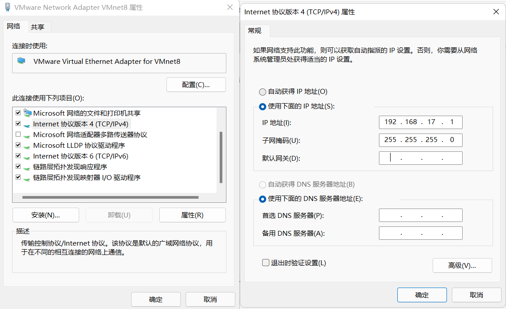
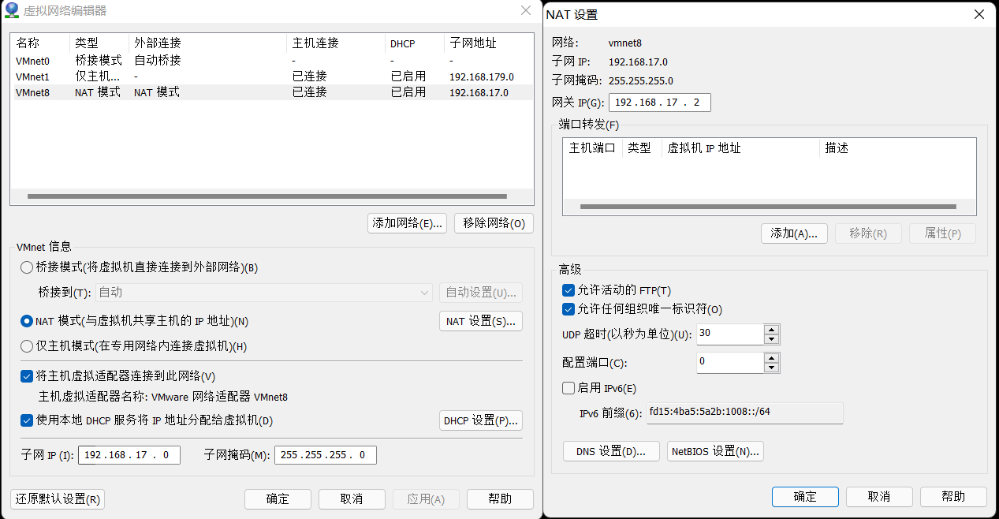

## 虚拟机静态ip设置

### 1、修改网络适配器VM8



### 2、设置网卡

* 编辑->编辑虚拟机网络 (网关最后一位设置为2)

### 

### 3、配置ifcfg-ens33文件

* vim /etc/sysconfig/network-scripts/ifcfg-ens33
* 重启网卡 systemctl restart network

```properties
TYPE="Ethernet"
PROXY_METHOD="none"
BROWSER_ONLY="no"
BOOTPROTO="static"
DEFROUTE="yes"
IPV4_FAILURE_FATAL="no"
IPV6INIT="yes"
IPV6_AUTOCONF="yes"
IPV6_DEFROUTE="yes"
IPV6_FAILURE_FATAL="no"
IPV6_ADDR_GEN_MODE="stable-privacy"
NAME="ens33"
UUID="b7b86d10-0385-4fd9-b7d0-ffc698bd9a76"
DEVICE="ens33"
ONBOOT="yes"
IPADDR=192.168.17.128
#网关为虚拟机的网关
GATEWAY=192.168.17.2 
NETMASK=255.255.255.0
DNS1=192.168.17.2
```
