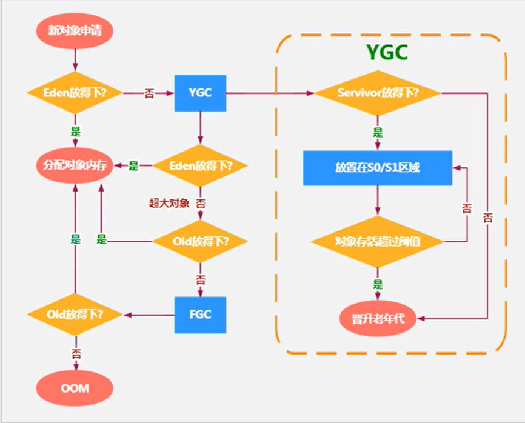

# JVM

## 1.JVM的构成

一个进程会有一个JVM

* 类加载子系统
* 运行时数据区

* 执行引擎

# 2. 类加载子系统

### 2.1类加载器的分类

* 引导类加载器 主要负责加载Java核心类库，%JRE_HOME%\lib下的rt.jar、resources.jar、charsets.jar和class等
* 扩展类加载器 主要负责加载目录%JRE_HOME%\lib\ext目录下的jar包和class文件
* 应用类加载器 主要负责加载当前应用的classpath下的所有类

### 2.2双亲委派机制

* 当一个类加载器收到了类加载的请求的时候，会委托给父加载器，一层一层向上委托，在父加载器无法加载的时候会让子加载器进行加载
* 作用
  * 通过委派的方式，可以避免类的重复加载，当父加载器已经加载过某一个类时，子加载器就不会再重新加载这个类
  * 保证安全性，防止核心类库api被恶意修改

### 2.3 类加载的过程

* 加载 由类加载器读取字节码文件到内存中
* 链接
  * 验证 验证文件格式等是否正确，确保字节码文件不会对jvm产生危害
  * 准备 静态变量分配内存空间和赋0值
  * 解析 将符号引用变为直接引用
* 初始化 静态变量显式赋值及静态代码块的执行

## 3.运行时数据区

### 3.1 程序计数器

* 记录当前代码执行的地址
* 线程私有
* 没有Error没有GC

### 3.2 java虚拟机栈

* 虚拟机栈存放一个一个栈帧，栈帧中存放局部变量表、操作数栈、动态连接和返回值地址
* 线程私有
* 一个线程有一个虚拟机栈
* 没有GC
* 参数：设置大小  Xss

### 3.3 本地方法栈

* 和虚拟机栈一样不过存放的是执行本地方法所需的数据
* 线程私有
* 没有GC

### 3.4 堆

几乎所有的对象，数组都保存在堆中，有线程私有的TLAB区，最小堆大小默认为内存的1/64，最大堆默认为1/4

* 新生代（伊甸区、from区、to区）
  * 伊甸区、from区、to区，默认比例为 8 : 1 : 1，通过SurvivorRatio来调整伊甸区，from区和to区的比例默认为8，关闭内存自适应策略，才体现为8:1:1,参数：-UseApativeSizePolicy
  * 几乎所有的对象都是在伊甸区分配的
  * -Xmn 设置新生代空间大小
* 老年代
  * 参数： -XX: MaxTenuringThreshold=<N> 最大的到老年代的阈值，默认是15岁
* 内存分配的过程：首先在伊甸区，伊甸区满了发生MinorGC，将还存活的对象放到s0区或s1区，之后重复此步骤，s0和s1必须有一个是空的，空的叫做to区；当s0或者s1满了之后，如果还有存活的对象将放到老年代
* 内存分配策略
  * 优先分配到Eden
  * 大对象直接分配到老年代
  * 长期存活的对象分配到老年代
  * 动态年龄判断：如果Survivor区中相同年龄的所有对象大小的总和大于Survivor空间的一半，年龄大于或等于该年龄的对象可以直接进入老年代，无需等到MaxTenuringThreshold中要求的年龄
  * 空间分配担保 -XX:HandlePromotionFailure
* 频繁在新生代收集，很少在老年代收集，几乎不在元空间收集
* 线程共享
* 有OOM、有GC
* 参数：最小堆 Xms 最大堆 Xmx
* 设置新生代和老年代的占比 NewRatio:4 表示老年代占1 / 5，默认NewRatio为2

